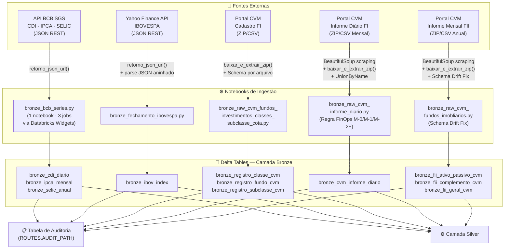

# 🥉 Camada Bronze — Documentação Técnica

> **Projeto:** Pipeline de Dados do Mercado Financeiro Brasileiro  
> **Arquitetura:** Medallion (Bronze → Silver → Gold)  
> **Plataforma:** Databricks + Delta Lake + Apache Spark  

---

## 1. Visão Geral

### TL;DR
A camada Bronze é a fronteira de ingestão do pipeline: recebe dados brutos de 4 fontes externas do mercado financeiro brasileiro (BCB, Yahoo Finance e CVM), persiste tudo em formato Delta com schema enforcing mínimo e rastreabilidade completa, servindo como fonte de verdade imutável para as camadas superiores.

### Objetivo da Camada
A camada Bronze tem como responsabilidade capturar, preservar e disponibilizar dados brutos provenientes de fontes externas heterogêneas — APIs REST e portais de dados públicos — sem aplicar transformações semânticas ou regras de negócio. Toda intervenção sobre os dados limita-se ao necessário para viabilizar o armazenamento estruturado (schema, encoding, normalização superficial de nomenclatura) e à adição de metadados técnicos de rastreabilidade.

### Papel na Arquitetura Medallion
Na arquitetura Medallion, a Bronze representa a **camada de ingestão e persistência bruta**. Ela atua como buffer entre as fontes externas — voláteis, sujeitas a mudanças de schema, indisponíveis ou com latência variável — e o restante do pipeline. Todo processamento analítico e transformação de negócio parte daqui, garantindo que o dado original jamais seja perdido e que qualquer reprocessamento seja possível sem consultar as fontes novamente.

### Responsabilidades da Camada
- Extrair dados de APIs REST e portais de dados abertos (BCB, Yahoo Finance, CVM).
- Aplicar schema enforcing mínimo (tipagem `StringType` universal) para evitar erros de parsing.
- Persistir os dados em formato Delta Lake particionado por `data_processamento`.
- Adicionar colunas técnicas de rastreabilidade (`_source_url`, `_ingest_timestamp`, `data_processamento`).
- Normalizar superficialmente nomenclaturas divergentes entre versões legadas e novas de um mesmo arquivo (schema drift), sem alterar os valores.
- Registrar auditoria de execução (SUCESSO/FALHA) para todas as cargas.
- Controlar janelas de execução alinhadas com as políticas de atualização das fontes (FinOps e CVM).

### Relacionamento com as Demais Camadas
| Camada | Relação |
|---|---|
| **Bronze (esta)** | Ingestão bruta, sem transformação de negócio |
| **Silver** | Consome a Bronze; aplica tipagem correta, deduplicação, joins e regras de negócio |
| **Gold** | Consome a Silver; produz visões analíticas e indicadores de negócio para consumo final |

---

## 2. Arquitetura da Camada e Fluxo de Dados

### Entradas Recebidas
| Fonte | Tipo | Protocolo | Dados |
|---|---|---|---|
| API Banco Central do Brasil (BCB SGS) | API REST JSON | HTTPS | Séries temporais: CDI (cód. 12), IPCA (cód. 433), SELIC (cód. 1178) — últimos 10 anos |
| Yahoo Finance API v8 | API REST JSON | HTTPS | Fechamentos diários do IBOVESPA (^BVSP) — últimos 10 anos |
| Portal CVM — Cadastro FI | Arquivo ZIP (CSV) | HTTPS | Registro de fundos de investimento, classes e subclasses (RCVM 175) |
| Portal CVM — Informe Diário FI | Arquivo ZIP (CSV) mensal | HTTPS | Informes diários de todos os fundos de investimento ativos |
| Portal CVM — Informe Mensal FII | Arquivo ZIP (CSV) anual | HTTPS | Informações mensais de fundos imobiliários (ativo/passivo, complemento, geral) |

### Processamentos Realizados
1. Requisição HTTP à fonte (REST JSON ou HTML scraping com BeautifulSoup para descoberta de arquivos ZIP).
2. Download e extração de arquivos ZIP para camada RAW intermediária (via `PipelineConfig.baixar_e_extrair_zip`).
3. Criação de DataFrame Spark com schema explícito (`StructType`).
4. Normalização superficial de schema drift (renomeação de colunas, adição de colunas nulas para versões legadas).
5. Adição de colunas de metadados técnicos.
6. Escrita em formato Delta Lake com particionamento por `data_processamento`.
7. Registro de auditoria de execução.

### Saídas Produzidas
11 tabelas Delta Lake no namespace `{ROUTES.TABLE_BASE}`, particionadas por `data_processamento` (YYYYMMDD), disponíveis para consumo pela camada Silver.

### Fluxo de Dados



### Motivo das Escolhas Arquiteturais
- **Separação de notebooks por domínio:** Cada fonte possui seu notebook dedicado, isolando falhas e facilitando manutenção e reprocessamento independente por fonte.
- **1 notebook, 3 jobs (BCB):** O padrão de Databricks Widgets permite reutilizar o mesmo código para CDI, IPCA e SELIC, eliminando duplicação e centralizando manutenção.
- **Schema enforcing com `StringType` universal:** Garante que dados brutos sejam ingeridos sem risco de falha por tipo inesperado na fonte; a coerção de tipos é responsabilidade da Silver.
- **Regra FinOps (informe diário):** Controla a frequência de processamento por mês de referência, evitando reprocessamento desnecessário de dados históricos já estáveis — reduzindo custo de cluster.
- **Janela de execução (cadastros CVM):** A CVM não atualiza os dados nos fins de semana (atualiza terça a sábado); o notebook evita execuções em segunda-feira e domingo, alinhando o pipeline à realidade da fonte.

---

## 3. Estrutura Física dos Dados

### Formato dos Arquivos
Todas as tabelas Bronze são armazenadas em **formato Delta Lake** (`format("delta")`). Internamente, o Delta utiliza arquivos Parquet com columnar storage, complementados pelo transaction log (`_delta_log`) para controle de versão, ACID e time travel.

### Tipo de Armazenamento
Tabelas gerenciadas no **metastore Databricks** (`saveAsTable`), registradas sob o namespace `{ROUTES.TABLE_BASE}` (inferido como `workspace.case_spark_cvm` a partir da query SQL identificada no código).

### Estratégia de Particionamento
| Coluna de Partição | Tipo | Formato | Benefício |
|---|---|---|---|
| `data_processamento` | `IntegerType` | `YYYYMMDD` | Permite `replaceWhere` idempotente por data de carga; elimina partições antigas sem reescrever a tabela inteira; facilita auditoria por data de ingestão |

O formato inteiro (`YYYYMMDD`) é utilizado consistentemente em todos os 5 notebooks, evitando problemas de ordenação lexicográfica e simplificando filtros numéricos.

### Convenções de Nomenclatura
| Elemento | Padrão | Exemplo |
|---|---|---|
| Tabelas de indicadores BCB | `bronze_{serie_nome}_{serie_freq}` | `bronze_cdi_diario`, `bronze_ipca_mensal` |
| Tabela de índice de mercado | `bronze_{nome}_index` | `bronze_ibov_index` |
| Tabelas cadastrais CVM | `bronze_{nome_arquivo}_cvm` | `bronze_registro_classe_cvm` |
| Tabelas FII | `bronze_fii_{tipo}_cvm` | `bronze_fii_ativo_passivo_cvm` |
| Colunas de metadados | Prefixo `_` (underscore) | `_source_url`, `_ingest_timestamp` |

### Benefícios das Decisões
- **Delta Lake vs. Parquet puro:** Permite `replaceWhere` por partição (reprocessamento idempotente), `mergeSchema` para evolução segura de schema, e transaction log para auditoria e time travel.
- **`coalesce(1)` para APIs BCB e IBOVESPA:** Volumes pequenos (séries históricas de ~2.600 registros) não justificam múltiplos arquivos Parquet; um único arquivo por partição reduz overhead de metadados.
- **`autoOptimize.optimizeWrite` + `autoCompact`:** Otimização automática do tamanho dos arquivos Parquet gerados, evitando o problema de small files sem necessidade de execução manual de `OPTIMIZE`.

---

## 4. Modelo de Dados

### 4.1 `bronze_cdi_diario` / `bronze_ipca_mensal` / `bronze_selic_anual`
**Descrição:** Séries temporais de indicadores macroeconômicos extraídas da API do Banco Central do Brasil (SGS — Sistema Gerenciador de Séries Temporais). Cada tabela corresponde a uma série específica com sua frequência natural.

| Campo | Tipo | Descrição |
|---|---|---|
| `data` | String | Data de referência do valor da série (formato original da API BCB) |
| `valor` | String | Valor da série no período (taxa percentual, formato original da API) |
| `_source_url` | String | URL completa utilizada na extração, incluindo código da série e data inicial |
| `_ingest_timestamp` | Timestamp | Data e hora da execução da ingestão no Databricks |
| `data_processamento` | Integer | Data de processamento no formato YYYYMMDD (coluna de partição) |

- **Chave de negócio:** `data` (data de referência da série)
- **Granularidade:** Um registro por data de referência por série (diária para CDI, mensal para IPCA, anual para SELIC)
- **Séries mapeadas:** CDI (cód. BCB: 12), IPCA (cód. BCB: 433), SELIC (cód. BCB: 1178)
- **Janela histórica:** 10 anos retroativos à data de execução

---

### 4.2 `bronze_ibov_index`
**Descrição:** Série histórica de fechamentos diários do Índice Bovespa (IBOVESPA / ^BVSP), extraída via Yahoo Finance API v8.

| Campo | Tipo | Descrição |
|---|---|---|
| `timestamp` | String | Unix timestamp correspondente à data de pregão (formato original da API) |
| `close` | String | Preço de fechamento do índice no pregão (valor numérico, formato original) |
| `_source_url` | String | URL da requisição à Yahoo Finance API |
| `_ingest_timestamp` | Timestamp | Data e hora da execução da ingestão |
| `data_processamento` | Integer | Data de processamento no formato YYYYMMDD (coluna de partição) |

- **Chave de negócio:** `timestamp` (identificador do pregão)
- **Granularidade:** Um registro por pregão diário
- **Janela histórica:** 10 anos (`range=10y&interval=1d`)

---

### 4.3 `bronze_registro_classe_cvm`
**Descrição:** Cadastro de classes de fundos de investimento regulamentados pela CVM (RCVM 175), incluindo informações de situação, classificação ANBIMA, patrimônio e prestadores de serviço.

| Campo | Tipo | Descrição |
|---|---|---|
| `ID_Registro_Fundo` | String | Identificador único do registro do fundo pai |
| `ID_Registro_Classe` | String | Identificador único da classe de cotas (chave de negócio) |
| `CNPJ_Classe` | String | CNPJ da classe de cotas |
| `Codigo_CVM` | String | Código CVM da classe |
| `Data_Registro` | String | Data de registro junto à CVM |
| `Data_Constituicao` | String | Data de constituição da classe |
| `Tipo_Classe` | String | Tipo de classe (ex: Renda Fixa, Ações) |
| `Denominacao_Social` | String | Nome oficial da classe |
| `Situacao` | String | Situação cadastral (ex: EM FUNCIONAMENTO, CANCELADA) |
| `Classificacao_Anbima` | String | Classificação ANBIMA da classe |
| `Classe_ESG` | String | Indicador se a classe possui mandato ESG |
| `Patrimonio_Liquido` | String | Patrimônio líquido da classe na data de referência |
| `CNPJ_Auditor` | String | CNPJ do auditor independente |
| `CNPJ_Custodiante` | String | CNPJ do custodiante |
| `CNPJ_Controlador` | String | CNPJ do administrador de carteira |
| `_source_url` | String | URL do arquivo ZIP de origem |
| `_ingest_timestamp` | Timestamp | Data e hora da ingestão |
| `data_processamento` | Integer | Data de processamento YYYYMMDD (coluna de partição) |

> Schema completo: 30 campos (conforme `SCHEMA_CLASSE` no notebook `bronze_raw_cvm_fundos_investimentos_classes_subclasse_cota.py`)

- **Chave de negócio:** `ID_Registro_Classe`
- **Granularidade:** Um registro por classe de fundo de investimento

---

### 4.4 `bronze_registro_fundo_cvm`
**Descrição:** Cadastro dos fundos de investimento estruturados sob a RCVM 175, contendo dados do fundo pai (gestor, administrador, tipo, situação).

| Campo | Tipo | Descrição |
|---|---|---|
| `ID_Registro_Fundo` | String | Identificador único do fundo (chave de negócio) |
| `CNPJ_Fundo` | String | CNPJ do fundo |
| `Codigo_CVM` | String | Código CVM do fundo |
| `Tipo_Fundo` | String | Tipo do fundo (ex: FI, FIC) |
| `Denominacao_Social` | String | Nome oficial do fundo |
| `Situacao` | String | Situação cadastral do fundo |
| `Data_Adaptacao_RCVM175` | String | Data de adequação à nova regulamentação |
| `Patrimonio_Liquido` | String | Patrimônio líquido do fundo |
| `CNPJ_Administrador` | String | CNPJ do administrador do fundo |
| `CPF_CNPJ_Gestor` | String | CPF ou CNPJ do gestor |
| `_source_url` | String | URL do arquivo ZIP de origem |
| `_ingest_timestamp` | Timestamp | Data e hora da ingestão |
| `data_processamento` | Integer | Data de processamento YYYYMMDD (coluna de partição) |

> Schema completo: 21 campos (conforme `SCHEMA_FUNDO` no notebook)

- **Chave de negócio:** `ID_Registro_Fundo`
- **Granularidade:** Um registro por fundo de investimento

---

### 4.5 `bronze_registro_subclasse_cvm`
**Descrição:** Cadastro das subclasses de cotas vinculadas às classes de fundos de investimento.

| Campo | Tipo | Descrição |
|---|---|---|
| `ID_Registro_Classe` | String | Identificador da classe pai (FK para `bronze_registro_classe_cvm`) |
| `ID_Subclasse` | String | Identificador único da subclasse (chave de negócio) |
| `Codigo_CVM` | String | Código CVM da subclasse |
| `Denominacao_Social` | String | Nome da subclasse |
| `Situacao` | String | Situação cadastral da subclasse |
| `Previdenciario` | String | Indicador de produto previdenciário |
| `Exclusivo_INR` | String | Indicador de exclusividade para investidores não residentes |
| `_source_url` | String | URL do arquivo ZIP de origem |
| `_ingest_timestamp` | Timestamp | Data e hora da ingestão |
| `data_processamento` | Integer | Data de processamento YYYYMMDD (coluna de partição) |

> Schema completo: 14 campos (conforme `SCHEMA_SUBCLASSE` no notebook)

- **Chave de negócio:** `ID_Subclasse`
- **Granularidade:** Um registro por subclasse de cotas

---

### 4.6 `bronze_cvm_informe_diario`
**Descrição:** Informes diários de todos os fundos de investimento ativos na CVM, contendo valor da cota, patrimônio líquido, captações, resgates e número de cotistas. Inclui dados de arquivos com schema legado (anterior à inclusão da coluna `ID_SUBCLASSE`).

| Campo | Tipo | Descrição |
|---|---|---|
| `TP_FUNDO_CLASSE` | String | Tipo do fundo/classe (coluna normalizada de `TP_FUNDO` no schema legado) |
| `CNPJ_FUNDO_CLASSE` | String | CNPJ do fundo/classe (normalizado de `CNPJ_FUNDO` no schema legado) |
| `ID_SUBCLASSE` | String | Identificador da subclasse (null em registros de arquivos legados) |
| `DT_COMPTC` | String | Data de competência do informe |
| `VL_TOTAL` | String | Valor total da carteira do fundo |
| `VL_QUOTA` | String | Valor da cota na data |
| `VL_PATRIM_LIQ` | String | Valor do patrimônio líquido |
| `CAPTC_DIA` | String | Captações do dia |
| `RESG_DIA` | String | Resgates do dia |
| `NR_COTST` | String | Número de cotistas |
| `_source_url` | String | URL base do portal CVM |
| `_ingest_timestamp` | Timestamp | Data e hora da ingestão |
| `data_processamento` | Integer | Data de processamento YYYYMMDD (coluna de partição) |

- **Chave de negócio:** `CNPJ_FUNDO_CLASSE` + `DT_COMPTC` + `ID_SUBCLASSE`
- **Granularidade:** Um registro por fundo/subclasse por dia de competência

---

### 4.7 `bronze_fii_ativo_passivo_cvm`
**Descrição:** Posição mensal de ativo e passivo dos fundos de investimento imobiliário (FII), com detalhamento de alocações por tipo de ativo (imóveis, títulos, derivativos) e passivos.

| Campo (principais) | Tipo | Descrição |
|---|---|---|
| `CNPJ_Fundo_Classe` | String | CNPJ do FII (chave de negócio) |
| `Data_Referencia` | String | Mês de referência do informe |
| `Versao` | String | Versão do documento enviado à CVM |
| `Total_Investido` | String | Valor total investido pelo fundo |
| `Direitos_Bens_Imoveis` | String | Total em direitos e bens imóveis |
| `CRI` | String | Total em Certificados de Recebíveis Imobiliários |
| `LCI` | String | Total em Letras de Crédito Imobiliário |
| `Total_Passivo` | String | Total do passivo do fundo |
| `_source_url` | String | URL base do portal CVM |
| `_ingest_timestamp` | Timestamp | Data e hora da ingestão |
| `data_processamento` | Integer | Data de processamento YYYYMMDD (coluna de partição) |

> Schema completo: 51 campos (conforme `SCHEMA_ATIVO_PASSIVO` no notebook)

- **Chave de negócio:** `CNPJ_Fundo_Classe` + `Data_Referencia` + `Versao`
- **Granularidade:** Um registro por FII por mês de referência

---

### 4.8 `bronze_fii_complemento_cvm`
**Descrição:** Dados complementares mensais dos FIIs: distribuição de cotistas por tipo de investidor, rentabilidade, dividend yield e amortizações.

| Campo (principais) | Tipo | Descrição |
|---|---|---|
| `CNPJ_Fundo_Classe` | String | CNPJ do FII (chave de negócio) |
| `Data_Referencia` | String | Mês de referência |
| `Total_Numero_Cotistas` | String | Total de cotistas |
| `Numero_Cotistas_Pessoa_Fisica` | String | Cotistas pessoa física |
| `Valor_Ativo` | String | Valor do ativo total |
| `Patrimonio_Liquido` | String | Patrimônio líquido |
| `Cotas_Emitidas` | String | Quantidade de cotas emitidas |
| `Percentual_Rentabilidade_Efetiva_Mes` | String | Rentabilidade efetiva no mês |
| `Percentual_Dividend_Yield_Mes` | String | Dividend yield mensal |
| `_source_url` | String | URL base do portal CVM |
| `_ingest_timestamp` | Timestamp | Data e hora da ingestão |
| `data_processamento` | Integer | Data de processamento YYYYMMDD (coluna de partição) |

> Schema completo: 30 campos (conforme `SCHEMA_COMPLEMENTO` no notebook)

- **Chave de negócio:** `CNPJ_Fundo_Classe` + `Data_Referencia`
- **Granularidade:** Um registro por FII por mês de referência

---

### 4.9 `bronze_fii_geral_cvm`
**Descrição:** Dados gerais e cadastrais dos FIIs no contexto do informe mensal: mandato, segmento, gestão, mercados de negociação e dados do administrador. Inclui tratamento de schema drift para arquivos legados de 2016.

| Campo (principais) | Tipo | Descrição |
|---|---|---|
| `Tipo_Fundo_Classe` | String | Tipo do fundo (null em registros legados de 2016) |
| `CNPJ_Fundo_Classe` | String | CNPJ do FII (normalizado de `CNPJ_Fundo` no layout legado) |
| `Data_Referencia` | String | Mês de referência |
| `Nome_Fundo_Classe` | String | Nome do FII (normalizado de `Nome_Fundo` no layout legado) |
| `Mandato` | String | Mandato de investimento do FII |
| `Segmento_Atuacao` | String | Segmento de atuação (ex: Lajes Corporativas, Logística) |
| `Tipo_Gestao` | String | Tipo de gestão (ativa/passiva) |
| `Codigo_ISIN` | String | Código ISIN das cotas do FII |
| `Nome_Administrador` | String | Nome do administrador do fundo |
| `CNPJ_Administrador` | String | CNPJ do administrador |
| `_source_url` | String | URL base do portal CVM |
| `_ingest_timestamp` | Timestamp | Data e hora da ingestão |
| `data_processamento` | Integer | Data de processamento YYYYMMDD (coluna de partição) |

> Schema completo: 37 campos (conforme `SCHEMA_GERAL` no notebook `bronze_raw_cvm_fundos_imobliarios.py`)

- **Chave de negócio:** `CNPJ_Fundo_Classe` + `Data_Referencia`
- **Granularidade:** Um registro por FII por mês de referência

---

## 5. Regras de Qualidade dos Dados

| Regra | Tipo | Implementação no Código | Impacto |
|---|---|---|---|
| **Schema enforcing explícito** | Estrutural | `StructType` com todos os campos como `StringType` em todos os notebooks | Rejeita arquivos com colunas faltantes; evita falha silenciosa por inferência de schema |
| **Encoding ISO-8859-1** | Formato | `.option("encoding", "ISO-8859-1")` em leitura de CSVs CVM | Preserva caracteres especiais do português (acentos, cedilha) presentes nos nomes de fundos |
| **Separador ponto-e-vírgula** | Formato | `.option("sep", ";")` em todos os CSVs CVM | Consistente com o padrão de exportação dos arquivos do portal CVM |
| **Janela de execução cadastros CVM** | Operacional | `if hoje.weekday() in [0, 6]: dbutils.notebook.exit(...)` | Evita ingestão desnecessária em dias sem atualização (segunda e domingo), reduzindo custo |
| **Regra FinOps informe diário** | Operacional | Função `regra_finops()` com lógica de `diff_month` | M-0 e M-1: processamento diário; M-2+: apenas domingos. Controla custo de reprocessamento histórico |
| **Normalização schema drift (informe diário FI)** | Estrutural | `withColumnRenamed("TP_FUNDO", "TP_FUNDO_CLASSE")` + `withColumn("ID_SUBCLASSE", f.lit(None))` | Unifica arquivos de diferentes versões sem corromper dados históricos |
| **Normalização schema drift (FII geral)** | Estrutural | Separação por presença de coluna `CNPJ_Fundo` + `withColumnRenamed` em bloco | Trata 100% dos arquivos históricos incluindo layout de 2016 |
| **`unionByName allowMissingColumns`** | Estrutural | `.unionByName(df, allowMissingColumns=True)` | Permite union seguro entre DataFrames com colunas divergentes, preenchendo ausentes com null |
| **`mergeSchema`** | Evolutivo | `.option("mergeSchema", "true")` em todas as escritas Delta | Permite evolução do schema da tabela sem falha em caso de adição de colunas na fonte |
| **`replaceWhere` idempotente** | Operacional | `.option("replaceWhere", f"data_processamento = {DATA_PROC}")` | Garante que a reexecução do notebook no mesmo dia sobrescreva apenas a partição corrente |
| **Auditoria SUCESSO/FALHA** | Observabilidade | `PipelineConfig.registrar_auditoria(...)` em todos os notebooks (bloco `try/except`) | Registra status de execução, tabela destino, contagem de linhas e mensagem de erro |

### Tratamento de Valores Nulos
- Campos ausentes em arquivos legados recebem `null` explícito via `f.lit(None).cast("string")` (ex: `ID_SUBCLASSE` no informe diário e `Tipo_Fundo_Classe` no FII geral).
- Não há descarte de registros com nulos na Bronze — a decisão de tratamento é delegada à Silver.

### Tratamento de Duplicidades
- Não implementado explicitamente na Bronze — a deduplicação é responsabilidade da Silver.
- O `replaceWhere` por `data_processamento` garante idempotência na partição, evitando duplicação entre reexecuções do mesmo dia.

---

## 6. Transformações Aplicadas

### 6.1 Parsing de JSON Aninhado — IBOVESPA
**Notebook:** `bronze_fechamento_ibovespa.py`  
**Objetivo:** A Yahoo Finance API retorna um JSON profundamente aninhado com dois arrays separados (`timestamp` e `close`). A transformação extrai esses arrays e os combina com `zip()` para produzir uma lista de tuplas `(timestamp, close)`.

```python
timestamps = data["chart"]["result"][0]["timestamp"]
close = data["chart"]["result"][0]["indicators"]["quote"][0]["close"]
records = list(zip(timestamps, close))
df = spark.createDataFrame(records, schema=SCHEMA_IBOV)
```

### 6.2 HTML Scraping para Descoberta de Arquivos — CVM
**Notebooks:** `bronze_raw_cvm_informe_diario.py`, `bronze_raw_cvm_fundos_imobliarios.py`  
**Objetivo:** O portal CVM não oferece uma API REST para listar os arquivos disponíveis. O código usa `BeautifulSoup` para parsear o HTML da página de listagem e regex para identificar os links de interesse (padrão `inf_diario_fi_YYYYMM.zip` e `inf_mensal_fii_YYYY.zip`).

### 6.3 Adição de Colunas de Metadados de Rastreabilidade
**Todos os notebooks**  
**Objetivo:** Permitir rastreabilidade completa da origem de cada registro, independentemente da tabela ou da camada.

| Coluna | Valor | Propósito |
|---|---|---|
| `_source_url` | URL literal da fonte | Reprodutibilidade: permite reextrair os dados exatos |
| `_ingest_timestamp` | `current_timestamp()` | Rastreabilidade temporal da ingestão |
| `data_processamento` | `int(datetime.now().strftime("%Y%m%d"))` | Particionamento e identificação da carga |

### 6.4 Normalização de Schema Legado — Informe Diário FI
**Notebook:** `bronze_raw_cvm_informe_diario.py`  
**Objetivo:** Arquivos mais antigos do informe diário utilizam nomenclatura diferente (`TP_FUNDO`, `CNPJ_FUNDO`) e não possuem a coluna `ID_SUBCLASSE`. A transformação normaliza para o schema atual sem descartar dados históricos.

```python
# Identificação do tipo de arquivo via inspeção de colunas
colunas = spark.read.option("sep", ";").option("header", "true").csv(path).columns
if "TP_FUNDO" in colunas:
    arquivos_antigo.append(path)

# Renomeação e criação de coluna nula para o schema legado
df_antigo = df_antigo
    .withColumnRenamed("TP_FUNDO", "TP_FUNDO_CLASSE")
    .withColumnRenamed("CNPJ_FUNDO", "CNPJ_FUNDO_CLASSE")
    .withColumn("ID_SUBCLASSE", f.lit(None).cast("string"))
```

### 6.5 Normalização de Schema Drift — FII Geral
**Notebook:** `bronze_raw_cvm_fundos_imobliarios.py`  
**Objetivo:** Arquivos de anos anteriores (identificados pela presença da coluna `CNPJ_Fundo`) utilizam nomenclatura diferente da atual (`CNPJ_Fundo_Classe`, `Nome_Fundo_Classe`) e não possuem `Tipo_Fundo_Classe`.

```python
# Separação de arquivos pelo layout
if "CNPJ_Fundo" in colunas:
    arquivos_antigo.append(path)

# Correção em massa para o bloco legado
df_antigos = df_antigos
    .withColumnRenamed("CNPJ_Fundo", "CNPJ_FUNDO_CLASSE")
    .withColumnRenamed("Nome_Fundo", "Nome_Fundo_Classe")
    .withColumn("Tipo_Fundo_Classe", f.lit(None).cast("string"))
```

### 6.6 Seleção de Schema por Nome de Arquivo — Cadastro FI e FII
**Notebooks:** `bronze_raw_cvm_fundos_investimentos_classes_subclasse_cota.py`, `bronze_raw_cvm_fundos_imobliarios.py`  
**Objetivo:** Um único ZIP da CVM contém múltiplos CSVs com schemas distintos. O código determina qual schema aplicar via o nome do arquivo, evitando inferência automática que poderia produzir tipos incorretos.

### 6.7 Leitura em Lote (`batch read`) — FII
**Notebook:** `bronze_raw_cvm_fundos_imobliarios.py`  
**Objetivo:** Em vez de ler arquivo por arquivo em loops, o código agrupa caminhos por tipo e executa uma única leitura em lote por schema, reduzindo o número de jobs Spark e otimizando o uso de recursos do cluster.

---

## 7. Estratégia de Atualização

### Tipo de Carga
**Full load com idempotência por partição** via `overwrite` + `replaceWhere`.

### Critério de Atualização
| Tabela | Frequência | Critério |
|---|---|---|
| `bronze_cdi_diario` | Diária | Job Databricks com parâmetros via Widget |
| `bronze_ipca_mensal` | Mensal (ou diária) | Job Databricks com parâmetros via Widget |
| `bronze_selic_anual` | Anual (ou diária) | Job Databricks com parâmetros via Widget |
| `bronze_ibov_index` | Diária | Job Databricks dedicado |
| `bronze_registro_*_cvm` | Terça a Sábado | Janela de execução: não executa segunda e domingo |
| `bronze_cvm_informe_diario` | Diária (M-0/M-1) / Domingo (M-2+) | Regra FinOps com `diff_month` |
| `bronze_fii_*_cvm` | Não identificado no código | Sem controle de janela explícito |

### Estratégia de Merge / Upsert
Não implementado na Bronze — a camada utiliza `overwrite` com `replaceWhere` por partição. O padrão MERGE/UPSERT é responsabilidade da Silver.

### Idempotência
```python
.write
.mode("overwrite")
.option("replaceWhere", f"data_processamento = {DATA_PROC}")
```
A combinação de `mode("overwrite")` com `replaceWhere` garante que a reexecução do notebook no mesmo dia sobrescreva apenas a partição daquele dia, sem afetar partições históricas. Este é o mecanismo principal de segurança contra dupla ingestão.

### Controle de Histórico
O histórico de ingestões é mantido pelo **transaction log do Delta Lake** (`_delta_log`). Cada escrita gera uma entrada no log, permitindo time travel e auditoria de versões anteriores.

### Benefícios Operacionais
- **Reprocessamento seguro:** Basta reexecutar o notebook; a partição do dia será sobrescrita atomicamente.
- **Zero duplicação entre execuções:** O `replaceWhere` é atômico — ou a partição inteira é substituída, ou a operação falha.
- **Histórico imutável:** Partições de dias anteriores não são afetadas pelo processamento corrente.

---

## 8. Performance e Escalabilidade

### Estratégia de Otimização
| Mecanismo | Configuração | Benefício |
|---|---|---|
| **Auto Optimize Write** | `.option("delta.autoOptimize.optimizeWrite", "true")` | Reduz o número de arquivos Parquet gerados por escrita, evitando small files problem |
| **Auto Compact** | `.option("delta.autoOptimize.autoCompact", "true")` | Realiza compactação automática de arquivos pequenos após escritas, sem necessidade de `OPTIMIZE` manual |
| **Coalesce(1)** | `.coalesce(1)` | Aplicado nas ingestões de APIs BCB e IBOVESPA (volumes pequenos); reduz overhead de múltiplos arquivos para partições com poucos registros |

### Recursos Delta Lake Utilizados
- **Transaction Log:** Controle de versão e ACID compliance em todas as escritas.
- **`replaceWhere`:** Permite substituição atômica de partições específicas sem reescrever toda a tabela — fundamental para eficiência em reprocessamentos.
- **`mergeSchema`:** Evolução segura de schema sem necessidade de `ALTER TABLE`, essencial para fontes externas que podem adicionar colunas.

### Gargalos Potenciais
- **`coalesce(1)` em volumes grandes:** Forçar coalescência para 1 arquivo pode criar gargalo de memória no executor responsável se o volume de dados da API crescer. Monitorar especialmente em cargas históricas do informe diário.
- **Inspeção de colunas em loop (`spark.read...columns`):** O padrão utilizado para identificar o layout legado dos arquivos (leitura de colunas antes da leitura real) gera um job Spark extra por arquivo. Em cenários com centenas de arquivos, isso pode impactar o tempo de execução.
- **`df.count()` antes da escrita:** A contagem de registros antes da escrita força uma Action Spark adicional, materializando o DataFrame duas vezes. Em volumes muito grandes, pode ser substituído por uma contagem via `df.count()` após a escrita usando o `_delta_log`.

### Considerações de Escalabilidade
- O particionamento por `data_processamento` funciona bem para cargas incrementais diárias, mas pode gerar um número elevado de partições em cargas históricas (10 anos × diário = ~3.650 partições por tabela).
- O padrão de leitura em lote (`batch read`) nos FIIs é a solução correta para escalabilidade — evita o anti-pattern de loop com `df.union()` que cresce o plano lógico do Spark linearmente.

---

## 9. Decisões Técnicas — A Visão do Engenheiro

### Por que essa camada existe da forma que foi construída?

**Separação de responsabilidades acima de tudo.** A Bronze não transforma dados de negócio — ela persiste. Toda lógica de negócio (tipagem correta, joins, agregações, deduplicação) é responsabilidade exclusiva da Silver. Isso garante que, caso uma regra de negócio precise ser corrigida ou modificada, o dado bruto original sempre esteja disponível para reprocessamento completo sem necessidade de contato novamente com as fontes externas.

**StringType universal é uma decisão intencional.** Poderia-se aplicar `IntegerType` ou `DoubleType` nos campos numéricos já na Bronze. A decisão de manter `StringType` em todas as colunas de negócio é uma salvaguarda: a CVM eventualmente entrega campos com vírgulas como separador decimal, campos vazios onde números são esperados, ou valores como `"N/D"`. Um schema agressivo causaria falhas silenciosas ou erros de parsing. A conversão de tipos com tratamento de erros explícito é feita na Silver, onde temos contexto para tomar decisões sobre o dado.

**`overwrite` + `replaceWhere` em vez de MERGE:** Na Bronze não existe lógica de deduplicação ou upsert — todo o dado da fonte é recebido e persistido. O MERGE seria complexidade desnecessária (requer chave de negócio, lógica de condição, plan mais pesado). O `replaceWhere` oferece idempotência suficiente para a necessidade desta camada com performance superior.

**1 notebook, 3 jobs (BCB):** A parametrização via Databricks Widgets é a forma nativa da plataforma de reutilizar código. Evita duplicar o notebook por série, mantém manutenção centralizada e permite escalar facilmente para novas séries do BCB sem criar novos artefatos de código.

### Benefícios para Governança e Rastreabilidade
- `_source_url` em todos os registros permite auditoria completa da origem — qualquer analista pode reproduzir a extração exata consultando esse campo.
- `_ingest_timestamp` documenta exatamente quando o dado chegou ao Data Lake, independente da data de referência do dado.
- `PipelineConfig.registrar_auditoria` cria trilha de auditoria centralizada com status, contagem e erros por execução.
- O Delta Lake `_delta_log` oferece time travel nativo, permitindo consultar o estado exato da tabela em qualquer ponto no tempo.

---

## 10. Métricas da Camada

| Métrica | Valor |
|---|---|
| **Total de notebooks** | 5 |
| **Total de tabelas Bronze gerenciadas** | 11 |
| **Total de fontes externas** | 4 (API BCB, Yahoo Finance, CVM FI, CVM FII) |
| **Formato de armazenamento** | Delta Lake (Parquet + Transaction Log) |
| **Estratégia de particionamento** | `data_processamento` (YYYYMMDD) — uniforme em todas as tabelas |
| **Volume processado** | Não identificado no código analisado (requer execução e consulta ao Delta Log) |
| **Frequência de atualização** | Diária para indicadores financeiros; Terça–Sábado para cadastros CVM; Diária + Semanal (Regra FinOps) para informe diário |
| **Cobertura histórica** | 10 anos (APIs BCB e Yahoo Finance); Histórico completo disponível (portal CVM) |

---

## 11. Conclusão

A camada Bronze estabelece a fundação de confiança do pipeline de dados do mercado financeiro. Ao persistir dados brutos com rastreabilidade completa, schema enforcing mínimo e idempotência garantida, ela habilita as camadas superiores a operarem com a certeza de que o dado original está preservado e pode ser reprocessado a qualquer momento.

As decisões de controle de janela de execução (cadastros CVM, Regra FinOps) demonstram maturidade operacional: não basta ingerir dados corretamente — é preciso fazê-lo de forma eficiente e alinhada ao comportamento real das fontes. A camada entrega 11 tabelas Delta com cobertura de indicadores macroeconômicos, dados de mercado e informações regulatórias de fundos de investimento — o conjunto mínimo necessário para construir análises completas do mercado financeiro brasileiro nas camadas Silver e Gold.

---

## 12. Problemas Encontrados e Soluções

| Problema | Impacto | Solução Implementada |
|---|---|---|
| **Schema drift no Informe Diário FI** — arquivos legados usam `TP_FUNDO` / `CNPJ_FUNDO` e não possuem `ID_SUBCLASSE` | Union direto falharia ou produziria colunas duplicadas e dados corrompidos | Inspeção de colunas por arquivo, separação em listas `arquivos_novo` / `arquivos_antigo`, `withColumnRenamed` em lote, `withColumn` com `null` para campo ausente, `unionByName(allowMissingColumns=True)` |
| **Schema drift no FII Geral** — layout de 2016 usa `CNPJ_Fundo` / `Nome_Fundo` e ausência de `Tipo_Fundo_Classe` | Mesma falha de union; perda de histórico sem tratamento | Separação por presença de coluna `CNPJ_Fundo`, renomeação em massa do bloco legado, `withColumn` para campo ausente, union único (`O cluster agradece!`) |
| **Encoding ISO-8859-1 nos CSVs da CVM** — o Spark lê UTF-8 por padrão | Corrupção de caracteres em nomes de fundos com acentos e cedilha | `.option("encoding", "ISO-8859-1")` explícito em todas as leituras de CSV da CVM |
| **Estrutura JSON aninhada da Yahoo Finance API** — dados não são retornados em formato tabular | `createDataFrame` direto falharia; dados de timestamp e fechamento estão em arrays separados | Extração manual dos arrays `timestamp` e `close`, combinação com `zip()`, criação do DataFrame a partir de lista de tuplas |

---

## 13. Trade-offs Arquiteturais

### `overwrite + replaceWhere` vs. `MERGE`
| Critério | `overwrite + replaceWhere` (adotado) | `MERGE` |
|---|---|---|
| **Complexidade** | Baixa — sem lógica de chave de negócio | Alta — requer chave, condições de match e ação |
| **Performance** | Superior para cargas completas por partição | Overhead por comparação registro a registro |
| **Idempotência** | Garantida por partição | Garantida por registro |
| **Adequação à Bronze** | Alta — Bronze persiste tudo da fonte | Desnecessário — deduplicação é responsabilidade da Silver |

**Decisão:** `overwrite + replaceWhere` é o padrão correto para Bronze. MERGE seria over-engineering nesta camada.

### `StringType` universal vs. tipagem forte na ingestão
| Critério | `StringType` universal (adotado) | Tipagem forte |
|---|---|---|
| **Robustez** | Alta — nunca quebra por dado inesperado | Baixa — `"N/D"` em campo double causa falha |
| **Fidelidade** | Máxima — preserva o dado exatamente como veio | Perde informação em conversões mal-sucedidas |
| **Complexidade de downstream** | Silver precisa converter | Silver já recebe tipos corretos |

**Decisão:** `StringType` na Bronze é um padrão arquitetural deliberado. O custo de conversão na Silver é mínimo comparado ao risco de perda de dados na ingestão.

### `coalesce(1)` para APIs vs. paralelismo padrão
- **Benefício:** Um único arquivo por partição para volumes pequenos (séries BCB: ~2.600 registros; IBOVESPA: ~2.500 registros) reduz overhead de metadados do Delta.
- **Limitação:** Se o volume da API crescer (ex: em uma carga histórica completa do informe diário), o `coalesce(1)` pode se tornar um gargalo de memória. Para o informe diário (potencialmente milhões de registros), o `coalesce(1)` foi corretamente omitido.

### Leitura em Lote vs. Loop com `df.union()`
A escolha de acumular caminhos em listas e passar para uma única chamada `.csv(lista_de_caminhos)` — em vez de ler arquivo por arquivo e fazer `df.union()` no loop — evita o crescimento linear do plano lógico do Spark. Spark gerencia internamente a paralelização da leitura de múltiplos arquivos de forma mais eficiente do que um plano com múltiplos `UNION` aninhados.

### Alternativas Arquiteturais Futuras
- **Auto Loader (Databricks):** Para fontes de arquivos como CVM, o Auto Loader oferece ingestão incremental baseada em checkpoints, eliminando a necessidade de lógica de seleção de arquivos (BeautifulSoup + regex). Possível melhoria futura de maturidade.
- **Databricks Unity Catalog:** Para governança mais robusta, as tabelas poderiam ser registradas no Unity Catalog com políticas de acesso, lineage automático e auditoria centralizada.

---

## 14. Monitoramento e Observabilidade

### Logs Gerados
O módulo `logging` do Python é configurado em todos os 5 notebooks com nível `INFO` e formato `%(asctime)s [%(levelname)s] %(message)s`. Os seguintes eventos são logados:

| Evento | Nível | Informações Registradas |
|---|---|---|
| Início da ingestão | INFO | Código/nome da série, frequência, data de processamento |
| Registros recebidos da API | INFO | Contagem de registros retornados pela fonte |
| Início da escrita | INFO | Contagem de linhas a serem escritas |
| Conclusão da ingestão | INFO | Nome da série/tabela, caminho de destino, contagem de linhas, partição |

### Auditoria Centralizada
Todos os notebooks registram status de execução na tabela de auditoria via `PipelineConfig.registrar_auditoria(spark, ROUTES.AUDIT_PATH, ...)` com os seguintes parâmetros:
- Nome do notebook de origem
- Caminho/nome da tabela de destino
- Contagem de registros processados (0 em caso de FALHA)
- Status: `"SUCESSO"` ou `"FALHA"`
- Data de processamento
- Mensagem de erro (apenas em caso de FALHA)

### Estratégia de Captura de Erros
```python
try:
    n = df.count()
    df.write...saveAsTable(BRONZE_PATH)
    PipelineConfig.registrar_auditoria(..., n, "SUCESSO", ...)
except Exception as e:
    PipelineConfig.registrar_auditoria(..., 0, "FALHA", ..., str(e))
    raise  # Re-raise para falhar o job Databricks e ativar alertas
```

O padrão `raise` no `except` garante que falhas na escrita Delta sejam propagadas como falha do job Databricks, ativando mecanismos de alerta e retry configurados no Workflow.

### Controle de Execução por Janela
- **Cadastros CVM:** `dbutils.notebook.exit("Sucesso: Fora da janela de atualização da CVM")` — saída limpa sem falha quando fora da janela.
- **Informe diário:** `dbutils.notebook.exit("Sucesso: Sem arquivos novos")` — saída limpa quando a regra FinOps não identifica arquivos para processar.

---

## 15. Papel da Camada no Ecossistema de Dados

### Responsabilidade
Atuar como sistema de registro (*system of record*) dos dados brutos do mercado financeiro: a Bronze é a única camada que mantém contato com as fontes externas e a única que preserva os dados no formato original.

### Dependências Upstream
| Fonte | Tipo | Disponibilidade | Risco |
|---|---|---|---|
| API BCB SGS | API REST pública | Alta (SLA do BCB) | Mudança de estrutura do JSON ou indisponibilidade temporária |
| Yahoo Finance API v8 | API REST não-oficial | Média (sem SLA) | API não documentada, pode sofrer breaking changes sem aviso |
| Portal CVM — Dados Abertos | Portal público | Alta (SLA CVM) | Atraso na publicação, mudança de schema nos CSVs |

### Dependências Downstream
| Camada | Contrato |
|---|---|
| **Silver** | Espera tabelas Delta particionadas por `data_processamento` com campos de metadados `_source_url`, `_ingest_timestamp` e `data_processamento` |

### Contratos de Dados
- Todas as colunas de negócio são `StringType` na Bronze — a Silver não deve assumir tipos numéricos ou de data sem conversão explícita.
- A coluna `data_processamento` (YYYYMMDD inteiro) está presente em todas as 11 tabelas e é o único ponto de particionamento.
- As colunas com prefixo `_` são metadados técnicos — não devem ser utilizadas em lógica de negócio.

### Impacto Operacional em Caso de Falha
| Cenário | Impacto |
|---|---|
| Falha de ingestão BCB | Indicadores CDI/IPCA/SELIC desatualizados na Silver e Gold; impacto em cálculos de rentabilidade |
| Falha de ingestão IBOVESPA | Benchmarks de fundos versus IBOV desatualizados |
| Falha de ingestão Cadastro CVM | Dados de novos fundos ou mudanças cadastrais ausentes na Silver |
| Falha de ingestão Informe Diário | Cotas e PL de fundos desatualizados — impacto direto em produtos analíticos |

---

## 16. Competências Demonstradas

- **Apache Spark / PySpark** — Criação de DataFrames com schema explícito, transformações (`withColumn`, `withColumnRenamed`), `unionByName` com `allowMissingColumns`, leitura de múltiplos arquivos em lote, `coalesce`.
- **Delta Lake** — Escrita com `overwrite + replaceWhere` (idempotência por partição), `mergeSchema`, `autoOptimize.optimizeWrite`, `autoCompact`, particionamento, `saveAsTable`.
- **Databricks** — Widgets para parametrização de notebooks, `dbutils.notebook.exit()` para saídas controladas, `dbutils.fs.ls()` para navegação em volumes, integração com Workflows/Jobs.
- **Arquitetura Medallion** — Separação de responsabilidades entre Bronze, Silver e Gold; Bronze como camada de preservação de dados brutos.
- **Engenharia de Dados** — Design de pipelines de ingestão multi-fonte, controle de janelas de execução, estratégia de carga idempotente, gestão de schema drift.
- **Data Quality** — Schema enforcing, tratamento de encoding, normalização de nomenclatura entre versões de schema.
- **Governança de Dados** — Metadados de rastreabilidade, auditoria centralizada de execuções, transaction log Delta.
- **FinOps** — Controle de frequência de processamento baseado em política de atualização das fontes (M-0/M-1 vs. M-2+), janelas de execução alinhadas ao calendário da CVM.
- **ETL/ELT** — Ingestão de APIs REST (JSON), HTML scraping (BeautifulSoup), processamento de arquivos ZIP/CSV, normalização de schema legado.
- **Python** — `logging`, `datetime`, `re` (regex), `BeautifulSoup`, `urllib.parse`, `functools`, tratamento de exceções, operações com listas.
- **Integração com APIs Financeiras** — API BCB SGS (séries temporais), Yahoo Finance API v8 (dados de mercado), Portal de Dados Abertos CVM.

---

## 17. Riscos e Melhorias Futuras

### Limitações Atuais

| Limitação | Risco | Severidade |
|---|---|---|
| **Yahoo Finance API v8 não é oficial** | Pode sofrer breaking changes ou ser desativada sem aviso, quebrando a ingestão do IBOVESPA | Alta |
| **Ausência de deduplicação na Bronze** | Reexecuções de dias diferentes podem gerar duplicatas se o `replaceWhere` não for aplicado corretamente | Média |
| **`coalesce(1)` nas APIs** | Se o volume das APIs crescer (ex: carga histórica completa do informe diário), pode gerar OOM | Média |
| **Inspeção de colunas em loop** | Gera um job Spark extra por arquivo para identificar o layout legado — potencial impacto em cargas com muitos arquivos | Baixa |
| **Ausência de validação de completude** | Não há verificação se o número de registros retornados pela API está dentro de um intervalo esperado | Média |
| **Sem controle de janela para FIIs** | O notebook `bronze_raw_cvm_fundos_imobliarios.py` não possui lógica equivalente à Regra FinOps do informe diário | Baixa |

### Riscos Operacionais

| Risco | Probabilidade | Mitigação Atual | Mitigação Sugerida |
|---|---|---|---|
| Indisponibilidade da API BCB | Baixa | Re-raise + retry do Workflow Databricks | Implementar retry com backoff exponencial em `PipelineConfig` |
| Mudança de schema nos CSVs da CVM | Média | `mergeSchema=true` absorve novas colunas | Alertas quando `mergeSchema` adiciona colunas não esperadas |
| Crescimento de partições (10 anos × diário) | Baixa (longo prazo) | Auto Compact | Adicionar política de `VACUUM` para remover versões antigas do Delta Log |
| Falha silenciosa de encoding | Baixa | ISO-8859-1 explícito | Validação de caracteres esperados na Silver |

### Possíveis Otimizações Futuras

- **Auto Loader (Databricks):** Substituir a lógica de BeautifulSoup + regex por Auto Loader para ingestão incremental baseada em checkpoints, eliminando a necessidade de identificar manualmente quais arquivos processar.
- **Unity Catalog:** Migrar as tabelas para Unity Catalog para lineage automático, controle de acesso por coluna e auditoria centralizada nativa.
- **Great Expectations ou Databricks Data Quality:** Adicionar suite de validações de qualidade (completude, intervalos esperados, verificação de contagem mínima) entre a ingestão e a escrita Delta.
- **Alertas proativos de schema drift:** Registrar na tabela de auditoria quando `mergeSchema` detectar novas colunas — indicativo de mudança na fonte.
- **Substituição da Yahoo Finance API:** Migrar para fonte de dados oficial (ex: B3 ou fornecedor de dados financeiros com SLA) para maior resiliência.
- **Regra FinOps para FIIs:** Implementar lógica equivalente à do informe diário para os informes mensais dos FIIs, controlando quais anos precisam ser reprocessados.
- **Parametrização da janela histórica:** Externalizar os `range=10y` das APIs BCB e Yahoo Finance para parâmetros configuráveis no Workflow, permitindo ajuste sem alteração de código.
