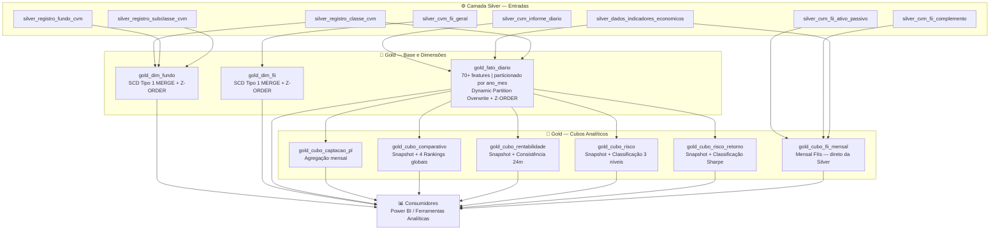

# 🥇 Camada Gold — Documentação Técnica

> **Projeto:** Pipeline de Dados do Mercado Financeiro Brasileiro
> **Arquitetura:** Medallion (Bronze → Silver → Gold)
> **Plataforma:** Databricks + Delta Lake + Apache Spark
> **Namespace:** `workspace.case_spark_cvm`

---

## 1. Visão Geral

### TL;DR
A camada Gold materializa 9 tabelas analíticas prontas para consumo por ferramentas de BI — incluindo uma fato diária com 70+ features de risco e retorno, 2 dimensões cadastrais e 6 cubos analíticos especializados —, transformando dados curados da Silver em inteligência financeira acionável sobre fundos de investimento brasileiros.

### Objetivo da Camada
A Gold é a camada de **entrega de valor**. Ela recebe dados limpos, tipados e únicos da Silver e os transforma em dois grupos distintos de artefatos: uma **fato diária desnormalizada** com todos os indicadores financeiros calculados por fundo e por dia, e um conjunto de **cubos analíticos temáticos** (rentabilidade, risco, captação, comparativo, FIIs) que materializam snapshots e agregações prontos para consumo direto por Power BI ou outras ferramentas analíticas. Os dados não são mais transformados: são **entregues**.

### Papel na Arquitetura Medallion
Na arquitetura Medallion, a Gold é a **camada de consumo**. Enquanto a Silver garante confiança e tipo correto, a Gold garante **relevância e performance**. Ela aplica as regras de negócio financeiras mais complexas (Sharpe, Sortino, VaR, Alpha, drawdown histórico, consistência de retorno, CDI acumulado composto), desnormaliza relacionamentos para eliminar joins em tempo de consulta e organiza os dados em modelos analíticos temáticos que respondem diretamente às perguntas do negócio. A Gold não deve ser confundida com um data mart: ela é a camada final que alimenta data marts ou é consumida diretamente por ferramentas de BI com semântica de modelo estrela.

### Responsabilidades da Camada
- Calcular todos os indicadores financeiros derivados: retornos acumulados (21d/63d/126d/252d/desde início), volatilidades anualizadas, drawdown histórico e em 1 ano, VaR 95%, Sharpe, Sortino, Alpha por benchmark dinâmico.
- Normalizar benchmarks declarados em texto livre pelos fundos na CVM em categorias padronizadas (CDI, IPCA, Selic, Ibovespa, outros).
- Construir a fato diária filtrada (fundos não-FII) e particionada por `ano_mes` para performance de leitura.
- Produzir cubos analíticos temáticos como visões materializadas desnormalizadas.
- Manter dimensões cadastrais com atualização SCD Tipo 1.
- Calcular indicadores específicos para FIIs (dividend yield, rentabilidade efetiva vs. CDI, composição do ativo imobiliário) em pipeline separado.
- Garantir performance de leitura via Z-ORDER aplicado após cada escrita.

### Como ela se relaciona com as demais camadas

| Camada | Relação |
|---|---|
| **Silver** | Fonte exclusiva de dados curados; Gold nunca lê diretamente da Bronze |
| **Gold (esta)** | Entrega de valor: features financeiras calculadas, dimensões de contexto e cubos analíticos temáticos |
| **`gold_fato_diario`** | Hub central da camada: serve de fonte para 5 dos 6 cubos analíticos (exceto `gold_cubo_fii_mensal`) |
| **Consumidores** | Power BI, ferramentas analíticas, modelos de risco — consomem as tabelas Gold diretamente sem transformação adicional |

---

## 2. Arquitetura da Camada e Fluxo de Dados

### Entradas Recebidas

| Tabela Silver | Tabela(s) Gold Produzidas |
|---|---|
| `silver_cvm_informe_diario` | `gold_fato_diario` |
| `silver_dados_indicadores_economicos` | `gold_fato_diario`, `gold_cubo_fii_mensal` |
| `silver_registro_classe_cvm` | `gold_fato_diario`, `gold_dim_fundo` |
| `silver_registro_fundo_cvm` | `gold_dim_fundo` |
| `silver_registro_subclasse_cvm` | `gold_dim_fundo` |
| `silver_cvm_fii_geral` | `gold_dim_fii` |
| `silver_cvm_fii_ativo_passivo` | `gold_cubo_fii_mensal` |
| `silver_cvm_fii_complemento` | `gold_cubo_fii_mensal` |
| `gold_fato_diario` *(tabela Gold intermediária)* | `gold_cubo_captacao_pl`, `gold_cubo_comparativo`, `gold_cubo_rentabilidade`, `gold_cubo_risco`, `gold_cubo_risco_retorno` |

### Processamentos Realizados

**Grupo 1 — Tabela Base e Dimensões (consumidas diretamente da Silver):**
1. **`gold_fato_diario`:** Join triple (informe diário + indicadores econômicos + classe CVM) → filtro de FIIs → normalização de benchmarks → 70+ features calculadas via Window Functions → escrita particionada por `ano_mes`.
2. **`gold_dim_fundo`:** Join triple (classe + fundo + subclasse) → deduplicação por CNPJ (`data_inicio` DESC) → criação de `benchmark_normalizado` e `benchmark_disponivel` → SCD Tipo 1 via MERGE.
3. **`gold_dim_fii`:** Leitura de FII geral → normalização de `tipo_fundo_classe` nulo → priorização Classe > Fundo → snapshot mais recente por CNPJ → SCD Tipo 1 via MERGE.

**Grupo 2 — Cubos Analíticos (derivados de `gold_fato_diario`):**
4. **`gold_cubo_captacao_pl`:** Agregação mensal de captação/resgate/PL + snapshot do último dia do mês + variação de cotistas + flag de captação negativa.
5. **`gold_cubo_comparativo`:** Snapshot da última data por fundo + `.coalesce(1)` + 4 rankings globais (retorno 1a, captação 1a, Sharpe, volatilidade).
6. **`gold_cubo_rentabilidade`:** Snapshot da última data + consistência de retorno calculada sobre 24 meses históricos via `min_by`/`max_by`.
7. **`gold_cubo_risco`:** Snapshot da última data + identificação da data do drawdown máximo histórico + classificação de risco em 3 níveis.
8. **`gold_cubo_risco_retorno`:** Snapshot da última data + classificação qualitativa do Índice de Sharpe em 4 níveis.

**Grupo 3 — Cubo FII (derivado diretamente da Silver, sem passar pela fato):**
9. **`gold_cubo_fii_mensal`:** Join triple (complemento + ativo/passivo + indicadores econômicos) → CDI acumulado mensal e 12m → rentabilidade efetiva/patrimonial/DY → Alpha vs. CDI → variações de PL e VPC → cotistas com forward fill → composição do ativo.

### Saídas Produzidas
9 tabelas Delta Lake no namespace `workspace.case_spark_cvm`.

### Fluxo de Dados



### Motivo das Escolhas Arquiteturais

**Hub Central (`gold_fato_diario` como fonte dos cubos):** Em vez de cada cubo recalcular as 70+ features base (retornos, volatilidade, Sharpe, drawdown) independentemente a partir da Silver, todos os cubos de fundos convencionais leem a `gold_fato_diario` já enriquecida. Isso elimina reprocessamento redundante em 5 notebooks distintos, garante consistência (um único ponto de verdade para Sharpe, VaR, alpha) e reduz a carga computacional total do pipeline.

**Separação FII/fundo convencional em tabelas distintas:** FIIs têm métricas específicas (dividend yield, composição de ativo imobiliário, rentabilidade efetiva vs. patrimonial, cotistas por categoria) que não existem na fato de fundos convencionais. Unificá-los criaria schema sparse com dezenas de colunas nulas para todos os registros. A separação em `gold_cubo_fii_mensal` e `gold_fato_diario` respeita a semântica de domínio e mantém schemas densos e coerentes.

**Full Overwrite para cubos vs. MERGE para dimensões:** Cubos analíticos são sempre recomputados do zero a partir da fato, que é a fonte de verdade. MERGE seria ineficiente para cubos — toda linha pode mudar, pois são derivadas de janelas históricas deslizantes. Dimensões, por outro lado, são tabelas de lookup estáticas que evoluem incrementalmente: MERGE SCD Tipo 1 preserva registros não alterados e aplica apenas mudanças cadastrais.

---

## 3. Estrutura Física dos Dados

### Formato dos Arquivos
Todas as tabelas Gold são armazenadas em **formato Delta Lake** com transaction log `_delta_log`, gerenciadas no Unity Catalog Databricks. Internamente, arquivos Parquet com columnar storage e compressão automática.

### Tipo de Armazenamento
Tabelas gerenciadas via `saveAsTable` no namespace `workspace.case_spark_cvm`, referenciáveis via `spark.table()` e SQL no Databricks.

### Estratégia de Particionamento

| Tabela | Particionamento | Coluna | Formato | Justificativa |
|---|---|---|---|---|
| `gold_fato_diario` | **Sim** | `ano_mes` | String "yyyy-MM" (ex: "2026-01") | Série temporal com crescimento contínuo; particionamento mensal permite Dynamic Partition Overwrite sem reescrever o histórico completo |
| Demais 8 tabelas Gold | **Não** | — | — | Tabelas de snapshot ou agregadas; volume compatível com Z-ORDER sem necessidade de particionamento adicional; cubos recomputados via full overwrite |

### Estratégia de Z-ORDER por Tabela

| Tabela | Colunas Z-ORDER | Padrão de Consulta Otimizado |
|---|---|---|
| `gold_fato_diario` | `cnpj_fundo_classe`, `dt_comptc` | Filtros por fundo + data de competência |
| `gold_dim_fundo` | `cnpj_fundo_classe` | Lookup por CNPJ |
| `gold_dim_fii` | `cnpj_fundo_classe` | Lookup por CNPJ |
| `gold_cubo_captacao_pl` | `cnpj_fundo_classe`, `ano_mes` | Análise temporal de um fundo específico |
| `gold_cubo_comparativo` | `cnpj_fundo_classe`, `rank_retorno_1a` | Filtro por fundo + ordenação por ranking |
| `gold_cubo_fii_mensal` | `cnpj_fundo_classe` | Análise de um FII específico |
| `gold_cubo_rentabilidade` | `cnpj_fundo_classe` | Análise de rentabilidade por fundo |
| `gold_cubo_risco` | `cnpj_fundo_classe`, `classificacao_risco` | Filtro por fundo ou por nível de risco |
| `gold_cubo_risco_retorno` | `cnpj_fundo_classe`, `classificacao_sharpe` | Filtro por fundo ou por classificação Sharpe |

### Convenções de Nomenclatura

| Elemento | Padrão | Exemplos |
|---|---|---|
| Tabela fato | `gold_fato_{granularidade}` | `gold_fato_diario` |
| Tabela dimensão | `gold_dim_{entidade}` | `gold_dim_fundo`, `gold_dim_fii` |
| Tabela cubo | `gold_cubo_{tema}` | `gold_cubo_captacao_pl`, `gold_cubo_risco` |
| Colunas | `snake_case` (herdado da Silver) | `vl_patrim_liq`, `dt_comptc` |
| Coluna de partição | `ano_mes` | String "yyyy-MM" gerado com `date_format` |
| Flags booleanos | `flag_{descricao}` com valores "S"/"N" | `flag_captacao_negativa`, `flag_fundo_novo` |
| Classificações textuais | `classificacao_{metrica}` | `classificacao_risco`, `classificacao_sharpe` |
| Rankings | `rank_{metrica}` | `rank_retorno_1a`, `rank_sharpe_1a` |
| Percentuais de composição | `pct_{descricao}` | `pct_cotistas_pf`, `pct_imoveis_ativo` |
| Alpha por horizonte | `alpha_{Nd}` | `alpha_21d`, `alpha_252d` |

### Benefícios das Decisões

**Particionamento por `ano_mes` na fato:** Permite que o Dynamic Partition Overwrite reescreva apenas os meses processados, sem tocar no histórico completo. Em reprocessamentos pontuais, isola completamente o impacto temporal.

**Z-ORDER em todas as tabelas:** Garante clustering físico das colunas de maior seletividade (CNPJ, data, classificação) nos arquivos Parquet, ativando Data Skipping no Databricks para leituras parciais.

**`overwriteSchema: true` nos cubos:** Suporta evolução de schema sem quebras de pipeline ao adicionar novos indicadores — a próxima execução sobrescreve com o schema atualizado automaticamente.

---

## 4. Modelo de Dados

### 4.1 `gold_fato_diario`

**Descrição:** Série temporal diária de todos os fundos de investimento não-FII ativos na CVM, enriquecida com 70+ features financeiras: retornos em múltiplos horizontes, volatilidades anualizadas, drawdown histórico, VaR, Sharpe, Sortino e Alpha por benchmark dinâmico. É o hub central da camada Gold, servindo de fonte para 5 cubos analíticos.
**Chave de negócio:** `cnpj_fundo_classe` + `dt_comptc`
**Granularidade:** Um registro por fundo por dia de competência
**Particionamento:** `ano_mes` (String "yyyy-MM")
**Exclusão explícita:** Fundos do tipo `"Classes de Cotas de Fundos FII"` são filtrados — processados em `gold_cubo_fii_mensal`

**Dicionário de Dados:**

*Bloco 1 — Identificação e Registro Bruto (da Silver)*

| Campo | Tipo | Descrição |
|---|---|---|
| `cnpj_fundo_classe` | String | CNPJ normalizado do fundo (14 dígitos, sem máscara) |
| `tp_fundo_classe` | String | Tipo regulatório do fundo (ex: "CLASSES - FIF") |
| `id_subclasse` | String | Identificador de subclasse (null para fundos sem subclasse) |
| `dt_comptc` | Date | Data de competência do informe diário |
| `vl_total` | Decimal(38,2) | Valor total da carteira no dia |
| `vl_quota` | Decimal(38,11) | Valor da cota (alta precisão para cálculo de retorno) |
| `vl_patrim_liq` | Decimal(38,2) | Patrimônio líquido no dia |
| `captc_dia` | Decimal(38,2) | Captações brutas do dia |
| `resg_dia` | Decimal(38,2) | Resgates do dia |
| `nr_cotst` | Long | Número de cotistas no dia |
| `indicador_desempenho` | String | Benchmark declarado pelo fundo na CVM (texto livre original) |
| `benchmark_normalizado` | String | Benchmark categorizado: "CDI", "IPCA", "Selic", "Ibovespa", "IGP-M", "TR", "Dolar", "SEM_BENCHMARK", "NAO_DISPONIVEL" |
| `ano_mes` | String | Coluna de partição, formato "yyyy-MM" (ex: "2026-01") |

*Bloco 2 — Indicadores Econômicos do Dia (da Silver)*

| Campo | Tipo | Descrição |
|---|---|---|
| `selic_anual` | Decimal(10,4) | Taxa SELIC anual (%) — renomeada de `valor_selic` |
| `cdi_diario` | Decimal(10,6) | Taxa CDI diária (%) — renomeada de `valor_cdi` |
| `ipca_mensal` | Decimal(10,4) | Variação IPCA mensal vigente (forward-filled da Silver) |
| `ipca_anual` | Decimal(10,4) | IPCA acumulado dos últimos 12 meses |
| `ibov_close` | Decimal(18,2) | Fechamento do IBOVESPA no dia |
| `indice_cdi` | Decimal(20,8) | Índice acumulado CDI desde início da série (da Silver) |
| `indice_selic` | Decimal(20,8) | Índice acumulado SELIC desde início da série (da Silver) |
| `indice_ipca` | Decimal(20,8) | Índice acumulado IPCA desde início da série (da Silver) |
| `selic_diaria` | Double | SELIC desanualizada: `pow(1 + selic_anual/100, 1/252) - 1` |
| `ipca_diario` | Double | IPCA desmensal: `pow(1 + ipca_mensal/100, 1/21) - 1` |

*Bloco 3 — Retornos do Fundo (derivados)*

| Campo | Tipo | Descrição |
|---|---|---|
| `retorno_diario` | Double | Retorno do dia: `vl_quota / lag(vl_quota, 1) - 1` |
| `retorno_21d` | Double | Retorno acumulado ~1 mês (21 pregões) |
| `retorno_63d` | Double | Retorno acumulado ~3 meses (63 pregões) |
| `retorno_126d` | Double | Retorno acumulado ~6 meses (126 pregões) |
| `retorno_252d` | Double | Retorno acumulado ~1 ano (252 pregões) |
| `retorno_inicio` | Double | Retorno desde a primeira cota disponível na série (`first` over unboundedPreceding) |
| `captacao_liquida_dia` | Decimal | `captc_dia - resg_dia` |
| `captacao_liquida_21d` | Double | Captação líquida acumulada em 21 dias |
| `captacao_liquida_252d` | Double | Captação líquida acumulada em 252 dias |
| `variacao_cotistas` | Double | Variação percentual diária no número de cotistas |

*Bloco 4 — Métricas de Risco (derivadas)*

| Campo | Tipo | Descrição |
|---|---|---|
| `volatilidade_21d` | Double | Volatilidade anualizada janela 21d: `stddev(retorno_diario) * sqrt(252)` |
| `volatilidade_63d` | Double | Volatilidade anualizada janela 63d |
| `volatilidade_252d` | Double | Volatilidade anualizada janela 252d |
| `max_quota_historico` | Decimal(38,11) | Pico histórico do valor da cota (max over unboundedPreceding) |
| `drawdown` | Double | Queda percentual em relação ao pico: `vl_quota / max_quota_historico - 1` |
| `drawdown_maximo_252d` | Double | Pior drawdown nos últimos 252 pregões |
| `drawdown_maximo_historico` | Double | Pior drawdown desde o início do fundo |
| `retorno_negativo_diario` | Double | `retorno_diario` quando < 0; 0 caso contrário (insumo para Sortino) |
| `downside_deviation_252d` | Double | Desvio padrão anualizado apenas dos retornos negativos — janela 252d |
| `var_95_252d` | Double | VaR Histórico 95%: percentil 5% dos retornos diários (252 dias) via `percentile_approx` |
| `flag_fundo_novo` | String | "S" se fundo tem menos de 90 dias de histórico; "N" caso contrário |
| `flag_resgate_consistente` | String | "S" se `captacao_liquida_21d < 0` (saída de recursos no mês); "N" c.c. |

*Bloco 5 — Benchmarks Acumulados por Horizonte (derivados)*

| Campo | Tipo | Descrição |
|---|---|---|
| `cdi_acum_21d` / `_63d` / `_126d` / `_252d` | Double | CDI acumulado no período: `indice_cdi / lag(indice_cdi, N) - 1` |
| `selic_acum_21d` / `_63d` / `_126d` / `_252d` | Double | SELIC acumulada no período |
| `ipca_acum_21d` / `_63d` / `_126d` / `_252d` | Double | IPCA acumulado no período |
| `ibov_retorno_21d` / `_63d` / `_126d` / `_252d` | Double | Retorno do IBOVESPA: `ibov_close / lag(ibov_close, N) - 1` |
| `retorno_benchmark_21d` / `_63d` / `_126d` / `_252d` | Double | Retorno do benchmark declarado pelo fundo no período (CDI, Selic, IPCA ou Ibovespa conforme `benchmark_normalizado`) |

*Bloco 6 — Alpha e Indicadores Ajustados ao Risco (derivados)*

| Campo | Tipo | Descrição |
|---|---|---|
| `alpha_21d` / `alpha_63d` / `alpha_126d` / `alpha_252d` | Double | Excesso de retorno do fundo sobre seu benchmark declarado: `retorno_Nd - retorno_benchmark_Nd` |
| `sharpe_252d` | Double | Índice de Sharpe 252d: `(retorno_252d - selic_acum_252d) / volatilidade_252d` |
| `sortino_252d` | Double | Índice de Sortino 252d: `(retorno_252d - selic_acum_252d) / downside_deviation_252d` |

---

### 4.2 `gold_dim_fundo`

**Descrição:** Dimensão mestre de fundos de investimento (exceto FIIs). Une dados cadastrais de classe, fundo-pai e subclasse em uma única linha por CNPJ. Adiciona `benchmark_normalizado` e `benchmark_disponivel` para eliminar lógica de negócio no BI sobre benchmarks.
**Chave de negócio (PK):** `cnpj_fundo_classe`
**Granularidade:** Um registro por fundo/classe (visão atual — SCD Tipo 1)
**Estratégia de escrita:** MERGE (whenMatchedUpdateAll + whenNotMatchedInsertAll) + OPTIMIZE ZORDER

| Campo | Tipo | Descrição |
|---|---|---|
| `cnpj_fundo_classe` | String | CNPJ da classe — chave primária da dimensão |
| `id_subclasse` | String | ID da subclasse (FK para `silver_registro_subclasse_cvm`) |
| `id_registro_classe` | Integer | ID do registro de classe (FK para `silver_registro_classe_cvm`) |
| `id_registro_fundo` | Integer | ID do registro de fundo (FK para `silver_registro_fundo_cvm`) |
| `denominacao_social` | String | Nome do fundo: `coalesce(sc.denominacao_social, fu.denominacao_social)` — fallback para o nome do fundo quando subclasse não existe |
| `situacao` | String | Situação cadastral atual (ex: "Em Funcionamento Normal") — da tabela classe |
| `data_inicio` | Date | Data de início de operação (da subclasse) |
| `tipo_fundo` | String | Tipo do fundo (ex: "FI", "FIC") — do fundo-pai |
| `tipo_classe` | String | Tipo da classe (ex: "Renda Fixa", "Ações") |
| `classe_cotas` | String | Classificação de cotas |
| `classificacao` | String | Classificação CVM |
| `classificacao_anbima` | String | Classificação ANBIMA |
| `forma_condominio` | String | Forma de condomínio (aberto/fechado) |
| `classe_esg` | String | Indicador de mandato ESG |
| `exclusivo` | String | Indicador de fundo exclusivo |
| `publico_alvo` | String | Público-alvo do fundo |
| `custodiante` | String | Nome do custodiante |
| `gestor` | String | Nome do gestor — do fundo-pai |
| `administrador` | String | Nome do administrador — do fundo-pai |
| `indicador_desempenho` | String | Benchmark declarado na CVM (texto livre original) |
| `benchmark_normalizado` | String | Benchmark padronizado: "CDI", "IPCA", "Selic", "Ibovespa", "IGP-M", "TR", "Dolar", "SEM_BENCHMARK", "NAO_DISPONIVEL" |
| `benchmark_disponivel` | String | "S" se `benchmark_normalizado` ∈ {CDI, Selic, IPCA, Ibovespa}; "N" c.c. — flag para filtrar fundos com benchmark comparável |

---

### 4.3 `gold_dim_fii`

**Descrição:** Dimensão cadastral de Fundos de Investimento Imobiliário (FIIs). Resolve a duplicidade Fundo/Classe da RCVM 175 e materializa o snapshot mais recente por CNPJ como tabela de lookup em dashboards FII.
**Chave de negócio (PK):** `cnpj_fundo_classe`
**Granularidade:** Um registro por FII (visão atual — SCD Tipo 1)

| Campo | Tipo | Descrição |
|---|---|---|
| `cnpj_fundo_classe` | String | CNPJ normalizado do FII — chave primária |
| `nome_fundo_classe` | String | Nome oficial do FII |
| `tipo_fundo_classe` | String | "Classe" ou "Fundo" (null → normalizado para "Fundo") |
| `codigo_isin` | String | Código ISIN das cotas negociadas em bolsa |
| `mandato` | String | Mandato de investimento (Renda, Desenvolvimento, etc.) |
| `segmento_atuacao` | String | Segmento de atuação (Lajes Corporativas, Logística, Recebíveis, etc.) |
| `tipo_gestao` | String | Tipo de gestão (ativa/passiva) |
| `publico_alvo` | String | Público-alvo |
| `prazo_duracao` | String | Prazo de duração do fundo |
| `mercado_negociacao_bolsa` | String | Indicador de negociação em bolsa (B3) |
| `mercado_negociacao_mb` | String | Indicador de negociação no mercado de balcão |
| `fundo_exclusivo` | String | Indicador de fundo exclusivo |
| `cotistas_vinculo_familiar` | String | Indicador de cotistas com vínculo familiar |
| `nome_administrador` | String | Nome do administrador |
| `cnpj_administrador` | String | CNPJ do administrador |
| `data_funcionamento` | Date | Data de início de funcionamento |
| `cidade` | String | Cidade do administrador |
| `estado` | String | Estado do administrador |

---

### 4.4 `gold_cubo_captacao_pl`

**Descrição:** Cubo analítico mensal de captação e patrimônio líquido. Agrega fluxo de caixa (captação bruta, resgate, captação líquida) e PL por mês, com snapshot do último dia útil e variação de cotistas. Habilita análise de tendência de captação e identificação de fundos em situação de resgate consistente.
**Chave de negócio:** `cnpj_fundo_classe` + `ano_mes`
**Granularidade:** Um registro por fundo por mês
**Fonte:** `gold_fato_diario`

| Campo | Tipo | Descrição |
|---|---|---|
| `cnpj_fundo_classe` | String | CNPJ do fundo |
| `ano_mes` | Date | Primeiro dia do mês de referência (`date_trunc("month", dt_comptc)`) |
| `pl_ultimo_dia_mes` | Decimal | PL no último dia útil do mês (via `row_number DESC` por fundo/mês) |
| `pl_medio_mes` | Double | PL médio do mês (`avg(vl_patrim_liq)`) |
| `captacao_bruta_mes` | Decimal | Soma das captações diárias no mês |
| `resgate_mes` | Decimal | Soma dos resgates diários no mês |
| `captacao_liquida_mes` | Decimal | `captacao_bruta_mes - resgate_mes` |
| `nr_cotistas_ultimo_dia` | Long | Número de cotistas no último dia útil do mês |
| `cotistas_mes_anterior` | Long | Número de cotistas no último dia do mês anterior (`lag` por fundo) |
| `variacao_cotistas_mes` | Long | Variação absoluta de cotistas: `nr_cotistas_ultimo_dia - cotistas_mes_anterior` |
| `flag_captacao_negativa` | String | "S" se `captacao_liquida_mes < 0`; "N" caso contrário |

---

### 4.5 `gold_cubo_comparativo`

**Descrição:** Cubo snapshot com a posição mais recente de cada fundo e 4 rankings globais comparativos. Permite comparação cross-fundo em termos de retorno, captação, relação risco-retorno (Sharpe) e volatilidade. `.coalesce(1)` é aplicado antes dos rankings para garantir ordenação global consistente.
**Chave de negócio:** `cnpj_fundo_classe`
**Granularidade:** Um registro por fundo (snapshot da última data disponível)

| Campo | Tipo | Descrição |
|---|---|---|
| `cnpj_fundo_classe` | String | CNPJ do fundo |
| `dt_referencia` | Date | Data da última cota disponível |
| `pl_atual` | Decimal | PL na data de referência |
| `retorno_21d` | Double | Retorno acumulado ~1 mês |
| `retorno_252d` | Double | Retorno acumulado ~1 ano |
| `captacao_liquida_252d` | Double | Captação líquida acumulada 1 ano |
| `sharpe_252d` | Double | Índice de Sharpe 1 ano |
| `volatilidade_252d` | Double | Volatilidade anualizada 1 ano |
| `nr_cotst` | Long | Número de cotistas na data de referência |
| `rank_retorno_1a` | Integer | Ranking global por retorno 1 ano (1 = melhor; `desc_nulls_last`) |
| `rank_captacao_1a` | Integer | Ranking global por captação líquida 1 ano (1 = maior captação; `desc_nulls_last`) |
| `rank_sharpe_1a` | Integer | Ranking global por Sharpe 1 ano (1 = melhor relação risco-retorno; `desc_nulls_last`) |
| `rank_volatilidade` | Integer | Ranking global por volatilidade 1 ano (1 = menor volatilidade; `asc_nulls_last`) |

---

### 4.6 `gold_cubo_rentabilidade`

**Descrição:** Cubo snapshot com indicadores de rentabilidade e performance relativa de cada fundo na data mais recente. Inclui retornos em múltiplos horizontes, Alpha sobre o benchmark declarado e consistência de retorno calculada sobre os últimos 24 meses de histórico mensal.
**Chave de negócio:** `cnpj_fundo_classe`
**Granularidade:** Um registro por fundo (snapshot da última data disponível)

| Campo | Tipo | Descrição |
|---|---|---|
| `cnpj_fundo_classe` | String | CNPJ do fundo |
| `dt_referencia` | Date | Data da última cota disponível |
| `retorno_diario` | Double | Retorno do último dia útil |
| `retorno_21d` | Double | Retorno acumulado ~1 mês |
| `retorno_63d` | Double | Retorno acumulado ~3 meses |
| `retorno_126d` | Double | Retorno acumulado ~6 meses |
| `retorno_252d` | Double | Retorno acumulado ~1 ano |
| `retorno_inicio` | Double | Retorno total desde o primeiro registro disponível |
| `retorno_benchmark_21d` / `_63d` / `_126d` / `_252d` | Double | Retorno do benchmark declarado pelo fundo no período |
| `alpha_21d` / `alpha_63d` / `alpha_126d` / `alpha_252d` | Double | Excesso de retorno sobre o benchmark no período |
| `benchmark_normalizado` | String | Benchmark do fundo (CDI, IPCA, Selic, Ibovespa, etc.) |
| `consistencia_retorno` | Double | Proporção de meses com retorno positivo nos últimos 24 meses (0.0 a 1.0) |

---

### 4.7 `gold_cubo_risco`

**Descrição:** Cubo snapshot com indicadores de risco de cada fundo na data mais recente: volatilidades anualizadas em múltiplos horizontes, drawdowns máximos, VaR histórico e a data exata do drawdown máximo histórico. Inclui classificação automática de risco em três categorias baseada na volatilidade anualizada de 1 ano.
**Chave de negócio:** `cnpj_fundo_classe`
**Granularidade:** Um registro por fundo (snapshot da última data disponível)

| Campo | Tipo | Descrição |
|---|---|---|
| `cnpj_fundo_classe` | String | CNPJ do fundo |
| `dt_referencia` | Date | Data da última cota disponível |
| `volatilidade_21d` | Double | Volatilidade anualizada janela 1 mês |
| `volatilidade_63d` | Double | Volatilidade anualizada janela 3 meses |
| `volatilidade_252d` | Double | Volatilidade anualizada janela 1 ano |
| `drawdown_maximo_252d` | Double | Pior drawdown nos últimos 252 pregões |
| `drawdown_maximo_historico` | Double | Pior drawdown desde o início do fundo |
| `data_drawdown_maximo` | Date | Data em que o drawdown máximo histórico foi atingido (via `Window.orderBy(drawdown ASC, dt_comptc DESC)`) |
| `var_95_252d` | Double | VaR Histórico 95%: percentil 5% dos retornos diários em 252 dias |
| `classificacao_risco` | String | "BAIXO" (`vol < 0.02`), "MÉDIO" (`0.02 ≤ vol ≤ 0.10`), "ALTO" (`vol > 0.10`) |

---

### 4.8 `gold_cubo_risco_retorno`

**Descrição:** Cubo snapshot focado na relação risco-retorno de cada fundo. Reúne os dois eixos fundamentais da avaliação de fundos com os índices ajustados ao risco (Sharpe e Sortino) e classificação qualitativa automática da qualidade da relação risco-retorno.
**Chave de negócio:** `cnpj_fundo_classe`
**Granularidade:** Um registro por fundo (snapshot da última data disponível)

| Campo | Tipo | Descrição |
|---|---|---|
| `cnpj_fundo_classe` | String | CNPJ do fundo |
| `dt_referencia` | Date | Data da última cota disponível |
| `retorno_252d` | Double | Retorno acumulado 1 ano |
| `volatilidade_252d` | Double | Volatilidade anualizada 1 ano |
| `vl_patrim_liq` | Decimal | PL na data de referência |
| `sharpe_252d` | Double | Índice de Sharpe 1 ano |
| `sortino_252d` | Double | Índice de Sortino 1 ano |
| `classificacao_sharpe` | String | "RUIM" (`< 0`), "REGULAR" (`0–1`), "BOM" (`1–2`), "EXCELENTE" (`≥ 2`) |

---

### 4.9 `gold_cubo_fii_mensal`

**Descrição:** Cubo analítico mensal exclusivo para Fundos de Investimento Imobiliário. Não deriva da `gold_fato_diario` — consome diretamente tabelas Silver de FIIs. Calcula indicadores específicos do segmento: dividend yield, rentabilidade efetiva vs. patrimonial, comparativo vs. CDI, variações de patrimônio, cotistas por categoria com forward fill e composição do ativo imobiliário.
**Chave de negócio:** `cnpj_fundo_classe` + `data_referencia`
**Granularidade:** Um registro por FII por mês de referência

*Bloco 1 — Identificação*

| Campo | Tipo | Descrição |
|---|---|---|
| `cnpj_fundo_classe` | String | CNPJ do FII |
| `data_referencia` | Date | Mês de referência do informe |
| `ano_mes` | Date | `date_trunc("month", data_referencia)` |

*Bloco 2 — Rentabilidade e Comparativo CDI*

| Campo | Tipo | Descrição |
|---|---|---|
| `rentabilidade_efetiva_mes` | Double | Rentabilidade efetiva no mês (%) — da silver_complemento |
| `rentabilidade_patrimonial_mes` | Double | Rentabilidade patrimonial no mês (%) |
| `dividend_yield_mes` | Double | Dividend yield mensal (%) |
| `rentabilidade_efetiva_12m` | Double | Rentabilidade efetiva acumulada 12 meses via `exp(sum(log(1 + r)))` |
| `dividend_yield_12m` | Double | Dividend yield acumulado 12 meses (soma simples) |
| `cdi_acum_mes` | Double | CDI acumulado no mês via `exp(sum(log(1 + cdi_dia/100))) - 1` |
| `alpha_vs_cdi_mes` | Double | `rentabilidade_efetiva_mes - cdi_acum_mes` |
| `alpha_vs_cdi_12m` | Double | `rentabilidade_efetiva_12m - cdi_acum_12m` |

*Bloco 3 — Patrimônio e Cotas*

| Campo | Tipo | Descrição |
|---|---|---|
| `patrimonio_liquido` | Decimal(22,2) | PL do FII no mês |
| `valor_ativo` | Decimal(22,2) | Valor do ativo total |
| `cotas_emitidas` | Decimal(22,2) | Quantidade de cotas emitidas |
| `valor_patrimonial_cotas` | Decimal(22,2) | Valor patrimonial por cota (VPC) |
| `variacao_pl_mes` | Double | `patrimonio_liquido / lag(patrimonio_liquido) - 1` (via `try_divide`) |
| `variacao_vpc_mes` | Double | `valor_patrimonial_cotas / lag(valor_patrimonial_cotas) - 1` (via `try_divide`) |
| `taxa_administracao_pct` | Double | Taxa de administração (%) — renomeada de `percentual_despesas_taxa_administracao` |
| `amortizacao_cotas_mes` | Double | Amortização de cotas no mês (%) — renomeada de `percentual_amortizacao_cotas_mes` |

*Bloco 4 — Cotistas*

| Campo | Tipo | Descrição |
|---|---|---|
| `total_cotistas` | Integer | Total de cotistas (forward-filled via `last(..., ignorenulls=True)`) |
| `cotistas_pessoa_fisica` | Integer | Cotistas PF (forward-filled) |
| `cotistas_pessoa_juridica` | Integer | Cotistas PJ não financeira (forward-filled) |
| `cotistas_investidores_nao_residentes` | Integer | Cotistas não residentes (forward-filled) |
| `cotistas_previdencia` | Integer | Soma de entidades de previdência aberta e fechada (`coalesce(..., 0) + coalesce(..., 0)`) |
| `cotistas_outros_fundos` | Integer | Cotistas de outros fundos (forward-filled) |
| `pct_cotistas_pf` | Double | `cotistas_pessoa_fisica / total_cotistas` (proteção: somente quando total > 0) |
| `variacao_cotistas_mes` | Integer | `total_cotistas - lag(total_cotistas)` |

*Bloco 5 — Composição do Ativo*

| Campo | Tipo | Descrição |
|---|---|---|
| `total_necessidades_liquidez` | Decimal | Total de necessidades de liquidez (fillna(0) aplicado) |
| `disponibilidades` | Decimal | Disponibilidades em caixa (fillna(0) aplicado) |
| `total_investido` | Decimal | Total investido pelo FII (fillna(0) aplicado) |
| `direitos_bens_imoveis` | Decimal | Investimentos em imóveis físicos (fillna(0) aplicado) |
| `imoveis_renda_acabados` | Decimal | Imóveis de renda acabados |
| `imoveis_renda_construcao` | Decimal | Imóveis de renda em construção |
| `cri` | Decimal | Certificados de Recebíveis Imobiliários (fillna(0) aplicado) |
| `lci` | Decimal | Letras de Crédito Imobiliário (fillna(0) aplicado) |
| `fii` | Decimal | Cotas de outros FIIs (fillna(0) aplicado) |
| `total_passivo` | Decimal | Total do passivo (fillna(0) aplicado) |
| `pct_imoveis_ativo` | Double | `direitos_bens_imoveis / total_investido` (quando `total_investido > 0`) |
| `pct_papel_ativo` | Double | `(cri + lci + lci_lca) / total_investido` — FIIs de recebíveis |
| `pct_fii_ativo` | Double | `fii / total_investido` — FIIs de fundos |
| `pct_liquidez` | Double | `total_necessidades_liquidez / total_investido` |

---

## 5. Regras de Qualidade dos Dados

A camada Gold não implementa quarentena explícita (papel exclusivo da Silver). No entanto, diversas regras de proteção são aplicadas nas transformações:

| Regra | Implementação | Tabelas Afetadas |
|---|---|---|
| **Proteção contra divisão por zero** | `f.try_divide()` em todos os cálculos de retorno, Sharpe, Sortino e variações percentuais — retorna null em vez de exceção | `gold_fato_diario`, `gold_cubo_fii_mensal` |
| **Exclusão de FIIs da fato diária** | `.filter(f.col("tipo_classe") != "Classes de Cotas de Fundos FII")` antes de qualquer cálculo | `gold_fato_diario` |
| **Normalização de nulos em `tipo_fundo_classe`** | `.when(isNull, "Fundo").otherwise(col)` — evita nulos na dimensão FII | `gold_dim_fii` |
| **`fillna(0)` em ativo/passivo** | `fillna(0)` em 10 colunas de ativo/passivo antes dos cálculos de percentual | `gold_cubo_fii_mensal` |
| **Forward fill de cotistas** | `f.last("col", ignorenulls=True).over(window)` com `rowsBetween(unboundedPreceding, 0)` | `gold_cubo_fii_mensal` |
| **Proteção de `log` em rentabilidade 12m** | `.when(f.col("rentabilidade_efetiva_mes") > -1, 1 + col)` antes do `log` — evita log(0) ou log de negativo | `gold_cubo_fii_mensal` |
| **Proteção de nulos em rentabilidade 12m** | `.when(f.col("rentabilidade_efetiva_mes").isNotNull(), exp(...))` | `gold_cubo_fii_mensal` |
| **Deduplicação de CNPJ na dimensão de fundos** | `row_number() OVER (PARTITIONBY cnpj ORDER BY data_inicio DESC)` + `filter == 1` | `gold_dim_fundo` |
| **Deduplicação Classe > Fundo na dimensão FII** | `prioridade_tipo = 1` para "Classe", `= 2` para "Fundo"; `row_number()` + `filter == 1` por CNPJ + data; segunda janela para snapshot mais recente por CNPJ | `gold_dim_fii` |

---

## 6. Transformações Aplicadas

### 6.1 Filtro de FIIs na Fato Diária

```python
gold_fato_diario = df_diario_silver\
    .join(df_classe_silver, df_diario_silver.cnpj_fundo_classe == df_classe_silver.cnpj_classe, "left")\
    .filter(f.col("tipo_classe") != "Classes de Cotas de Fundos FII")
```
**Objetivo:** FIIs são processados em pipeline separado com granularidade mensal e indicadores próprios. Incluí-los na fato diária misturaria regimes de análise distintos e criaria schema sparse — FIIs reportam patrimônio e cotas de forma diferente dos fundos convencionais.

### 6.2 Normalização de Benchmark por CASE WHEN Ordenado

```python
df_classe_silver = df_classe_silver.withColumn(
    "benchmark_normalizado",
    f.when(f.col("indicador_desempenho").isin("DI de um dia", "Taxa Básica Financeira", ...), "CDI")
     .when(f.col("indicador_desempenho").contains("NTN-B"), "IPCA")  # NTN-B ANTES de .contains("Andima")
     .when(f.col("indicador_desempenho").isin("Índice de Preços ao Consumidor Amplo ...", ...), "IPCA")
     .when(f.col("indicador_desempenho").contains("Andima"), "CDI")   # genérica depois do NTN-B
     .when(f.col("indicador_desempenho").isin("Taxa Selic"), "Selic")
     .when(f.col("indicador_desempenho").isin("Ibovespa", "IBrX", "IBrX-50"), "Ibovespa")
     ...
     .otherwise("NAO_DISPONIVEL")
)
```
**Objetivo:** O campo `indicador_desempenho` da CVM contém texto livre com dezenas de variações para o mesmo índice. A normalização cria `benchmark_normalizado` em categorias controladas para calcular `retorno_benchmark_Nd` e `alpha_Nd` automaticamente. A ordem das regras é crítica: NTN-B deve ser classificada como IPCA *antes* de `.contains("Andima")`, pois títulos NTN-B contêm "Andima" no nome e seriam incorretamente classificados como CDI — este é um bug documentado no código (`gold_fato_diario.py` e `gold_dim_fundo.py`).

### 6.3 Retornos por Janela Deslizante

```python
window_spec = Window.partitionBy("cnpj_fundo_classe").orderBy("dt_comptc")

gold_fato_diario = gold_fato_diario\
    .withColumn("retorno_diario",
        f.try_divide(f.col("vl_quota"), f.lag("vl_quota", 1).over(window_spec)) - 1
    )\
    .withColumn("retorno_252d",
        f.try_divide(f.col("vl_quota"), f.lag("vl_quota", 252).over(window_spec)) - 1
    )\
    .withColumn("retorno_inicio",
        f.try_divide(f.col("vl_quota"), f.first("vl_quota").over(window_spec_first)) - 1
    )
```
**Objetivo:** Calcula retornos em múltiplos horizontes via razão de cotas. `f.try_divide` garante que divisões por zero ou nulo retornem null. `retorno_inicio` usa `first` com janela `unboundedPreceding` para capturar a primeira cota disponível da série do fundo.

### 6.4 Volatilidade Anualizada Rolling

```python
window_252d = Window.partitionBy("cnpj_fundo_classe").orderBy("dt_comptc").rowsBetween(-251, 0)

gold_fato_diario = gold_fato_diario\
    .withColumn("volatilidade_252d",
        f.stddev("retorno_diario").over(window_252d) * f.sqrt(f.lit(252))
    )
```
**Objetivo:** Calcula o desvio padrão dos retornos diários na janela de 252 pregões e anualiza pelo fator `sqrt(252)` — convenção de mercado para conversão de volatilidade diária em anual.

### 6.5 Drawdown e Pico Histórico

```python
window_inicio = Window.partitionBy("cnpj_fundo_classe").orderBy("dt_comptc")\
    .rowsBetween(Window.unboundedPreceding, 0)

gold_fato_diario = gold_fato_diario\
    .withColumn("max_quota_historico", f.max("vl_quota").over(window_inicio))\
    .withColumn("drawdown", f.try_divide(f.col("vl_quota"), f.col("max_quota_historico")) - 1)\
    .withColumn("drawdown_maximo_historico", f.min("drawdown").over(window_inicio))\
    .withColumn("drawdown_maximo_252d", f.min("drawdown").over(window_252d))
```
**Objetivo:** `max_quota_historico` captura o pico de valor da cota acumulado desde o início. `drawdown` mede a queda percentual atual em relação ao pico. `drawdown_maximo_historico` e `drawdown_maximo_252d` identificam o pior momento de queda na história total e no último ano, respectivamente.

### 6.6 Downside Deviation e VaR Histórico

```python
gold_fato_diario = gold_fato_diario\
    .withColumn("retorno_negativo_diario",
        f.when(f.col("retorno_diario") < 0, f.col("retorno_diario")).otherwise(0)
    )\
    .withColumn("downside_deviation_252d",
        f.stddev("retorno_negativo_diario").over(window_252d) * f.sqrt(f.lit(252))
    )\
    .withColumn("var_95_252d",
        f.percentile_approx("retorno_diario", 0.05).over(window_252d)
    )
```
**Objetivo:** `downside_deviation_252d` é o denominador do Índice de Sortino — mede risco apenas dos retornos negativos, penalizando fundos com quedas bruscas mesmo quando a volatilidade total é baixa. `var_95_252d` usa `percentile_approx` para estimar o quantil 5% dos retornos históricos (VaR Histórico 95%).

### 6.7 Índice de Sharpe e Sortino

```python
gold_fato_diario = gold_fato_diario\
    .withColumn("sharpe_252d",
        f.try_divide(f.col("retorno_252d") - f.col("selic_acum_252d"), f.col("volatilidade_252d"))
    )\
    .withColumn("sortino_252d",
        f.try_divide(f.col("retorno_252d") - f.col("selic_acum_252d"), f.col("downside_deviation_252d"))
    )
```
**Objetivo:** Sharpe mede retorno excedente sobre a taxa livre de risco (SELIC) por unidade de risco total. Sortino utiliza o mesmo numerador, mas refina o denominador para penalizar apenas volatilidade negativa — mais relevante para fundos com distribuições assimétricas de retorno.

### 6.8 Benchmarks Acumulados via Índice de Razão

```python
gold_fato_diario = gold_fato_diario\
    .withColumn("cdi_acum_252d",
        f.try_divide(f.col("indice_cdi"), f.lag("indice_cdi", 252).over(window_spec)) - 1
    )
```
**Objetivo:** Em vez de somar taxas diárias (incorreto para juros compostos), usa os índices acumulados da Silver e calcula variação em N dias via razão de índices. O método garante exatidão para qualquer horizonte sem necessidade de função `exp/log`.

### 6.9 Alpha por Benchmark Dinâmico

```python
gold_fato_diario = gold_fato_diario\
    .withColumn("retorno_benchmark_252d",
        f.when(f.col("benchmark_normalizado") == "CDI", f.col("cdi_acum_252d"))
         .when(f.col("benchmark_normalizado") == "Selic", f.col("selic_acum_252d"))
         .when(f.col("benchmark_normalizado") == "IPCA", f.col("ipca_acum_252d"))
         .when(f.col("benchmark_normalizado") == "Ibovespa", f.col("ibov_retorno_252d"))
    )\
    .withColumn("alpha_252d",
        f.col("retorno_252d") - f.col("retorno_benchmark_252d")
    )
```
**Objetivo:** Cada fundo é comparado ao seu próprio benchmark declarado. Um fundo de renda fixa CDI é avaliado contra o CDI do período; um fundo de ações, contra o IBOV. Isso torna o Alpha comparável entre fundos de diferentes categorias.

### 6.10 Consistência de Retorno com `min_by` / `max_by`

```python
window_24m = Window.partitionBy("cnpj_fundo_classe").orderBy("ano_mes").rowsBetween(-23, 0)

df_mensal = gold_fato_diario \
    .groupBy("cnpj_fundo_classe", "ano_mes") \
    .agg(
        f.expr("min_by(vl_quota, dt_comptc)").alias("quota_inicio_mes"),
        f.expr("max_by(vl_quota, dt_comptc)").alias("quota_fim_mes")
    ) \
    .withColumn("retorno_mensal",
        f.try_divide(f.col("quota_fim_mes"), f.col("quota_inicio_mes")) - 1
    ) \
    .withColumn("mes_positivo", f.when(f.col("retorno_mensal") > 0, 1).otherwise(0)) \
    .withColumn("consistencia_retorno", f.avg("mes_positivo").over(window_24m))
```
**Objetivo:** Mede a proporção de meses com retorno positivo nos últimos 24 meses. `min_by(vl_quota, dt_comptc)` é a expressão nativa Spark que retorna o valor de `vl_quota` correspondente ao mínimo de `dt_comptc` — captura a cota do primeiro dia sem Window Function adicional. Um fundo com `consistencia_retorno = 0.75` foi positivo em 18 dos últimos 24 meses.

### 6.11 Rankings Globais com `.coalesce(1)`

```python
window_retorno = Window.orderBy(f.col("retorno_252d").desc_nulls_last())
window_vol     = Window.orderBy(f.col("volatilidade_252d").asc_nulls_last())

gold_cubo_comparativo = gold_cubo_comparativo \
    .coalesce(1) \
    .withColumn("rank_retorno_1a", f.rank().over(window_retorno))\
    .withColumn("rank_volatilidade", f.rank().over(window_vol))
```
**Objetivo:** Rankings globais sem `partitionBy` ordenam todos os fundos entre si, exigindo que o DataFrame esteja em uma única partição. `.coalesce(1)` antes dos rankings evita shuffles caros em um DataFrame distribuído para estas 4 operações de Window global.

### 6.12 CDI Acumulado Mensal por Juros Compostos (FIIs)

```python
df_indicadores = df_indicadores_silver\
    .withColumn("fator_cdi_dia", 1 + f.coalesce(f.col("valor_cdi"), f.lit(0)) / 100)\
    .groupby("ano_mes")\
    .agg(
        (f.exp(f.sum(f.log(f.col("fator_cdi_dia")))) - 1).alias("cdi_acum_mes"),
        f.last("ipca_mensal", ignorenulls=True).alias("ipca_mensal"),
        f.last("ipca_anual", ignorenulls=True).alias("ipca_anual")
    )
```
**Objetivo:** Calcula CDI acumulado de cada mês via produto encadeado dos fatores diários usando `exp(sum(log(fator)))` — método matematicamente exato para juros compostos com Window Functions. Valores nulos de CDI recebem fator 1 via `coalesce(..., 0)`, contribuindo com rendimento zero sem propagar nulos.

### 6.13 Rentabilidade FII Acumulada 12 Meses

```python
window_fundo_12m = Window.partitionBy("cnpj_fundo_classe").orderBy("data_referencia").rowsBetween(-11, 0)

gold_cubo_fii_mensal = gold_cubo_fii_mensal\
    .withColumn("rentabilidade_efetiva_12m",
        f.when(
            f.col("rentabilidade_efetiva_mes").isNotNull(),
            f.exp(
                f.sum(
                    f.log(f.when(f.col("rentabilidade_efetiva_mes") > -1, 1 + f.col("rentabilidade_efetiva_mes")))
                ).over(window_fundo_12m)
            ) - 1
        )
    )
```
**Objetivo:** Rentabilidade composta dos últimos 12 meses por FII. O duplo filtro — `isNotNull()` no `when` externo e `> -1` no `when` interno — protege o `log` de receber valor nulo ou ≤ 0 (caso de rentabilidade ≤ -100%), evitando NaN ou erro em runtime.

### 6.14 Classificações Automáticas de Risco e Sharpe

```python
# Risco (gold_cubo_risco)
.withColumn("classificacao_risco",
    f.when(f.col("volatilidade_252d") < 0.02, "BAIXO")
     .when((f.col("volatilidade_252d") >= 0.02) & (f.col("volatilidade_252d") <= 0.10), "MÉDIO")
     .otherwise("ALTO")
)

# Sharpe (gold_cubo_risco_retorno)
.withColumn("classificacao_sharpe",
    f.when(f.col("sharpe_252d") < 0, "RUIM")
     .when((f.col("sharpe_252d") >= 0) & (f.col("sharpe_252d") < 1), "REGULAR")
     .when((f.col("sharpe_252d") >= 1) & (f.col("sharpe_252d") < 2), "BOM")
     .otherwise("EXCELENTE")
)
```
**Objetivo:** Materializa categorias qualitativas diretamente na tabela, eliminando a necessidade de lógica de negócio no BI para filtros como "Mostrar apenas fundos de risco BAIXO" ou "Fundos com Sharpe BOM ou EXCELENTE".

---

## 7. Estratégia de Atualização

### Três Estratégias Distintas por Tipo de Tabela

| Estratégia | Tabelas | Comportamento |
|---|---|---|
| **Dynamic Partition Overwrite** | `gold_fato_diario` | Reescreve apenas as partições `ano_mes` presentes no DataFrame; histórico de meses anteriores é preservado |
| **SCD Tipo 1 (MERGE)** | `gold_dim_fundo`, `gold_dim_fii` | Atualiza atributos alterados, insere novos CNPJs — sem histórico de mudanças |
| **Full Overwrite** | Os 6 cubos analíticos | DataFrame inteiro substituído a cada execução; `overwriteSchema: true` aceita evolução de schema |

### `gold_fato_diario` — Dynamic Partition Overwrite

```python
writer = (df_para_gravar.write
          .format("delta")
          .mode("overwrite")
          .option("mergeSchema", "true")
          .partitionBy(coluna_particao)
          .option("partitionOverwriteMode", "dynamic"))
```
O modo `dynamic` garante que somente as partições presentes no DataFrame de entrada são sobrescritas. O uso de `.option("partitionOverwriteMode", "dynamic")` via `option()` (em vez de `spark.conf.set()`) é necessário no Unity Catalog, que bloqueia alterações de configurações de sessão via `conf.set` — problema documentado explicitamente no código com o comentário `# A SOLUÇÃO DO ERRO AQUI`.

### Dimensões — SCD Tipo 1 via MERGE

```python
# gravar_dimensao_gold() — config.py
if spark.catalog.tableExists(tabela_destino):
    delta.alias("d").merge(df_novo.alias("n"), condicao)\
        .whenMatchedUpdateAll()\
        .whenNotMatchedInsertAll()\
        .execute()

spark.sql(f"OPTIMIZE {tabela_destino} ZORDER BY ({chave_pk[0]})")
```
SCD Tipo 1 sobrescreve atributos alterados sem histórico de mudanças. Para análise de performance de fundos, o cadastro atual é suficiente — o histórico de mudanças de gestor ou nome não é relevante para métricas financeiras retrospectivas. OPTIMIZE é executado após cada MERGE (dimensões são pequenas — custo baixo).

### Cubos — Full Overwrite

```python
# gravar_cubo_gold() — config.py
writer = df_cubo.write\
    .format("delta")\
    .mode("overwrite")\
    .option("overwriteSchema", "true")

writer.saveAsTable(tabela_destino)
spark.sql(f"OPTIMIZE {tabela_destino} ZORDER BY ({zorder_clause})")
```
Cubos são sempre recomputados do zero a partir da `gold_fato_diario`. Full Overwrite é a única estratégia correta: MERGE seria ineficiente, pois qualquer alteração em uma janela histórica altera potencialmente todas as linhas do cubo. `overwriteSchema: true` permite adicionar novas features sem DDL manual.

### Benefícios Operacionais

| Benefício | Como é Alcançado |
|---|---|
| **Reprocessamento idempotente** | Reexecutar qualquer notebook Gold em qualquer data produz o mesmo resultado |
| **Evolução de schema sem quebra** | `overwriteSchema: true` em cubos; `mergeSchema: true` na fato |
| **Zero downtime em dimensões** | MERGE Delta é transacional — a tabela nunca fica em estado inconsistente |
| **Partições antigas protegidas** | Dynamic Partition Overwrite garante que histórico da fato nunca é sobrescrito acidentalmente |
| **Performance garantida pós-escrita** | OPTIMIZE + ZORDER executado automaticamente após cada operação de escrita |

---

## 8. Performance e Escalabilidade

### Estratégias de Otimização

| Mecanismo | Implementação | Benefício |
|---|---|---|
| **Z-ORDER** | `OPTIMIZE ... ZORDER BY (cols)` após cada escrita — implementado em `gravar_*_gold` | Data skipping no Delta Lake: arquivos Parquet que não contêm os valores filtrados são pulados |
| **Partition Pruning** | `partitionBy("ano_mes")` + Dynamic Partition Overwrite | Queries com filtro em `ano_mes` leem apenas as partições relevantes |
| **Reparticionamento físico** | `df_novo.repartition(coluna_particao)` antes da escrita da fato | Alinha partições lógicas do DataFrame com partições físicas do Delta — evita arquivos tiny por partição |
| **`.coalesce(1)` no comparativo** | Antes dos 4 rankings globais sem `partitionBy` | Consolida dados em um executor para evitar múltiplos shuffles independentes |
| **`f.try_divide`** | Em todos os cálculos de razão | Evita exceptions em tempo de execução sem custo de `filter()` adicional |
| **`exp(sum(log(...)))`** | Para juros compostos (CDI mensal, rentabilidade 12m FII) | Equivalente ao produto encadeado, compatível com Window Functions que aceitam funções de agregação |
| **`min_by` / `max_by`** | Para cota do início e fim do mês (`gold_cubo_rentabilidade`) | Funções nativas Spark que evitam Window Function adicional com `row_number` + `filter` |

### Recursos Delta Lake Utilizados

**MERGE transacional:** Operações MERGE nas dimensões são atômicas — sem estado intermediário visível para leitores concorrentes no Unity Catalog.

**`overwriteSchema: true`:** Permite evolução de schema dos cubos sem `ALTER TABLE`, mantendo o pipeline compatível com novos campos sem intervenção manual.

**`mergeSchema: true` na fato:** Permite adicionar novas colunas derivadas à fato sem recriar a tabela.

**Transaction Log:** Todo OPTIMIZE, MERGE e Overwrite gera uma versão numerada no `_delta_log`, habilitando time travel e auditoria de execuções via `DESCRIBE HISTORY`.

### Gargalos Potenciais

| Gargalo | Tabela | Descrição | Severidade |
|---|---|---|---|
| **Windows globais no comparativo** | `gold_cubo_comparativo` | 4 Windows sem `partitionBy` exigem todos os dados em um único executor via `.coalesce(1)` | Média — ok para ~20k fundos ativos, pode escalar mal |
| **Windows `unboundedPreceding` na fato** | `gold_fato_diario` | `max_quota_historico`, `drawdown_maximo_historico` e `retorno_inicio` crescem com o histórico do fundo | Alta em longo prazo |
| **`percentile_approx` em Window** | `gold_fato_diario` | `var_95_252d` usa `percentile_approx` sobre janela de 252 dias — computacionalmente intensivo | Média |
| **Full scan da fato para cada cubo** | 5 cubos derivados | Cada cubo lê `gold_fato_diario` por completo sem filtros além do particionamento | Média — mitigado pelo Z-ORDER |
| **Sem controle de concorrência** | Todos | Não há evidência de lock ou orquestração com dependência explícita no código analisado | Baixa — específico à orquestração |

---

## 9. Decisões Técnicas — A Visão do Engenheiro

### Por que a Gold foi construída desta forma?

**O `gold_fato_diario` como hub centralizado resolve o problema de consistência e reprocessamento em escala.** Se cada cubo recalculasse as 70+ features diretamente da Silver, haveria 5 implementações independentes de Sharpe, VaR, drawdown — com 5 oportunidades de divergência sutil. O hub centralizado garante que todos os cubos derivam das mesmas regras calculadas uma única vez. Mudanças metodológicas (ex: mudar a taxa livre de risco do Sortino de SELIC para CDI) afetam um único notebook, com propagação automática para todos os cubos.

**Full Overwrite nos cubos é uma aposta na imutabilidade como garantia de correção.** Cubos analíticos com Window Functions históricas são inerentemente não-incrementais: qualquer novo dia de dado altera o valor da janela de 252 dias de todos os registros que a contêm. Tentar identificar quais linhas mudaram para um MERGE seletivo seria mais complexo que recomputar do zero — e propenso a bugs sutis de janela histórica. Full Overwrite com `overwriteSchema: true` é a solução mais simples que funciona corretamente.

**A separação FII/fundo convencional é uma decisão de domínio, não apenas técnica.** FIIs operam com granularidade mensal (informe mensal CVM), enquanto fundos convencionais têm informe diário. FIIs têm dividend yield, composição imobiliária e cotistas por categoria — estruturas que não existem na fato diária. Unificá-los forçaria ~30 colunas nulas para 100% dos fundos convencionais e ~40 colunas nulas para 100% dos FIIs. A separação mantém schemas densos e contratos de dados coerentes.

**`benchmark_normalizado` na dimensão e na fato elimina lógica de negócio do BI.** Com 40+ variações textuais para "CDI" na CVM, qualquer análise de Alpha exigiria `CASE WHEN` complexo no SQL do BI. Materializar `benchmark_normalizado` e `retorno_benchmark_Nd` na Gold distribui a complexidade regulatória para o pipeline — que é o lugar correto para ela — e entrega ao BI uma coluna simples e confiável.

### Benefícios para Governança, Rastreabilidade e Performance

**Fonte única de verdade financeira:** `gold_fato_diario` é o único lugar onde Sharpe, Sortino, VaR e Alpha são calculados. Mudanças metodológicas afetam um único notebook com propagação automática.

**Classificações auditáveis:** `classificacao_risco` e `classificacao_sharpe` são derivadas de fórmulas documentadas no código, reproduzíveis e inspecionáveis via SQL diretamente na tabela.

**Delta time travel para auditoria:** Todas as 9 tabelas Gold possuem histórico de versões via `_delta_log` — é possível comparar o estado de qualquer tabela entre duas datas de execução com `SELECT * FROM tabela VERSION AS OF N`.

**Separação de responsabilidades por tabela:** Cada cubo responde a uma pergunta de negócio específica (captação, risco, rentabilidade, comparativo, risco-retorno, FIIs). Nenhum cubo acumula responsabilidades misturadas.

---

## 10. Métricas da Camada

| Métrica | Valor |
|---|---|
| **Total de notebooks Gold** | 9 |
| **Total de tabelas Gold produzidas** | 9 |
| **Tabelas consumidas como entrada** | 10 (8 Silver + `gold_fato_diario` como hub intermediário) |
| **Features derivadas em `gold_fato_diario`** | 70+ colunas calculadas via Window Functions |
| **Estratégias de persistência distintas** | 3 (Dynamic Partition Overwrite, SCD Tipo 1 MERGE, Full Overwrite) |
| **Tabelas particionadas** | 1 (`gold_fato_diario` por `ano_mes`) |
| **Tabelas com Z-ORDER** | 9 (todas) |
| **Horizonte de retornos calculados** | 4 horizontes (21d, 63d, 126d, 252d) + desde o início |
| **Cubos derivados do hub** | 5 (`gold_cubo_captacao_pl`, `gold_cubo_comparativo`, `gold_cubo_rentabilidade`, `gold_cubo_risco`, `gold_cubo_risco_retorno`) |
| **Volume processado** | Não identificado no código analisado (requer execução e consulta ao Delta Log) |
| **Frequência de atualização** | Não identificada explicitamente no código; inferência arquitetural: diária para cubos derivados da fato; mensal para `gold_cubo_fii_mensal` |

---

## 11. Conclusão

A camada Gold entrega o produto final do pipeline: um conjunto de 9 tabelas Delta Lake com qualidade analítica de nível institucional, prontas para consumo direto por ferramentas de BI sem qualquer transformação adicional.

O design em três grupos distintos — fato diária enriquecida como hub, dimensões cadastrais com SCD Tipo 1 e cubos analíticos temáticos via Full Overwrite — reflete um equilíbrio deliberado entre fidelidade histórica (a fato preserva a série temporal completa), atualidade cadastral (dimensões refletem sempre o estado vigente) e agilidade analítica (cubos materializam snapshots e rankings para consultas de baixa latência).

A implementação de 70+ features financeiras em uma única passagem pela fato diária — retornos, volatilidades, drawdowns, VaR, Sharpe, Sortino, Alpha por benchmark dinâmico e consistência de retorno — posiciona esta camada como o motor analítico do pipeline, eliminando completamente a necessidade de lógica financeira em qualquer camada de consumo. O ecossistema de fundos de investimento brasileiro, com sua complexidade regulatória (RCVM 175, separação FII/fundo convencional, benchmarks em texto livre), é inteiramente abstraído para o consumidor final.

---

## 12. Problemas Encontrados e Soluções

| Problema | Impacto | Solução Implementada |
|---|---|---|
| **`spark.conf.set("partitionOverwriteMode", "dynamic")` bloqueado pelo Unity Catalog** | Dynamic Partition Overwrite não funcionaria na fato, causando sobrescrita do histórico completo a cada execução | Substituição por `.option("partitionOverwriteMode", "dynamic")` no writer — comentário explícito no código: `# A SOLUÇÃO DO ERRO AQUI` |
| **Bug Case-Sensitive em `benchmark_disponivel`** | Valores gerados por `benchmark_normalizado` (ex: "CDI") não batiam com a verificação `isin(...)` se houvesse divergência de maiúsculas/minúsculas — comentado no código: "Correção do Bug Case-Sensitive (Claude O3)" | Garantir que os valores verificados em `.isin()` usam exatamente o mesmo case dos valores gerados: "CDI", "Selic", "IPCA", "Ibovespa" |
| **Ordem de regras para NTN-B no benchmark** | Títulos NTN-B contêm "Andima" no nome; aplicar `.contains("Andima")` antes de `.contains("NTN-B")` os classificaria incorretamente como CDI | Regra explícita para NTN-B posicionada *antes* da regra genérica `.contains("Andima")` em ambos os notebooks (`gold_fato_diario.py` e `gold_dim_fundo.py`) |
| **`log(0)` ou `log(negativo)` em rentabilidade 12m FII** | Erro em runtime na função `f.log()` para FIIs com rentabilidade ≤ -100% (caso extremo) | Duplo filtro protetor: `f.when(isNotNull)` externo + `f.when(> -1, 1 + col)` interno antes de aplicar `log` |
| **Divisão por zero em métricas financeiras** | Sharpe, Sortino, retornos e variações percentuais poderiam gerar exceção para fundos sem histórico ou com cota zero | `f.try_divide()` em todos os cálculos de razão — retorna null em vez de exceção, sem custo de `filter()` adicional |
| **Duplicidade Fundo/Classe na dimensão FII (RCVM 175)** | CNPJ reportado como "Fundo" e "Classe" simultaneamente; duplicidade na dimensão | Mesma lógica da Silver aplicada na Gold: `prioridade_tipo = 1` para "Classe", `= 2` para "Fundo"; `row_number()` + `filter == 1` por CNPJ + data; segundo `row_number` para snapshot mais recente por CNPJ |

---

## 13. Trade-offs Arquiteturais

### Full Overwrite (cubos) vs. MERGE Incremental

| Critério | Full Overwrite (adotado) | MERGE Incremental |
|---|---|---|
| **Correção com Window Functions históricas** | Alta — resultado determinístico; janelas recomputadas sempre corretas | Baixa — identificar quais linhas mudaram em janelas históricas é computacionalmente complexo e propenso a bugs |
| **Custo de reprocessamento** | Alto — tabela inteira reescrita a cada execução | Baixo — apenas registros alterados tocados |
| **Complexidade de implementação** | Baixa — sempre correto por construção | Alta — requer lógica de detecção de mudanças |
| **Risco de inconsistência** | Baixo | Médio — condição de merge incorreta pode gerar dados obsoletos |

**Decisão:** Full Overwrite é a única estratégia correta para tabelas derivadas de Window Functions históricas. O custo de reescrita é aceito em troca da simplicidade e garantia de correção.

### Dynamic Partition Overwrite (fato) vs. Full Overwrite

| Critério | Dynamic Partition Overwrite (adotado) | Full Overwrite |
|---|---|---|
| **Preservação de histórico** | Total — apenas o mês atual sobrescrito | Nenhuma — todo histórico reescrito a cada execução |
| **Reprocessamento pontual** | Simples e seguro — outros meses não são afetados | Pesado — seria necessário reprocessar toda a série temporal |
| **Custo incremental** | Baixo | Alto e crescente com o histórico |

**Decisão:** Dynamic Partition Overwrite é obrigatório para fato com dados históricos crescentes.

### SCD Tipo 1 vs. SCD Tipo 2 nas Dimensões

| Critério | SCD Tipo 1 (adotado) | SCD Tipo 2 |
|---|---|---|
| **Complexidade do modelo** | Baixa | Alta (data_inicio, data_fim, flag_ativo) |
| **Histórico de mudanças cadastrais** | Não preservado | Preservado |
| **Adequação ao BI de performance** | Alta — o que importa é o estado atual do fundo | Necessário apenas para análises de mudanças históricas de atributos |

**Decisão:** SCD Tipo 1 é suficiente. Mudanças de gestor ou denominação raramente impactam análises financeiras retrospectivas.

### Hub Centralizado vs. Cálculo Distribuído nos Cubos

**Decisão:** Hub centralizado em `gold_fato_diario` elimina 5 reprocessamentos redundantes das mesmas 70+ features, garante consistência entre cubos e facilita manutenção. O trade-off — leituras completas da fato em cada cubo — é mitigado pelo Z-ORDER e particionamento mensal.

### `.coalesce(1)` no `gold_cubo_comparativo`

**Trade-off aceito:** O `.coalesce(1)` antes dos rankings globais força todos os dados para um único executor, eliminando paralelismo. Para o volume atual (~15k–20k fundos ativos no Brasil), este trade-off é aceitável. Em escala de centenas de milhares de entidades, rankings particionados por categoria (ex: `classificacao_anbima`) seriam necessários.

---

## 14. Monitoramento e Observabilidade

### Logs Gerados

O módulo `logging` com nível `INFO` está configurado em todos os 9 notebooks:

```
%(asctime)s [%(levelname)s] %(message)s
```

| Evento | Nível | Mensagem |
|---|---|---|
| Início da escrita | INFO | `"Iniciando a escrita da dimensão unificada em: {GOLD_PATH}"` |
| Conclusão do processamento | INFO | `"Processamento da {GOLD_PATH} concluído com sucesso!"` |
| Escrita inicial (tabela inexistente) | INFO | `"[GOLD] Tabela {tabela_destino} não encontrada. Criando nova tabela..."` |
| Início do OPTIMIZE | INFO | `"[GOLD] Aplicando OPTIMIZE + ZORDER BY ({zorder_clause})"` |
| Conclusão do OPTIMIZE | INFO | `"[GOLD] OPTIMIZE concluído."` |
| Conclusão da escrita do cubo | INFO | `"Cubo {tabela_destino} regravado. Z-ORDER: {zorder_cols}. Partição: {coluna_particao}"` |

### Rastreabilidade via Delta Log

O `DESCRIBE HISTORY` de cada tabela Gold registra automaticamente todas as operações de escrita com metadados de execução:

```sql
-- Verificar histórico de atualizações da fato Gold
DESCRIBE HISTORY workspace.case_spark_cvm.gold_fato_diario LIMIT 5;

-- Inspecionar métricas de operação (número de linhas escritas, partições afetadas)
SELECT operationMetrics
FROM (DESCRIBE HISTORY workspace.case_spark_cvm.gold_fato_diario)
WHERE version = (SELECT MAX(version) FROM (DESCRIBE HISTORY workspace.case_spark_cvm.gold_fato_diario));
```

### Observabilidade via Consultas de Sanidade

```sql
-- Distribuição de fundos por classificação de risco
SELECT classificacao_risco, COUNT(*) as qtd_fundos
FROM workspace.case_spark_cvm.gold_cubo_risco
GROUP BY classificacao_risco;

-- Fundos com captação negativa no mês mais recente
SELECT COUNT(*) as fundos_em_resgate
FROM workspace.case_spark_cvm.gold_cubo_captacao_pl
WHERE flag_captacao_negativa = 'S'
AND ano_mes = (SELECT MAX(ano_mes) FROM workspace.case_spark_cvm.gold_cubo_captacao_pl);

-- Top 10 fundos por Sharpe no comparativo
SELECT cnpj_fundo_classe, sharpe_252d, rank_sharpe_1a, classificacao_sharpe
FROM workspace.case_spark_cvm.gold_cubo_risco_retorno r
JOIN workspace.case_spark_cvm.gold_cubo_comparativo c USING (cnpj_fundo_classe)
ORDER BY rank_sharpe_1a
LIMIT 10;
```

### Limitações de Monitoramento

**Sem contagem de registros nos logs:** `gravar_cubo_gold` e `gravar_fato_diario_gold` não registram o número de linhas escritas — é necessário consultar `operationMetrics` do Delta Log ou executar `COUNT(*)` após a escrita.

**Sem alertas automáticos:** Não há integração com sistema de notificação identificada no código. Monitoramento é passivo, baseado em análise de logs após execução.

**`PipelineConfig.registrar_auditoria` não utilizado:** O método existe em `config.py` e seria ideal para registrar `n_linhas`, `status` e `executado_em` por notebook Gold, mas não é chamado por nenhum dos 9 notebooks Gold analisados.

---

## 15. Papel da Camada no Ecossistema de Dados

### Responsabilidade
A Gold é o **produto final** do pipeline — o único artefato projetado para consumo direto por humanos (analistas, gestores de fundo) e ferramentas de BI. Todo o pipeline anterior existe para viabilizar a qualidade analítica desta camada.

### Hierarquia de Consumo

```
Consumidores (Power BI / Ferramentas Analíticas)
├── gold_dim_fundo          → Lookup cadastral de fundos (join com fato e cubos no BI)
├── gold_dim_fii            → Lookup cadastral de FIIs (join com cubo FII no BI)
├── gold_fato_diario        → Análise de série temporal histórica por fundo
├── gold_cubo_captacao_pl   → Dashboard de captação e patrimônio mensal
├── gold_cubo_comparativo   → Ranking e comparação cross-fundo
├── gold_cubo_rentabilidade → Análise de retorno e performance relativa ao benchmark
├── gold_cubo_risco         → Análise de risco, drawdown e classificação de risco
├── gold_cubo_risco_retorno → Quadrante risco-retorno e classificação Sharpe
└── gold_cubo_fii_mensal    → Dashboard específico para FIIs
```

### Dependências Upstream e Impacto em Caso de Falha

| Dependência Crítica | Tabela Gold Afetada | Impacto Downstream |
|---|---|---|
| `silver_cvm_informe_diario` | `gold_fato_diario` | Cascata: todos os 5 cubos derivados desatualizados |
| `silver_dados_indicadores_economicos` | `gold_fato_diario`, `gold_cubo_fii_mensal` | Benchmarks, Sharpe, Alpha e CDI acumulado desatualizados |
| `silver_registro_classe_cvm` | `gold_fato_diario`, `gold_dim_fundo` | Normalização de benchmark impossível; fundos novos sem cadastro |
| `silver_cvm_fii_ativo_passivo` | `gold_cubo_fii_mensal` | Composição do ativo FII desatualizada |
| `silver_cvm_fii_complemento` | `gold_cubo_fii_mensal` | Rentabilidade e DY dos FIIs desatualizados |
| `gold_fato_diario` *(hub)* | Todos os 5 cubos derivados | Dependência em cadeia — falha na fato propaga para todos os cubos de fundos |

### Contratos de Dados Atendidos

Todas as tabelas Gold honram os seguintes contratos implícitos para consumidores:

- CNPJ como chave de negócio universal (14 dígitos, snake_case, sem máscara).
- Cubos de snapshot: exatamente 1 registro por CNPJ.
- Cubos de série temporal: exatamente 1 registro por CNPJ + data/mês.
- Percentuais em formato decimal (0.05 = 5%), nunca em string com "%" — consistência para cálculos no BI.
- Flags como strings padronizadas: "S"/"N".
- Classificações como strings padronizadas: "BAIXO"/"MÉDIO"/"ALTO", "RUIM"/"REGULAR"/"BOM"/"EXCELENTE".
- Nenhuma coluna de metadados Bronze ou Silver residual presente nas tabelas Gold.

---

## 16. Competências Demonstradas

- **Apache Spark / PySpark** — Window Functions com múltiplas janelas deslizantes (`rowsBetween`, `unboundedPreceding`, `currentRow`), `row_number`, `lag`, `max`, `min`, `avg`, `stddev`, `percentile_approx`, `first`, `last` com `ignorenulls`, `try_divide`, `exp/log` para produto encadeado, `min_by`/`max_by`, `coalesce`, `fillna`, join múltiplo com aliasing, `repartition` pré-escrita, `.coalesce(1)` para Window global.
- **Delta Lake** — Dynamic Partition Overwrite com `partitionOverwriteMode: dynamic` via `.option()` (solução Unity Catalog); MERGE SCD Tipo 1 (`whenMatchedUpdateAll + whenNotMatchedInsertAll`); Full Overwrite com `overwriteSchema: true`; `mergeSchema: true`; OPTIMIZE + ZORDER BY via SQL; time travel implícito; `DeltaTable.forName`.
- **Databricks** — Unity Catalog (`saveAsTable` em namespace `catalog.schema`); `spark.catalog.tableExists`; distinção entre `.option()` e `spark.conf.set()` em ambiente Unity Catalog; DESCRIBE HISTORY para auditoria.
- **Engenharia de Dados** — Arquitetura hub-and-spoke com fato central e cubos derivados; separação de responsabilidade por tipo de tabela (fato/dimensão/cubo); três estratégias de escrita diferenciadas por semântica de dados; `PipelineConfig` como abstração de infraestrutura; design para idempotência.
- **Finanças Quantitativas** — Índice de Sharpe e Sortino; VaR Histórico 95%; drawdown e máximo histórico; volatilidade anualizada (sqrt(252)); retornos acumulados em múltiplos horizontes; juros compostos via exp/log; Alpha por benchmark dinâmico; consistência de retorno; dividend yield acumulado; desanualização de SELIC; CDI acumulado mensal.
- **Modelagem de Dados** — Star schema implícito (fato + dimensões); SCD Tipo 1 para dimensões cadastrais; cubos analíticos temáticos com granularidades distintas; separação de domínio FII vs. fundo convencional.
- **Governança de Dados** — Normalização de benchmarks por CASE WHEN ordenado e documentado; classificações auditáveis e reproduzíveis; contratos de dados com cardinalidades definidas; separação de responsabilidades de transformação por camada.
- **ETL/ELT** — Pipeline em múltiplos notebooks com dependências explícitas; hub centralizado para eliminação de redundância; desnormalização controlada para eliminar joins no BI; forward fill de dados esparsos.
- **Python** — Programação com classes utilitárias (`PipelineConfig`, métodos estáticos); `@dataclass(frozen=True)` para imutabilidade de rotas; `logging`; tratamento de exceções; `datetime` para `DATA_PROC`.
- **Regulação do Mercado Financeiro Brasileiro** — Separação FII/fundo conforme segmentação regulatória CVM; normalização de benchmarks do mercado brasileiro (CDI, SELIC, IPCA, Ibovespa, NTN-B, IGP-M); compreensão da hierarquia RCVM 175 (Fundo > Classe > Subclasse); período de transição "CLASSES-FIF" vs. "FI".

---

## 17. Riscos e Melhorias Futuras

### Limitações Atuais

| Limitação | Risco | Severidade |
|---|---|---|
| **`.coalesce(1)` antes dos rankings globais** | Consolida todos os dados em um único executor — gargalo de memória em escala de centenas de milhares de fundos | Média |
| **Windows `unboundedPreceding` sem checkpoint** | Para fundos com 15+ anos de histórico, as janelas de `max_quota_historico` e `drawdown_maximo_historico` crescem indefinidamente, aumentando o custo a cada execução | Alta em longo prazo |
| **Full scan da fato para cada cubo** | Cada um dos 5 cubos derivados lê `gold_fato_diario` por completo sem pushdown de filtros além do particionamento mensal | Média |
| **Sem contagem de linhas escritas nos logs** | Não é possível detectar automaticamente execuções que gravaram 0 linhas (falha silenciosa) | Média |
| **`PipelineConfig.registrar_auditoria` não utilizado** | Pipeline Gold sem tabela de auditoria centralizada — impossível monitorar status de execução programaticamente | Baixa |
| **`DATA_PROC` calculado mas não utilizado** | Variável calculada em todos os notebooks mas não persistida em nenhuma tabela Gold como metadado de execução | Baixa |
| **Colunas intermediárias na fato** | Colunas como `retorno_negativo_diario`, `max_quota_historico` e os 16 acumulados individuais de benchmarks ficam na tabela, aumentando volume sem agregar valor direto ao BI | Baixa |

### Riscos Operacionais

| Risco | Probabilidade | Mitigação Atual | Mitigação Sugerida |
|---|---|---|---|
| **Cubo desatualizado enquanto fato ainda está sendo escrita** | Baixa | Escrita atômica Delta Lake | Orquestração com dependência explícita entre notebooks |
| **Evolução de schema da Silver quebra cubos derivados** | Média | `overwriteSchema: true` aceita colunas novas | Testes de schema antes de promover mudanças Silver → Gold |
| **Acúmulo de arquivos small após muitas execuções** | Média | OPTIMIZE executado após cada escrita mitiga | Agendamento de `VACUUM` periódico |
| **FIIs excluídos da fato sem validação de volume filtrado** | Baixa | Filtro documentado no código | Adicionar `log.info(f"Registros filtrados (FIIs): {n}")` após o filtro |
| **Rankings inválidos para fundos sem benchmark disponível** | Baixa | `null` propagado para `retorno_benchmark` — rank por retorno bruto não afetado | Filtrar fundos com `benchmark_normalizado = "NAO_DISPONIVEL"` em rankings de Alpha |

### Possíveis Otimizações Futuras

**Cache da `gold_fato_diario` durante execução em cadeia dos cubos:** Se os 5 cubos derivados forem executados sequencialmente no mesmo cluster, um `.cache()` da fato reduziria 5 leituras de disco para 1 leitura + 4 leituras de memória.

**Materialização de snapshot "última data" como tabela auxiliar:** Criar `gold_snapshot_atual` como pré-computação do último dia de cada fundo eliminaria os `row_number()` + `filter == 1` repetidos em 4 cubos — e garantiria consistência temporal entre eles (todos usariam exatamente a mesma "última data").

**Rankings particionados por categoria no comparativo:** Particionar rankings por `classificacao_anbima` (ranking dentro de "Renda Fixa DI", dentro de "Multimercado") seria mais relevante analiticamente, eliminaria o `.coalesce(1)` e permitiria execução paralela.

**`PipelineConfig.registrar_auditoria` para a Gold:** O método existe em `config.py` mas não é chamado por nenhum notebook Gold. Adicionar com `n_linhas`, `status = "SUCESSO"/"FALHA"` e `executado_em` habilitaria monitoramento centralizado do pipeline completo Bronze → Silver → Gold em uma única tabela de auditoria.

**Particionamento de `gold_cubo_captacao_pl` por `ano_mes`:** O cubo de captação tem granularidade mensal e crescimento contínuo — particionamento permitiria reprocessamento cirúrgico de meses específicos sem Full Overwrite total.

**Select final explícito na `gold_fato_diario`:** Adicionar um `.select()` final que exclua colunas intermediárias (`retorno_negativo_diario`, `max_quota_historico`, os 16 acumulados individuais de benchmarks) reduz volume de armazenamento e simplifica o schema para consumidores, sem impacto nos cálculos dependentes.

**Testes de sanidade pós-escrita:** Adicionar verificações mínimas após cada escrita: contagem > 0, valores não-nulos em `cnpj_fundo_classe`, distribuição de `classificacao_risco` dentro de range histórico esperado — habilitaria detecção de regressões silenciosas.
