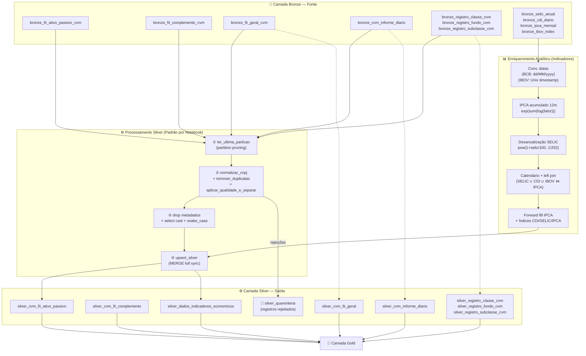

# ⚙️ Camada Silver — Documentação Técnica

> **Projeto:** Pipeline de Dados do Mercado Financeiro Brasileiro  
> **Arquitetura:** Medallion (Bronze → Silver → Gold)  
> **Plataforma:** Databricks + Delta Lake + Apache Spark  
> **Namespace:** `workspace.case_spark_cvm`

---

## 1. Visão Geral

### TL;DR
A camada Silver é onde o dado bruto se torna confiável: aplica tipagem forte, deduplicação determinística com regras específicas por domínio (incluindo adaptações à Resolução CVM 175), normalização de CNPJ e cálculo de indicadores econômicos derivados — tudo com MERGE incremental e rastreabilidade de rejeições em quarentena centralizada.

### Objetivo da Camada
A Silver é a camada de **confiança e preparação**. Ela recebe dados brutos e heterogêneos da Bronze e os transforma em um conjunto estruturado, tipado, deduplicado e validado — pronto para ser consumido por regras de negócio, modelos analíticos e pela camada Gold. Cada tabela Silver representa uma entidade de negócio bem definida com chave única garantida e tipos de dado apropriados para cálculo.

### Papel na Arquitetura Medallion
Na arquitetura Medallion, a Silver é a **camada de confiança e curadoria**. Enquanto a Bronze preserva o dado original sem julgamento, a Silver aplica o julgamento: decide qual registro vence quando há conflito, descarta o que é inválido (com rastreabilidade), converte tipos e calcula métricas derivadas que serão reutilizadas em toda a camada Gold. É a fundação sobre a qual os produtos de dados são construídos.

### Responsabilidades da Camada
- Ler exclusivamente a partição mais recente de cada tabela Bronze (`ler_ultima_particao`).
- Normalizar CNPJs para o padrão de 14 dígitos sem máscara.
- Aplicar deduplicação com regras de priorização determinísticas e documentadas, isolando registros descartados na quarentena.
- Validar campos-chave (completude, tipo numérico esperado) com critérios específicos por tabela.
- Converter todos os campos de `StringType` (padrão Bronze) para tipos semânticos: `DateType`, `IntegerType`, `DecimalType`, `double`, `LongType`.
- Renomear colunas de `PascalCase` (Bronze) para `snake_case` (Silver/Gold), padronizando a convenção de nomenclatura.
- Calcular indicadores econômicos derivados: IPCA acumulado 12 meses, índices acumulados de CDI/SELIC/IPCA, além de desanualização da SELIC.
- Persistir dados via MERGE Delta Lake com sincronização completa (insert + update + delete).
- Isolar registros rejeitados em tabela de quarentena unificada e idempotente.

### Relacionamento com as Demais Camadas
| Camada | Relação |
|---|---|
| **Bronze** | Fonte de dados brutos; Silver lê apenas a última partição disponível de cada tabela |
| **Silver (esta)** | Curadoria, tipagem e deduplicação; contrato de dados tipados e únicos por chave de negócio |
| **Gold** | Consome tabelas Silver para construir dimensões (SCD Tipo 1), fatos diários e cubos analíticos |
| **silver_quarentena** | Tabela transversal alimentada por todos os notebooks Silver; captura registros rejeitados para auditoria |

---

## 2. Arquitetura da Camada e Fluxo de Dados

### Entradas Recebidas
| Tabela Bronze | Notebook Silver Consumidor |
|---|---|
| `bronze_fii_ativo_passivo_cvm` | `silver_cvm_fiis_ativo_passivo.py` |
| `bronze_fii_complemento_cvm` | `silver_cvm_fiis_complemento.py` |
| `bronze_fii_geral_cvm` | `silver_cvm_fiis_geral.py` |
| `bronze_cvm_informe_diario` | `silver_cvm_informe_diario.py` |
| `bronze_registro_classe_cvm` | `silver_cvm_registro_classe.py` |
| `bronze_registro_fundo_cvm` | `silver_cvm_registro_fundo.py` |
| `bronze_registro_subclasse_cvm` | `silver_cvm_registro_subclasse.py` |
| `bronze_selic_anual`, `bronze_cdi_diario`, `bronze_ipca_mensal`, `bronze_ibov_index` | `silver_indicadores_desempenho.py` |

### Processamentos Realizados
Para cada notebook, o pipeline segue o **padrão de 4 etapas**:
1. **Leitura seletiva** da última partição Bronze via `ler_ultima_particao`.
2. **Curadoria dos dados:** normalização de CNPJ → deduplicação com regra de desempate específica → validação de campos-core com isolamento de rejeições.
3. **Tipagem e renomeação:** drop de metadados Bronze → `select()` único com casting completo e alias `snake_case`.
4. **Persistência via MERGE** na tabela Silver de destino com `upsert_silver`.

O notebook `silver_indicadores_desempenho.py` adiciona uma etapa extra de **enriquecimento analítico**: cálculo de IPCA acumulado, desanualização da SELIC, construção de calendário, forward fill e índices acumulados.

### Saídas Produzidas
8 tabelas Silver no namespace `workspace.case_spark_cvm` + tabela de quarentena unificada.

### Fluxo de Dados



### Motivo das Escolhas Arquiteturais
- **PipelineConfig como camada de abstração:** Isola a lógica de infraestrutura (MERGE, quarentena, deduplicação) dos notebooks de negócio. Mudanças na estratégia de MERGE não requerem alteração em todos os 8 notebooks.
- **`ler_ultima_particao` em vez de leitura full:** Evita scan completo da Bronze; utiliza `SHOW PARTITIONS` para identificar e filtrar apenas a partição mais recente, reduzindo I/O significativamente.
- **Select único na tipagem:** Todas as conversões de tipo são realizadas em um único `select()`, permitindo que o Catalyst Optimizer do Spark gere um plano de execução otimizado em vez de múltiplos stages encadeados.
- **MERGE com `whenNotMatchedBySourceDelete`:** Silver mantém sincronização completa com a última foto da fonte — registros removidos da Bronze são removidos da Silver, garantindo que a camada reflita sempre o estado vigente.

---

## 3. Estrutura Física dos Dados

### Formato dos Arquivos
Todas as tabelas Silver são armazenadas em **formato Delta Lake**, gerenciadas no Unity Catalog Databricks. Internamente, arquivos Parquet com columnar storage, complementados pelo transaction log `_delta_log`.

### Tipo de Armazenamento
Tabelas gerenciadas (`saveAsTable`) no namespace `workspace.case_spark_cvm`, referenciáveis via `spark.table()` e SQL no Databricks.

### Estratégia de Particionamento
As tabelas Silver **não são particionadas explicitamente** na implementação atual. A função `upsert_silver` realiza MERGE sem `partitionBy`, e nenhum dos notebooks Silver adiciona particionamento antes da chamada. O comentário no `upsert_silver` (`"Se for particionar, faça no notebook antes de chamar essa função!"`) indica que o design suporta particionamento futuro, mas esta camada opta por não particionar, delegando a otimização de leitura ao motor Delta via Z-Order na Gold.

### Convenções de Nomenclatura
| Elemento | Padrão Bronze | Padrão Silver | Exemplo |
|---|---|---|---|
| Nome de colunas | `PascalCase` | `snake_case` | `Data_Referencia` → `data_referencia` |
| Colunas de metadados | `_source_url`, `_ingest_timestamp`, `data_processamento` | Removidas | Não presentes na Silver |
| Tabelas cadastrais (dimensões) | `bronze_registro_{entidade}_cvm` | `silver_registro_{entidade}_cvm` | `silver_registro_fundo_cvm` |
| Tabelas FII | `bronze_fii_{tipo}_cvm` | `silver_cvm_fii_{tipo}` | `silver_cvm_fii_ativo_passivo` |
| Tabela de fatos diários | `bronze_cvm_informe_diario` | `silver_cvm_informe_diario` | — |
| Tabela de indicadores | (4 tabelas Bronze) | `silver_dados_indicadores_economicos` | — |
| Quarentena | — | `silver_quarentena` | Unificada para toda a Silver |

### Benefícios das Decisões
- **snake_case universal:** Compatível com SQL ANSI, SQL engines como Presto/Trino e convenções de ferramentas de BI (Power BI, Tableau, Metabase).
- **Remoção de metadados Bronze:** Reduz volume de armazenamento e simplifica o schema para consumidores da Silver; os metadados de rastreabilidade permanecem disponíveis na Bronze para reprocessamento.
- **Tabela de quarentena unificada:** Um único ponto de monitoramento de qualidade para toda a camada, em vez de múltiplas tabelas de erro fragmentadas.

---

## 4. Modelo de Dados

### 4.1 `silver_cvm_fii_ativo_passivo`
**Descrição:** Posição mensal consolidada de ativo e passivo dos Fundos de Investimento Imobiliário (FIIs), com tipagem forte e deduplicação por chave de negócio.
**Chave de negócio:** `cnpj_fundo_classe` + `data_referencia`  
**Granularidade:** Um registro por FII por mês de referência

| Campo | Tipo | Descrição |
|---|---|---|
| `cnpj_fundo_classe` | String | CNPJ normalizado do FII (14 dígitos, sem máscara) |
| `data_referencia` | Date | Mês de referência do informe |
| `versao` | Integer | Versão do documento enviado à CVM |
| `total_necessidades_liquidez` | Decimal(22,2) | Total de necessidades de liquidez |
| `disponibilidades` | Decimal(22,2) | Disponibilidades em caixa |
| `titulos_publicos` | Decimal(22,2) | Total em títulos públicos |
| `titulos_privados` | Decimal(22,2) | Total em títulos privados |
| `total_investido` | Decimal(18,2) | Total investido pelo fundo |
| `direitos_bens_imoveis` | Decimal(22,2) | Total em direitos e bens imóveis |
| `cri` | Decimal(22,2) | Total em Certificados de Recebíveis Imobiliários |
| `lci` | Decimal(22,2) | Total em Letras de Crédito Imobiliário |
| `total_passivo` | Decimal(22,2) | Total do passivo do fundo |

> Schema completo: 51 campos com casting para `DecimalType(22,2)` ou `DecimalType(18,2)` conforme a precisão necessária por campo. Colunas com escala menor (`DecimalType(12,2)`) aplicadas para campos historicamente de menor magnitude (ex: `cedulas_debentures`).

---

### 4.2 `silver_cvm_fii_complemento`
**Descrição:** Dados complementares mensais dos FIIs: distribuição de cotistas por categoria, patrimônio, rentabilidade e dividend yield.  
**Chave de negócio:** `cnpj_fundo_classe` + `data_referencia`  
**Granularidade:** Um registro por FII por mês de referência

| Campo | Tipo | Descrição |
|---|---|---|
| `cnpj_fundo_classe` | String | CNPJ normalizado do FII |
| `data_referencia` | Date | Mês de referência |
| `versao` | Integer | Versão do documento |
| `data_informacao_numero_cotistas` | Date | Data de referência da contagem de cotistas |
| `total_numero_cotistas` | Integer | Total de cotistas |
| `numero_cotistas_pessoa_fisica` | Integer | Cotistas pessoa física |
| `numero_cotistas_investidores_nao_residentes` | Integer | Cotistas investidores não residentes |
| `valor_ativo` | Decimal(22,2) | Valor do ativo total |
| `patrimonio_liquido` | Decimal(22,2) | Patrimônio líquido |
| `cotas_emitidas` | Decimal(22,2) | Quantidade de cotas emitidas |
| `valor_patrimonial_cotas` | Decimal(22,2) | Valor patrimonial das cotas |
| `percentual_rentabilidade_efetiva_mes` | Double | Rentabilidade efetiva no mês (%) |
| `percentual_dividend_yield_mes` | Double | Dividend yield mensal (%) |
| `percentual_amortizacao_cotas_mes` | Double | Amortização de cotas no mês (%) |

> Schema completo: 30 campos. Contagens de cotistas por categoria (`Integer`); valores monetários (`Decimal(22,2)`); percentuais de rentabilidade e despesas (`Double`).

---

### 4.3 `silver_cvm_fii_geral`
**Descrição:** Dados cadastrais e estruturais dos FIIs no contexto do informe mensal. Inclui tratamento determinístico para duplicidade gerada pela transição para a Resolução CVM 175 (prioridade para registros do tipo "Classe" sobre "Fundo").  
**Chave de negócio:** `cnpj_fundo_classe` + `data_referencia`  
**Granularidade:** Um registro por FII por mês de referência

| Campo | Tipo | Descrição |
|---|---|---|
| `tipo_fundo_classe` | String | Tipo: "Classe" ou "Fundo" (distinção da CVM 175) |
| `cnpj_fundo_classe` | String | CNPJ normalizado do FII |
| `nome_fundo_classe` | String | Nome oficial do FII |
| `data_referencia` | Date | Mês de referência |
| `versao` | Integer | Versão do informe |
| `data_entrega` | Date | Data de entrega do informe à CVM |
| `data_funcionamento` | Date | Data de início de funcionamento do fundo |
| `codigo_isin` | String | Código ISIN das cotas |
| `quantidade_cotas_emitidas` | Decimal(22,2) | Quantidade de cotas emitidas no mês |
| `mandato` | String | Mandato de investimento (ex: Renda, Desenvolvimento) |
| `segmento_atuacao` | String | Segmento de atuação (ex: Lajes Corporativas, Logística) |
| `tipo_gestao` | String | Tipo de gestão (ativa/passiva) |
| `nome_administrador` | String | Nome do administrador |
| `cnpj_administrador` | String | CNPJ do administrador |
| `email` | String | E-mail de contato do administrador |

> Schema completo: 37 campos incluindo endereço completo e contatos do administrador.

---

### 4.4 `silver_cvm_informe_diario`
**Descrição:** Série temporal diária de cotas, patrimônio e fluxo de caixa de todos os fundos de investimento ativos na CVM. Aplica priorização de tipo regulatório ("CLASSES - FIF" > "FI") resultante da Resolução CVM 175.  
**Chave de negócio:** `cnpj_fundo_classe` + `id_subclasse` + `dt_comptc`  
**Granularidade:** Um registro por fundo/subclasse por dia de competência

| Campo | Tipo | Descrição |
|---|---|---|
| `tp_fundo_classe` | String | Tipo do fundo ("CLASSES - FIF", "FI", etc.) |
| `cnpj_fundo_classe` | String | CNPJ normalizado do fundo |
| `id_subclasse` | String | Identificador da subclasse (null para fundos sem subclasse) |
| `dt_comptc` | Date | Data de competência do informe |
| `vl_total` | Decimal(38,2) | Valor total da carteira |
| `vl_quota` | Decimal(38,11) | Valor da cota (alta precisão: 11 casas decimais) |
| `vl_patrim_liq` | Decimal(38,2) | Patrimônio líquido |
| `captc_dia` | Decimal(38,2) | Captações do dia |
| `resg_dia` | Decimal(38,2) | Resgates do dia |
| `nr_cotst` | Long | Número de cotistas (LongType para escala futura) |

> Nota técnica: `vl_quota` usa `DecimalType(38,11)` — precisão máxima disponível no Spark para preservar o valor da cota sem arredondamento, dado que pequenas variações diárias são analiticamente relevantes.

---

### 4.5 `silver_registro_classe_cvm`
**Descrição:** Tabela dimensão com registro cadastral de classes de fundos de investimento (RCVM 175). Um único registro vigente por `cnpj_classe`, determinado pela data de registro mais recente com prioridade para status operacionais ativos.  
**Chave de negócio (PK):** `cnpj_classe`  
**Granularidade:** Um registro por classe de fundo (visão atual)

| Campo | Tipo | Descrição |
|---|---|---|
| `id_registro_fundo` | Integer | ID do fundo pai (FK para `silver_registro_fundo_cvm`) |
| `id_registro_classe` | Integer | ID único da classe |
| `cnpj_classe` | String | CNPJ da classe (chave primária da dimensão) |
| `codigo_cvm` | Integer | Código CVM da classe |
| `data_registro` | Date | Data de registro na CVM |
| `data_constituicao` | Date | Data de constituição |
| `situacao` | String | Situação atual (ex: "Em Funcionamento Normal") |
| `data_inicio_situacao` | Date | Data de início da situação atual |
| `denominacao_social` | String | Nome oficial da classe |
| `tipo_classe` | String | Tipo da classe (ex: Renda Fixa, Ações) |
| `classificacao_anbima` | String | Classificação ANBIMA |
| `classe_esg` | String | Indicador de mandato ESG |
| `patrimonio_liquido` | Decimal(25,2) | PL da classe na data de referência |
| `cnpj_auditor` | String | CNPJ do auditor independente |
| `cnpj_custodiante` | String | CNPJ do custodiante |
| `cnpj_controlador` | String | CNPJ do administrador de carteira |

> Schema completo: 30 campos.

---

### 4.6 `silver_registro_fundo_cvm`
**Descrição:** Tabela dimensão com registro cadastral dos fundos de investimento no nível do fundo-pai (RCVM 175). Um registro vigente por `cnpj_fundo`, refletindo o estado atual mais recente com prioridade para status ativos.  
**Chave de negócio (PK):** `cnpj_fundo`  
**Granularidade:** Um registro por fundo (visão atual)

| Campo | Tipo | Descrição |
|---|---|---|
| `id_registro_fundo` | Integer | ID único do fundo |
| `cnpj_fundo` | String | CNPJ do fundo (chave primária) |
| `codigo_cvm` | Integer | Código CVM do fundo |
| `tipo_fundo` | String | Tipo do fundo (ex: FI, FIC) |
| `denominacao_social` | String | Nome oficial do fundo |
| `data_registro` | Date | Data de registro na CVM |
| `data_constituicao` | Date | Data de constituição |
| `data_cancelamento` | Date | Data de cancelamento (null se ativo) |
| `situacao` | String | Situação cadastral atual |
| `data_adaptacao_rcvm175` | Date | Data de adequação à nova regulamentação |
| `patrimonio_liquido` | Decimal(25,2) | Patrimônio líquido do fundo |
| `cnpj_administrador` | String | CNPJ do administrador |
| `gestor` | String | Nome do gestor |

> Schema completo: 21 campos.

---

### 4.7 `silver_registro_subclasse_cvm`
**Descrição:** Tabela dimensão da hierarquia CVM 175 no terceiro nível: subclasses de cotas vinculadas às classes. Um registro vigente por `id_subclasse`.  
**Chave de negócio (PK):** `id_subclasse` (explicitamente comentado como PK no código)  
**Chave estrangeira:** `id_registro_classe` → `silver_registro_classe_cvm` (explicitamente comentado como FK no código)  
**Granularidade:** Um registro por subclasse (visão atual)

| Campo | Tipo | Descrição |
|---|---|---|
| `id_registro_classe` | Integer | FK para `silver_registro_classe_cvm` |
| `id_subclasse` | String | Identificador único da subclasse (PK) |
| `codigo_cvm` | Integer | Código CVM da subclasse |
| `data_constituicao` | Date | Data de constituição |
| `data_inicio` | Date | Data de início de operação |
| `situacao` | String | Situação cadastral |
| `data_inicio_situacao` | Date | Data de início da situação atual |
| `denominacao_social` | String | Nome da subclasse |
| `previdenciario` | String | Indicador de produto previdenciário |
| `exclusivo_inr` | String | Exclusividade para investidores não residentes |

> Schema completo: 15 campos.

---

### 4.8 `silver_dados_indicadores_economicos`
**Descrição:** Série temporal diária de indicadores macroeconômicos e de mercado, enriquecida com métricas derivadas calculadas via Window Functions (IPCA acumulado, índices de CDI/SELIC/IPCA desde o início da série). Integra 4 fontes Bronze heterogêneas em um calendário único.  
**Chave de negócio:** `data`  
**Granularidade:** Um registro por dia (calendário contínuo das séries disponíveis)

| Campo | Tipo | Descrição |
|---|---|---|
| `data` | Date | Data de referência (calendário de pregões/dias úteis) |
| `valor_selic` | Decimal(10,4) | Taxa SELIC anual (%) — fonte BCB série 1178 |
| `valor_cdi` | Decimal(10,6) | Taxa CDI diária (%) — fonte BCB série 12 |
| `ipca_mensal` | Decimal(10,4) | Variação mensal do IPCA (%) — fonte BCB série 433 |
| `ipca_anual` | Decimal(10,4) | IPCA acumulado dos últimos 12 meses — **campo derivado** |
| `ibov_close` | Decimal(18,2) | Fechamento diário do IBOVESPA — fonte Yahoo Finance |
| `indice_cdi` | Decimal(20,8) | Índice acumulado do CDI desde o início da série — **campo derivado** |
| `indice_selic` | Decimal(20,8) | Índice acumulado da SELIC desde o início da série — **campo derivado** |
| `indice_ipca` | Decimal(20,8) | Índice acumulado do IPCA desde o início da série — **campo derivado** |

### 4.9 `silver_quarentena` *(tabela de suporte)*
**Descrição:** Tabela Delta centralizada para isolamento de todos os registros rejeitados por qualquer etapa de qualidade ou deduplicação em qualquer notebook Silver. Design idempotente: execuções repetidas do mesmo dia sobrescrevem lotes anteriores.

| Campo | Tipo | Descrição |
|---|---|---|
| `_tabela_origem` | String | Nome da tabela Bronze de onde o registro veio |
| `_data_proc` | Integer | Data de processamento YYYYMMDD |
| `_capturado_em` | Timestamp | Momento exato da captura na quarentena |
| `_motivo_quarentena` | String | Descrição granular do motivo da rejeição |
| `_source_url` | String | URL original da fonte do registro rejeitado |
| `_dados_raw` | String | Todos os campos do registro serializado como JSON |

---

## 5. Regras de Qualidade dos Dados

### 5.1 Regras Aplicadas em Todos os Notebooks Silver

| Regra | Implementação | Tabelas Afetadas | Ação sobre Rejeições |
|---|---|---|---|
| **Normalização CNPJ** | `PipelineConfig.normalizar_cnpj()`: remove não-numéricos (regex), `lpad(14, "0")`, null para inválidos | Todas exceto `silver_registro_subclasse_cvm` | CNPJ inválido → null (campo fica nulo no dado) |
| **Completude campos-chave** | Regra `"not_null"` em `aplicar_qualidade_e_separar()` | Todos os notebooks | Registro enviado para quarentena |
| **Formato decimal** | Regra `"decimal"`: tenta cast para `DecimalType(22,2)`; rejeita se cast falha mas campo não é null | Campos numéricos monetários | Registro enviado para quarentena |
| **Formato inteiro** | Regra `"int"`: tenta cast para `IntegerType`; rejeita se cast falha mas campo não é null | Campos de contagem (cotistas, NR_COTST) | Registro enviado para quarentena |

### 5.2 Regras de Deduplicação por Tabela

| Tabela | Chave de Negócio | Regra de Desempate | Lógica |
|---|---|---|---|
| `silver_cvm_fii_ativo_passivo` | CNPJ + Data_Referencia | `Total_Investido` DESC | Sem regra clara: mantém maior patrimônio investido |
| `silver_cvm_fii_complemento` | CNPJ + Data_Referencia | `Patrimonio_Liquido` DESC | Mantém maior PL como proxy de completude |
| `silver_cvm_fii_geral` | CNPJ + Data_Referencia | Tipo "Classe" > "Fundo"; depois `Data_Entrega` DESC | Adaptação CVM 175: "Classe" tem prioridade sobre "Fundo" |
| `silver_cvm_informe_diario` | CNPJ + ID_Subclasse + DT_COMPTC | "CLASSES - FIF" = 1 > outros = 2; depois `VL_PATRIM_LIQ` DESC | Adaptação CVM 175: tipo regulatório novo tem prioridade |
| `silver_registro_classe_cvm` | CNPJ_Classe | `_ordem_desempate` = Data_Registro + peso_status DESC | Registro mais recente; status ativo ("B") ganha de inativo ("A") no mesmo dia |
| `silver_registro_fundo_cvm` | CNPJ_Fundo | `_ordem_desempate` = Data_Registro + peso_status DESC | Mesma lógica: temporal + status |
| `silver_registro_subclasse_cvm` | ID_Subclasse | `_ordem_desempate` = Data_Inicio_Situacao + peso_status DESC | Situação mais recente com prioridade para status ativos |
| `silver_dados_indicadores_economicos` | data (por indicador) | `_ingest_timestamp` DESC | Retificação retroativa: versão mais recentemente ingerida vence |

### 5.3 Regras de Completude por Tabela

| Tabela | Campos `not_null` Obrigatórios | Campos Numéricos Monitorados |
|---|---|---|
| `silver_cvm_fii_ativo_passivo` | CNPJ_FUNDO_CLASSE, Data_Referencia | Total_Necessidades_Liquidez, Disponibilidades, Total_Investido |
| `silver_cvm_fii_complemento` | CNPJ_FUNDO_CLASSE, Data_Referencia | Total_Numero_Cotistas (int), Valor_Ativo, Patrimonio_Liquido |
| `silver_cvm_fii_geral` | CNPJ_FUNDO_CLASSE, Data_Referencia | Quantidade_Cotas_Emitidas |
| `silver_cvm_informe_diario` | CNPJ_FUNDO_CLASSE, DT_COMPTC | NR_COTST (int), VL_PATRIM_LIQ |
| `silver_registro_classe_cvm` | ID_Registro_Fundo, ID_Registro_Classe, CNPJ_Classe, Data_Registro, Situacao | — |
| `silver_registro_fundo_cvm` | ID_Registro_Fundo, CNPJ_Fundo, Codigo_CVM, Data_Registro, Situacao | — |
| `silver_registro_subclasse_cvm` | ID_Registro_Classe, ID_Subclasse | — |
| `silver_dados_indicadores_economicos` | data (filtro explícito no IPCA) | Tipagem implícita via cast |

### 5.4 Quarentena Inteligente (Anti-Spam)
Para as tabelas dimensão (`registro_classe`, `registro_fundo`, `registro_subclasse`), o pipeline diferencia dois tipos de descarte:
- **Descarte silencioso (histórico defasado):** Registro mais antigo que o vencedor — descartado sem gerar alerta. Comportamento esperado para tabelas que evoluem ao longo do tempo.
- **Anomalia grave (colisão na origem):** Dois registros com a mesma data de referência e mesmo status — enviado para quarentena com motivo explícito (`"Anomalia CVM: Múltiplos registros conflitantes..."`). Este é o caso que merece investigação.

---

## 6. Transformações Aplicadas

### 6.1 Normalização de CNPJ (Todos os Notebooks, Exceto Subclasse)
```python
# Remove tudo que não for dígito, preenche com zeros à esquerda até 14 posições
cnpj_limpo = f.regexp_replace(f.col(col_name).cast("string"), r"[^0-9]", "")
f.lpad(cnpj_limpo, 14, "0")  # CNPJs sem máscara ou com menos dígitos são corrigidos
# CNPJs com mais de 14 dígitos viram null (inválidos)
```
**Objetivo:** Eliminar variações de formato na entrega da CVM (com pontos, barras, traços ou sem zeros à esquerda) para garantir join confiável entre tabelas.

### 6.2 Deduplicação com Super-Chave Temporal + Peso de Status
*Aplicado em `silver_cvm_registro_classe.py`, `silver_cvm_registro_fundo.py`, `silver_cvm_registro_subclasse.py`*
```python
# Pesos: status operacionais ativos recebem "B" (maior), inativos recebem "A"
df = df.withColumn("_peso_status",
    f.when(f.col("Situacao").isin("Em Funcionamento Normal", "Fase Pré-Operacional"), f.lit("B"))
     .otherwise(f.lit("A"))
)
# Super-chave: "2025-06-27_B" vence "2025-06-27_A" e "2024-01-01_B"
df = df.withColumn("_ordem_desempate",
    f.concat_ws("_", f.col("Data_Registro"), f.col("_peso_status"))
)
```
**Objetivo:** Para tabelas dimensão onde o CNPJ é a PK, garantir que o registro mais recente com status operacional ativo vença, sem perder a capacidade de distinguir colisões reais na origem de simples descarte de histórico.

### 6.3 Priorização de Tipo Regulatório — FII Geral (CVM 175)
```python
# Janela: dentro do mesmo CNPJ + Data, verifica se existe pelo menos 1 registro "Classe"
window_tipo = Window.partitionBy(["CNPJ_FUNDO_CLASSE", "Data_Referencia"])
df = df.withColumn("_grupo_tem_classe",
    f.max(f.when(f.col("Tipo_Fundo_Classe") == "Classe", f.lit(1)).otherwise(f.lit(0))).over(window_tipo)
)
# Mantém "Classe" sempre; mantém "Fundo" apenas se não há "Classe" no grupo
df = df.filter(
    (f.col("Tipo_Fundo_Classe") == "Classe") |
    ((f.col("Tipo_Fundo_Classe") == "Fundo") & (f.col("_grupo_tem_classe") == 0))
)
```
**Objetivo:** Tratar o fenômeno da transição para a RCVM 175, onde administradoras submeteram o mesmo informe como "Fundo" E "Classe" simultaneamente. A regra garante que o registro mais aderente à nova regulamentação ("Classe") seja mantido.

### 6.4 Priorização de Tipo Regulatório — Informe Diário (CVM 175)
```python
# "CLASSES - FIF" = 1 (prioridade máxima), outros = 2
df = df.withColumn("prioridade_tipo",
    f.when(f.col("TP_FUNDO_CLASSE") == "CLASSES - FIF", 1).otherwise(2)
)
window_spec = Window.partitionBy("CNPJ_FUNDO_CLASSE", "ID_SUBCLASSE", "DT_COMPTC").orderBy("prioridade_tipo")
df = df.withColumn("row_num", f.row_number().over(window_spec))
df = df.filter(f.col("row_num") == 1)
```
**Objetivo:** Resolver a coexistência de registros com nomenclatura antiga ("FI") e nova ("CLASSES - FIF") para o mesmo fundo no período de transição. O tipo regulatório mais recente tem prioridade.

### 6.5 Conversão de Formatos de Data por Fonte
| Fonte | Formato Original | Transformação PySpark | Resultado |
|---|---|---|---|
| BCB (SELIC, CDI, IPCA) | `"dd/MM/yyyy"` (String) | `date_format(to_date(data, "dd/MM/yyyy"), "yyyy-MM-dd").cast(DateType())` | `DateType` ISO |
| Yahoo Finance (IBOVESPA) | Unix timestamp (Integer) | `from_unixtime(timestamp).cast("date")` | `DateType` UTC |
| CVM (CSVs) | `"yyyy-MM-dd"` (String) | `.cast(DateType())` direto | `DateType` |

### 6.6 Cálculo de IPCA Acumulado 12 Meses (Window Function + Juros Compostos)
```python
# Fator mensal: 1 + (ipca_mensal / 100)
df_silver_ipca = df_silver_ipca.withColumn("fator", (f.col("ipca_mensal") / 100) + 1)
# Produto dos fatores dos últimos 12 meses via log/exp (juros compostos)
window_12m = Window.orderBy("data_ipca").rowsBetween(-11, Window.currentRow)
df_silver_ipca = df_silver_ipca.withColumn(
    "fator_acumulado", f.exp(f.sum(f.log("fator")).over(window_12m))
).withColumn("ipca_anual", ((f.col("fator_acumulado") - 1) * 100).cast(DecimalType(10, 2)))
```
**Objetivo:** Calcular a inflação acumulada em 12 meses a partir de variações mensais, usando o método de juros compostos via `exp(sum(log(x)))` — equivalente ao produto encadeado dos fatores, mas compatível com Window Functions do Spark.

### 6.7 Desanualização da SELIC e Índices Acumulados
```python
# Converte taxa anual SELIC para fator diário (base 252 dias úteis)
df = df.withColumn("fator_selic",
    f.when(f.col("valor_selic").isNotNull(),
        f.pow(1 + (f.col("valor_selic") / 100), 1/252)
    ).otherwise(f.lit(1))  # Fins de semana/feriados: fator = 1 (sem rendimento)
)
# CDI: já é taxa diária, fator simples
df = df.withColumn("fator_cdi", 1 + (f.coalesce(f.col("valor_cdi"), f.lit(0)) / 100))
# Índices acumulados (produto encadeado desde o início da série)
window_historico = Window.orderBy("data").rowsBetween(Window.unboundedPreceding, Window.currentRow)
df = df.withColumn("indice_cdi", f.exp(f.sum(f.log("fator_cdi")).over(window_historico)))
df = df.withColumn("indice_selic", f.exp(f.sum(f.log("fator_selic")).over(window_historico)))
```
**Objetivo:** O CDI e a SELIC são divulgados em frequências diferentes (diária e anual). A desanualização converte a SELIC para base diária, permitindo comparação equitativa entre os indicadores e o cálculo de índices acumulados consistentes.

### 6.8 Construção de Calendário e Forward Fill do IPCA
```python
# Calendário: union de todas as datas com dados disponíveis
df_datas = df_selic.select("data").union(df_cdi.select("data")).union(df_ibov.select("data")).distinct()
df_datas = df_datas.withColumn("ano_mes", f.date_format("data", "yyyy-MM"))
# Join: datas ← SELIC ← CDI ← IBOV ← IPCA (mensal, pelo ano_mes)
df_indicadores = df_datas.join(df_silver_selic, "data", "left").join(...)
                          .join(df_silver_ipca, "ano_mes", "left")

# Forward fill: propaga o último IPCA conhecido para dias sem valor publicado
window_ffill = Window.orderBy("data").rowsBetween(Window.unboundedPreceding, Window.currentRow)
df_indicadores = df_indicadores.withColumn(
    "ipca_mensal", f.last("ipca_mensal", ignorenulls=True).over(window_ffill)
)
```
**Objetivo:** O IPCA é publicado mensalmente, enquanto CDI e SELIC são diários. O forward fill garante que todos os dias do calendário tenham o valor de IPCA vigente (último publicado), permitindo cálculos de rentabilidade real diários que requerem os três indicadores.

### 6.9 Select Único com Casting (Catalyst Optimizer)
Todos os notebooks Silver finalizam o DataFrame com um **único `select()` contendo todos os campos com cast e alias**:
```python
# Comentário explícito no código:
# SELEÇÃO E CASTING FINAL (Otimizado via Select único - Catalyst Optimizer)
df = df.select(
    f.col('CNPJ_FUNDO_CLASSE').cast(t.StringType()).alias('cnpj_fundo_classe'),
    f.col('Data_Referencia').cast(t.DateType()).alias('data_referencia'),
    ...
)
```
**Objetivo:** Consolidar todas as transformações em um único passo lógico, permitindo ao Catalyst Optimizer gerar um plano de execução mais eficiente do que múltiplos `withColumn()` encadeados. Também elimina as colunas de metadados Bronze em uma única operação.

---

## 7. Estratégia de Atualização

### Tipo de Carga
**MERGE incremental com sincronização completa.** A Silver não realiza carga full; utiliza MERGE Delta Lake com as seguintes operações:
- `whenMatchedUpdateAll()` — Atualiza todos os campos de registros existentes (absorve correções da CVM).
- `whenNotMatchedInsertAll()` — Insere novos registros que não existem na Silver.
- `whenNotMatchedBySourceDelete()` — **Remove da Silver registros que não existem mais na última partição Bronze.** Esta operação é crítica: se a CVM remover um fundo da base, ele será removido da Silver na próxima execução.

### Comportamento na Primeira Execução
```python
# upsert_silver: Se a tabela não existir, cria com overwrite
if not spark.catalog.tableExists(tabela_destino):
    df_novo.write.format("delta").mode("overwrite").saveAsTable(tabela_destino)
```
A primeira execução cria a tabela a partir de um `overwrite` inicial. Nas execuções seguintes, o MERGE é ativado.

### Estratégia de Leitura Bronze
A função `ler_ultima_particao` usa `SHOW PARTITIONS` + `max(partition_col)` para identificar e filtrar apenas a partição mais recente:
```python
max_partition = show_partitions_df.agg(f.max(partition_col)).collect()[0][0]
return spark.table(table_name).filter(f.col(partition_col) == max_partition)
```
**Efeito:** A Silver processa sempre o snapshot mais recente disponível na Bronze, garantindo que o MERGE seja baseado no estado atual da fonte.

### Controle de Histórico
- O **transaction log Delta** (`_delta_log`) mantém o histórico de todas as operações MERGE na Silver, habilitando time travel para qualquer versão anterior.
- A tabela `silver_quarentena` mantém histórico persistente de todos os registros rejeitados por data de processamento.

### Impacto do `whenNotMatchedBySourceDelete`
| Cenário | Comportamento |
|---|---|
| Fundo cancelado pela CVM na fonte | Removido da Silver na próxima execução |
| Dado corrigido/atualizado na CVM | Atualizado via `whenMatchedUpdateAll` |
| Novo fundo registrado na CVM | Inserido via `whenNotMatchedInsertAll` |
| Registro na Bronze com erro (vai para quarentena) | Não chega ao MERGE; permanece na Silver o valor anterior |

### Benefícios Operacionais
- **Reprocessamento idempotente:** Reexecutar o notebook no mesmo dia produz o mesmo resultado final — o MERGE opera sobre a última partição Bronze, que é sempre o mesmo dado para o dia.
- **Absorção de correções retroativas:** O `whenMatchedUpdateAll` garante que correções enviadas pela CVM para datas passadas sejam refletidas na Silver sem necessidade de reprocessamento manual.

---

## 8. Performance e Escalabilidade

### Estratégia de Otimização
| Mecanismo | Implementação | Benefício |
|---|---|---|
| **Partition Pruning na leitura Bronze** | `ler_ultima_particao` filtra por `max(data_processamento)` | Evita scan de toda a tabela Bronze; lê apenas os dados do último ciclo de ingestão |
| **Select único (Catalyst)** | Um único `.select()` com todos os casts e alias | Plano de execução otimizado; reduz número de estágios no DAG Spark |
| **`coalesce(1)` no IPCA** | `df_silver_ipca = df_silver_ipca.withColumn(...).coalesce(1)` | IPCA mensal tem volume muito reduzido (~120 registros por 10 anos); reduz overhead de shuffle no join com o calendário diário |
| **`f.coalesce(col, f.lit(0))`** | Para `fator_cdi` em dias sem valor | Evita null-propagation no cálculo de índice; dias sem CDI contribuem com fator 1 (sem rendimento) |

### Recursos Delta Lake Utilizados
- **MERGE INTO:** Operação nativa Delta com plan de execução otimizado; utiliza o transaction log para identificar apenas os arquivos Parquet afetados pelas condições de match.
- **`mergeSchema: true` na quarentena:** Permite evolução do schema da tabela de quarentena sem quebrar a pipeline quando novos campos de contexto são adicionados.
- **Transaction Log para time travel:** Disponível implicitamente em todas as tabelas Silver; permite auditoria retroativa e debugging de MERGE.

### Gargalos Potenciais
- **`salvar_quarentena` com `df_quarentena.count()`:** A verificação de contagem zero antes de gravar força uma Action Spark, materializando o DataFrame rejeitado duas vezes (uma para contar, outra para gravar). Em notebooks com volume alto de rejeições, pode ser substituído por escrita direta ignorando tabelas vazias.
- **Window Functions não particionadas em `silver_dados_indicadores_economicos`:** Os índices acumulados de CDI/SELIC/IPCA usam `Window.unboundedPreceding` sem `partitionBy`, ordenando toda a série temporal em um único executor. Para 10 anos de dados diários (~2.600 registros), não é crítico, mas escalar para histórico mais longo pode exigir particionamento por década ou ano.
- **`SHOW PARTITIONS` em `ler_ultima_particao`:** Requer acesso ao metastore Databricks; pode ser lento em ambientes com muitas tabelas ou partições. Para tabelas com histórico extenso, consultar o `_delta_log` diretamente seria mais eficiente.

---

## 9. Decisões Técnicas — A Visão do Engenheiro

### Por que a Silver existe da forma que foi construída?

**`whenNotMatchedBySourceDelete` é uma decisão de governança, não só técnica.** A maioria das implementações de Silver usa apenas insert + update (upsert clássico). A escolha de incluir o delete garante que a Silver reflita sempre o estado vigente da fonte — se a CVM cancela um fundo, ele deve desaparecer da Silver. Isso é crítico para análises regulatórias onde dados obsoletos geram conclusões incorretas. O trade-off é que reprocessar uma partição antiga da Bronze poderia inadvertidamente deletar dados válidos da Silver, por isso a `ler_ultima_particao` é a única estratégia de leitura permitida nesta camada.

**`PipelineConfig` como abstração de contrato.** A decisão de centralizar `remover_duplicatas`, `aplicar_qualidade_e_separar`, `salvar_quarentena` e `upsert_silver` em uma classe utilitária cria um **contrato implícito de qualidade**: qualquer notebook que use `PipelineConfig` automaticamente herda o padrão de quarentena, o padrão de MERGE e o padrão de logging. Isso também significa que uma melhoria na lógica de MERGE ou quarentena beneficia imediatamente todos os 8 notebooks sem modificação individual.

**A quarentena unificada é intencional.** Em vez de 8 tabelas `bronze_fii_ativo_passivo_rejected`, `bronze_fii_complemento_rejected`, etc., existe uma única `silver_quarentena`. Isso facilita o monitoramento: uma única query identifica todos os problemas de qualidade do dia em todas as fontes. O campo `_dados_raw` como JSON permite que a tabela armazene registros de qualquer schema sem necessidade de evolução estrutural — o `mergeSchema: true` no append é a válvula de segurança.

**Super-chave temporal com peso de status é determinismo sobre ambiguidade.** Em vez de ordenar por uma coluna de data diretamente (o que causaria empate em registros do mesmo dia com status diferentes), a super-chave `concat_ws("_", data, peso_status)` cria uma string comparável lexicograficamente: `"2025-06-27_B" > "2025-06-27_A"` e `"2025-06-27_B" > "2024-12-01_B"`. Isso resolve de uma vez a ambiguidade de prioridade temporal e de status, sem necessidade de múltiplos `orderBy` encadeados.

### Benefícios para Governança e Rastreabilidade
- **Motivos granulares na quarentena:** Cada tipo de descarte tem seu próprio `_motivo_quarentena`, permitindo diferenciar descarte esperado (histórico defasado) de anomalia na fonte (colisão de dados na CVM).
- **Rastreabilidade completa:** `_source_url` é preservado na quarentena, permitindo reconstituir exatamente de qual endpoint veio o registro problemático.
- **Idempotência da quarentena:** O padrão DELETE+APPEND por (`_tabela_origem`, `_data_proc`) garante que a quarentena reflita sempre o estado mais recente de cada execução, sem acúmulo infinito de rejeições do mesmo lote.

---

## 10. Métricas da Camada

| Métrica | Valor |
|---|---|
| **Total de notebooks Silver** | 8 |
| **Total de tabelas Silver produzidas** | 8 tabelas de negócio + 1 quarentena unificada |
| **Total de tabelas Bronze consumidas** | 11 tabelas (via `ler_ultima_particao`) |
| **Campos derivados calculados** | 4 (`ipca_anual`, `indice_cdi`, `indice_selic`, `indice_ipca`) |
| **Estratégia de persistência** | MERGE full sync (`whenMatchedUpdateAll + whenNotMatchedInsertAll + whenNotMatchedBySourceDelete`) |
| **Particionamento** | Não aplicado nas tabelas Silver |
| **Volume processado** | Não identificado no código analisado (requer execução e consulta ao Delta Log) |
| **Frequência de atualização** | Herdada do ciclo de atualização Bronze (diária para indicadores e informe diário; terça–sábado para cadastros CVM) |

---

## 11. Conclusão

A camada Silver entrega o ativo mais valioso de um pipeline de dados: **confiança**. Ao resolver os problemas regulatórios da transição CVM 175, normalizar CNPJs, aplicar regras de qualidade com rastreabilidade completa e calcular indicadores econômicos derivados, a Silver transforma dados brutos e heterogêneos em um conjunto analítico confiável e consistente.

O padrão MERGE com sincronização completa (`whenNotMatchedBySourceDelete`) posiciona a Silver não apenas como uma camada de transformação, mas como uma **réplica curada e vigente** da realidade do mercado financeiro regulado — pronta para ser consumida pela Gold em dimensões (SCD Tipo 1), fatos diários e cubos analíticos sem necessidade de filtragem ou limpeza adicional.

A arquitetura de quarentena centralizada com motivos granulares cria um ponto único de monitoramento de qualidade que, por design, pode ser estendido para alertas proativos sem modificação dos notebooks de negócio.

---

## 12. Problemas Encontrados e Soluções

| Problema | Impacto | Solução Implementada |
|---|---|---|
| **Duplicidade Fundo/Classe — Informe Mensal FII (CVM 175)** | Mesmo CNPJ e Data_Referencia enviado como "Fundo" e "Classe" por administradoras em transição para a nova norma. Exemplo real documentado no código. | Window function + filtro determinístico: "Classe" tem prioridade absoluta; desempate restante por `Data_Entrega` DESC via `remover_duplicatas` |
| **Duplicidade FI/CLASSES-FIF — Informe Diário (CVM 175)** | Mesmo CNPJ, Data e Subclasse reportados com tipo "FI" (legado) e "CLASSES - FIF" (novo), com valores ligeiramente diferentes. Exemplo real com valores documentado no código. | `prioridade_tipo = 1` para "CLASSES - FIF"; `row_number()` sobre Window priorizado; segunda deduplicação por `VL_PATRIM_LIQ` para residuais |
| **Múltiplos registros por CNPJ em cadastros CVM** | Fonte CVM é transacional: envia histórico de ciclo de vida do fundo. Para tabela dimensão (1 registro por CNPJ), isso gera duplicidade estrutural esperada. | Super-chave temporal `_ordem_desempate` = Data + peso_status; quarentena anti-spam que só aciona para colisões na mesma data (anomalia real) |
| **IPCA com lag de publicação** | IPCA é publicado com ~15 dias de defasagem; dias de meses recentes ficam nulos no join com o calendário diário | Forward fill com `last(col, ignorenulls=True).over(window_ffill)` — propaga último valor publicado para todos os dias até o próximo lançamento |
| **Retificação retroativa de indicadores financeiros** | APIs do BCB podem corrigir valores históricos em chamadas subsequentes (ex: revisão do CDI de dias anteriores) | Deduplicação por `_ingest_timestamp` DESC em `processar_indicador_silver()`; quarentena apenas quando o valor foi efetivamente alterado, não quando é mera duplicata |

---

## 13. Trade-offs Arquiteturais

### MERGE com `whenNotMatchedBySourceDelete` vs. Upsert Clássico
| Critério | Full Sync com Delete (adotado) | Upsert Clássico (insert + update) |
|---|---|---|
| **Consistência com fonte** | Alta — Silver = espelho vigente da Bronze | Baixa — registros removidos da fonte persistem indefinidamente |
| **Risco de deleção acidental** | Médio — reprocessar partição antiga deletaria dados válidos | Nenhum |
| **Adequação para dimensões** | Alta — dimensões devem refletir estado atual | Adequada para fatos históricos |
| **Complexidade** | Maior — requer atenção ao dado de entrada | Menor |

**Decisão:** Full sync aceito com a proteção de `ler_ultima_particao` — a Silver nunca recebe uma partição antiga acidentalmente.

### Quarentena Unificada vs. Quarentena por Tabela
| Critério | Unificada (adotado) | Por tabela |
|---|---|---|
| **Monitoramento** | Uma query para ver todos os problemas | N queries para N tabelas |
| **Flexibilidade de schema** | Alta — `_dados_raw` em JSON acomoda qualquer schema | Baixa — schema fixo por tabela |
| **Diagnóstico granular** | Via `_tabela_origem` + `_motivo_quarentena` | Implícito pela tabela |
| **Gestão de armazenamento** | Uma única tabela a manter | N tabelas a manter e monitorar |

**Decisão:** Quarentena unificada reduz overhead operacional e habilita monitoramento centralizado de qualidade.

### Sem Particionamento nas Tabelas Silver
A ausência de `partitionBy` nas Silver é uma escolha consciente documentada no comentário de `upsert_silver`. O MERGE Delta Lake não se beneficia tanto de particionamento quanto o overwrite, pois já utiliza o transaction log para identificar arquivos afetados. A otimização de leitura (Z-Order) é aplicada na Gold, onde as consultas analíticas têm filtros definidos.

### `PascalCase` (Bronze) → `snake_case` (Silver)
O renaming não é apenas cosmético: `snake_case` é o padrão de SQL ANSI e das ferramentas de BI mais utilizadas. Realizá-lo na Silver garante que a Gold e qualquer consumidor downstream não precisem se preocupar com compatibilidade de nomenclatura.

### `DecimalType(38,11)` para `vl_quota`
O valor da cota de um fundo (`VL_QUOTA`) possui variações diárias na 6ª a 11ª casa decimal. Usar `Double` introduziria imprecisão de ponto flutuante em cálculos de rentabilidade acumulada. O `DecimalType(38,11)` garante precisão exata para cálculos financeiros críticos.

---

## 14. Monitoramento e Observabilidade

### Logs Gerados
O módulo `logging` com nível `INFO` está configurado em todos os 8 notebooks:
```
%(asctime)s [%(levelname)s] %(message)s
```

| Evento | Nível | Mensagem |
|---|---|---|
| Partição máxima identificada | INFO | `"Partição Maxima (data_processamento): {max_partition}"` |
| MERGE executado com sucesso | INFO | `"MERGE executado com sucesso na tabela {tabela_destino}"` |
| Primeira carga (tabela criada) | INFO | `"Tabela {tabela_destino} não existe. Criando com carga inicial..."` |
| Registros isolados na quarentena | **WARNING** | `"[QUALIDADE] {n} registros isolados na quarentena unificada de '{tabela_origem}'"` |
| Falha ao ler Bronze | ERROR | `"Falha ao ler o caminho {table_name}: {e}"` |

### Quarentena como Ferramenta de Observabilidade
A tabela `silver_quarentena` é o principal artefato de monitoramento de qualidade:
```sql
-- Visão consolidada de rejeições por origem e motivo no dia
SELECT _tabela_origem, _motivo_quarentena, COUNT(*) as qtd_rejeitados
FROM workspace.case_spark_cvm.silver_quarentena
WHERE _data_proc = 20260530
GROUP BY _tabela_origem, _motivo_quarentena
ORDER BY qtd_rejeitados DESC
```

### Idempotência da Quarentena
O mecanismo DELETE + APPEND por (`_tabela_origem`, `_data_proc`) antes de cada escrita garante que reexecuções do mesmo dia substituam os registros anteriores da quarentena, sem acumulação de lotes duplicados.

### Auditoria por Tipo de Rejeição
Os `_motivo_quarentena` distintos registrados na Silver:
- `"Descarte de cópia - Chave duplicada: {chave}"` — duplicatas por `remover_duplicatas`
- `"Falha de qualidade nas colunas monitoradas: {lista}"` — falhas em `aplicar_qualidade_e_separar`
- `"Anomalia CVM: Múltiplos registros com status conflitante para o mesmo CNPJ"` — colisões graves na origem
- `"Anomalia CVM: Múltiplos registros conflitantes no mesmo CNPJ para a mesma Data de Registro"` — colisões em fundos
- `"Anomalia CVM: Múltiplos registros conflitantes para a mesma Subclasse na mesma data"` — colisões em subclasses
- `"Anomalia API: A fonte alterou retroativamente o valor deste indicador financeiro"` — retificação de indicadores

---

## 15. Papel da Camada no Ecossistema de Dados

### Responsabilidade
A Silver é o **ponto de contrato** do pipeline: toda a complexidade de lidar com heterogeneidade de fontes, evolução regulatória e inconsistências da CVM é absorvida aqui. A Gold e os consumidores finais recebem dados limpos, tipados e únicos.

### Hierarquia de Entidades
A Silver implementa implicitamente a hierarquia regulatória da RCVM 175:
```
silver_registro_fundo_cvm (nível 1: Fundo)
  └── silver_registro_classe_cvm (nível 2: Classe)
        └── silver_registro_subclasse_cvm (nível 3: Subclasse)
```
Esta hierarquia é utilizada para junções na Gold.

### Dependências Upstream
| Tabela Bronze | Criticidade | Impacto em Caso de Falha |
|---|---|---|
| `bronze_cvm_informe_diario` | Alta | Silver sem dados de cotas e PL; Gold e BI desatualizados |
| `bronze_cdi_diario` | Alta | Índice de CDI não calculado; benchmarks de fundos impossíveis |
| `bronze_fii_*` | Média | FIIs sem dados mensais; análises patrimoniais desatualizadas |
| `bronze_registro_*` | Baixa | Cadastros atualizam com menor frequência; impacto defasado |

### Dependências Downstream
| Consumidor | O que consome | Finalidade |
|---|---|---|
| **Camada Gold** | Todas as tabelas Silver | Dimensões SCD1, fatos diários, cubos analíticos |
| **`silver_quarentena`** | Alimentada por todos os notebooks | Monitoramento de qualidade, alertas operacionais |

### Contratos de Dados
- Todas as colunas de negócio possuem tipo semântico correto (sem `StringType` residual para campos numéricos ou de data).
- Chaves de negócio são únicas por tabela (garantidas por `remover_duplicatas` + regras específicas de priorização).
- CNPJs estão normalizados em 14 dígitos sem máscara.
- Colunas de metadados Bronze (`_source_url`, `_ingest_timestamp`, `data_processamento`) não existem nas Silver.

---

## 16. Competências Demonstradas

- **Apache Spark / PySpark** — Window Functions (`partitionBy`, `orderBy`, `rowsBetween`), `row_number`, `max`, `last` com `ignorenulls`, `exp/log` para produto encadeado, `coalesce`, `union`, `select` otimizado com Catalyst.
- **Delta Lake** — MERGE com `whenMatchedUpdateAll + whenNotMatchedInsertAll + whenNotMatchedBySourceDelete`; `DeltaTable.forName`; `delete` direcionado por predicado; `mergeSchema`; time travel implícito.
- **Databricks** — Unity Catalog (`spark.catalog.tableExists`); `saveAsTable` em namespace `catalog.schema`; `SHOW PARTITIONS` via Spark SQL.
- **Engenharia de Dados** — Design de pipeline com padrão de quarentena; abstração de infraestrutura via `PipelineConfig`; `ler_ultima_particao` para partition pruning; idempotência por design.
- **Data Quality** — Framework de validação com tipos "not_null", "decimal", "int"; quarentena centralizada com motivos granulares; distinção entre descarte esperado e anomalia grave.
- **Modelagem de Dados** — Tabelas dimensão com SCD implícito (status vigente); tabelas fato (informe diário, FIIs mensais); tabela de indicadores com métricas derivadas; hierarquia relacional RCVM 175.
- **Finanças / Domínio** — Cálculo de IPCA acumulado por juros compostos; desanualização de SELIC (base 252 dias úteis); índices acumulados; forward fill de indicadores mensais para série diária.
- **Governança de Dados** — Rastreabilidade via quarentena; motivos de rejeição documentados e persistidos; contratos de dados com tipos definidos e chaves únicas garantidas.
- **ETL/ELT** — Transformação de dados multi-fonte heterogêneos para modelo unificado; normalização de nomenclatura; casting tipado em operação única.
- **Python** — Programação orientada a objetos (`@dataclass`, métodos estáticos); `logging`; tratamento de exceções; tipagem com `tuple[DataFrame, DataFrame]`.
- **Regulação de Mercado Financeiro** — Compreensão e implementação de regras da Resolução CVM 175 (hierarquia Fundo > Classe > Subclasse; período de transição "CLASSES - FIF" vs "FI").

---

## 17. Riscos e Melhorias Futuras

### Limitações Atuais

| Limitação | Risco | Severidade |
|---|---|---|
| **`whenNotMatchedBySourceDelete` sobre última partição** | Se um dado de uma partição anterior da Bronze for reprocessado e enviado à Silver, registros válidos podem ser deletados | Alta |
| **Window sem `partitionBy` em indicadores** | `exp(sum(log(fator)).over(Window.unboundedPreceding))` para 10+ anos pode saturar memória de um executor em escala | Média |
| **`salvar_quarentena` com `count()` antes da escrita** | Materialização dupla do DataFrame rejeitado (count + write) | Baixa |
| **Ausência de validação de integridade referencial** | `id_registro_classe` em `silver_registro_subclasse_cvm` não é validado contra `silver_registro_classe_cvm` | Média |
| **Sem particionamento na Silver** | Queries full-scan em `silver_cvm_informe_diario` (volume alto, diário) podem ser lentas sem Z-Order aplicado na Silver | Média |
| **Forward fill do IPCA sem limite de prazo** | Se o IPCA não for publicado por muitos meses (improvável), o forward fill propagará valores muito antigos sem alerta | Baixa |

### Riscos Operacionais

| Risco | Probabilidade | Mitigação Atual | Mitigação Sugerida |
|---|---|---|---|
| Mudança de schema em CSV da CVM adiciona colunas não esperadas | Média | `mergeSchema: true` na quarentena | Alertas quando `_dados_raw` contém campos novos |
| CVM muda `Tipo_Fundo_Classe` para nova nomenclatura além de "CLASSES-FIF" | Baixa | Regra genérica (prioridade 1 vs 2) | Tornar lista de tipos prioritários configurável via parâmetro |
| Falha na `ler_ultima_particao` se tabela Bronze não tiver partições | Baixa | Raise explícito com log de erro | Verificação prévia de existência da tabela + partição mínima |

### Possíveis Otimizações Futuras

- **Z-Order em `silver_cvm_informe_diario`:** Adicionar `OPTIMIZE ... ZORDER BY (cnpj_fundo_classe, dt_comptc)` após o MERGE para acelerar queries por fundo e por data — padrão mais comum de consulta para a Gold.
- **Particionamento por `ano_mes` em tabelas de fatos:** `silver_cvm_informe_diario` e `silver_dados_indicadores_economicos` se beneficiariam de particionamento por `ano_mes` para limitar o escopo do MERGE e acelerar queries históricas.
- **Validação de integridade referencial:** Adicionar verificação pós-MERGE que valide FK de `silver_registro_subclasse_cvm → silver_registro_classe_cvm` com alerta para orfãos.
- **Parâmetro `tipos_prioritarios` na regra CVM 175:** Externalizar a lista `["CLASSES - FIF"]` e `["Classe"]` para configuração, evitando mudança de código em futuras revisões regulatórias.
- **Substituição de `count()` na quarentena:** Usar `isEmpty()` (disponível via `df.rdd.isEmpty()` ou equivalente) ou tentar a escrita diretamente sem verificação prévia, capturando o caso de tabela vazia no tratamento de exceção.
- **Testes unitários de `PipelineConfig`:** As funções `remover_duplicatas`, `aplicar_qualidade_e_separar` e `normalizar_cnpj` são candidatos naturais para testes unitários com `pytest` + `pyspark` in-memory, dado seu design como métodos estáticos puros.
- **Monitoramento automatizado da quarentena:** Implementar um job Databricks que monitore `silver_quarentena` diariamente e envie alertas (e-mail ou Slack) quando `_motivo_quarentena` contiver `"Anomalia CVM"`, diferenciando ruído de problemas reais.
