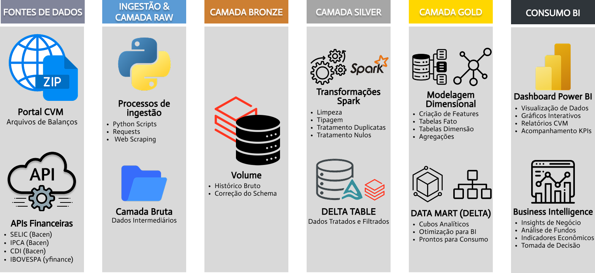

# 🇧🇷 Pipeline de Dados do Mercado Financeiro Brasileiro

> **Lakehouse analítico end-to-end sobre o universo de fundos de investimento brasileiros — da ingestão bruta de fontes regulatórias até indicadores financeiros de nível institucional entregues em Power BI.**

---


---

## 📋 Resumo Executivo

Este projeto implementa um **pipeline de dados de ponta a ponta** sobre o ecossistema de fundos de investimento brasileiro, integrando dados regulatórios da **CVM** (Comissão de Valores Mobiliários), séries macroeconômicas do **Banco Central do Brasil** e dados de mercado do **Yahoo Finance** em um Lakehouse construído sobre Databricks e Delta Lake.

A arquitetura Medallion transforma dados brutos, heterogêneos e sujeitos a inconsistências regulatórias em **28 tabelas Delta Lake** estruturadas em três camadas. A camada Gold entrega mais de **70 features financeiras calculadas** — retornos em múltiplos horizontes, volatilidades anualizadas, Sharpe, Sortino, VaR histórico, drawdown e Alpha por benchmark dinâmico — para analistas, gestores de fundos e ferramentas de BI que precisam de inteligência confiável e de alto desempenho sobre o universo de investimentos regulados no Brasil.

---

## 1. O Problema de Negócio e a Solução

### O Caos dos Dados Públicos Financeiros

O ecossistema de dados de fundos de investimento no Brasil é publicamente acessível, mas analiticamente inutilizável em sua forma bruta:

- **Portal CVM:** Arquivos ZIP mensais com múltiplos CSVs aninhados, separador ponto-e-vírgula, encoding `ISO-8859-1`, schema drift entre versões de anos diferentes (colunas com nomenclaturas distintas para o mesmo dado), e ausência de tipos semânticos — tudo chega como string.
- **Resolução CVM 175 (RCVM 175):** Uma mudança regulatória estrutural criou um período de transição onde o mesmo fundo é reportado simultaneamente como "Fundo" e "Classe", e o mesmo informe diário aparece como "FI" (legado) e "CLASSES - FIF" (novo), com valores ligeiramente diferentes. Sem tratamento, a duplicidade compromete qualquer análise de série temporal.
- **API BCB (Banco Central):** Três séries com frequências distintas (CDI diário, IPCA mensal, SELIC anual) e formato de data `dd/MM/yyyy` em texto livre. O IPCA tem lag de publicação de ~15 dias, criando nulos em série temporal diária. A SELIC é anual e precisa ser desanualizada para base diária (252 pregões).
- **Yahoo Finance API v8:** JSON profundamente aninhado com dois arrays separados (`timestamp` em Unix time + array `close`) que precisam ser pareados antes de se tornarem um DataFrame tabular.

### A Solução: Um Lakehouse com Governança Regulatória Nativa

O pipeline não apenas consolida as fontes — ele **absorve a complexidade regulatória brasileira como cidadão de primeira classe**. As regras de priorização para a RCVM 175, a normalização de 40+ variações textuais de benchmarks (ex: "DI de um dia", "Taxa Básica Financeira" → "CDI"), o cálculo de juros compostos correto para IPCA e CDI, e a desanualização da SELIC são implementados no pipeline em vez de serem delegados para o BI — entregando ao analista uma fonte de verdade única, tipada, deduplicada e financeiramente correta.

---

## 2. Arquitetura do Pipeline (Medallion)



### Camadas

| Camada | Responsabilidade | Tabelas | Documentação |
|---|---|---|---|
| 🥉 **Bronze** | Ingestão, preservação e rastreabilidade. Dados brutos como strings, particionados por data de processamento. Nunca transformados semanticamente. | 11 | [📖 BRONZE.md](./Docs/BRONZE.md) |
| ⚙️ **Silver** | Curadoria, tipagem forte, deduplicação com regras por domínio, validação de qualidade e isolamento de rejeições. MERGE incremental com sincronização completa. | 9 | [📖 SILVER.md](./Docs/SILVER.md) |
| 🥇 **Gold** | Entrega de valor: 70+ features financeiras calculadas, dimensões cadastrais SCD Tipo 1 e cubos analíticos temáticos prontos para consumo sem transformação adicional. | 9 | [📖 GOLD.md](./Docs/GOLD.md) |

---

## 3. Desafios de Engenharia Superados

### ⚖️ Tratamento da Resolução CVM 175 — Conflito Estrutural de Dados Regulatórios

A RCVM 175 criou um período de transição em que o mesmo fundo passou a ser reportado sob duas nomenclaturas simultâneas. Dois problemas distintos foram resolvidos no pipeline:

**No informe mensal de FIIs**, administradoras enviavam o mesmo informe como "Fundo" e como "Classe" para o mesmo CNPJ e mês de referência — um comportamento documentado com exemplo real de dados no código. A solução usa Window Functions para identificar grupos com ambos os tipos, priorizando deterministicamente o registro "Classe" sobre "Fundo". O desempate restante usa `Data_Entrega` DESC.

**No informe diário**, o mesmo fundo aparecia com tipo "FI" (legado) e "CLASSES - FIF" (regulatório novo) para o mesmo CNPJ, subclasse e data de competência. A solução mapeia `prioridade_tipo = 1` para "CLASSES - FIF" e aplica `row_number()` sobre Window particionada, garantindo que o tipo regulatório mais recente sempre vença.

**Nas tabelas dimensão** (cadastros de fundos, classes e subclasses), a mesma entidade gera múltiplos registros históricos ao longo do ciclo de vida do fundo. A solução cria uma **super-chave temporal com peso de status**: `concat_ws("_", data_registro, peso_status)`, onde status operacionais ativos recebem `"B"` e inativos `"A"` — fazendo `"2025-06-27_B"` vencer `"2025-06-27_A"` e `"2024-01-01_B"` em uma única comparação lexicográfica, sem múltiplos `orderBy` encadeados.

### 🔀 Schema Drift Dinâmico e Ingestão de Dados Heterogêneos

Três tipos distintos de schema drift foram tratados no pipeline:

**Informe diário CVM (histórico vs. atual):** Arquivos mais antigos usam `TP_FUNDO` / `CNPJ_FUNDO` sem a coluna `ID_SUBCLASSE`. A solução inspeciona as colunas do arquivo antes da leitura, separa em duas listas (`arquivos_novo` / `arquivos_antigo`) e executa `withColumnRenamed` em lote + `withColumn(null)` para o campo ausente. Um único `unionByName(allowMissingColumns=True)` unifica o resultado.

**Informe mensal FII (layout 2016 vs. atual):** Arquivos de 2016 usam `CNPJ_Fundo` em vez de `CNPJ_FUNDO_CLASSE`. Mesma estratégia de inspeção + renomeação em lote antes do union.

**JSON aninhado do IBOVESPA (Yahoo Finance):** A API retorna dois arrays separados (`timestamp` em Unix time + `close`) em estrutura `chart.result[0]`. A solução extrai os arrays, combina com `zip()` Python nativo e cria o DataFrame a partir de lista de tuplas — sem schema inference, sem risco de falha por formato inesperado.

### 🏗️ Estratégias Avançadas Delta Lake

**Idempotência na Bronze via `replaceWhere`:** Toda escrita usa `mode("overwrite")` + `option("replaceWhere", "data_processamento = {DATA_PROC}")`. A partição do dia é substituída atomicamente em cada execução — reprocessamentos são seguros por design.

**MERGE full sync na Silver com `whenNotMatchedBySourceDelete`:** A Silver não é apenas um upsert — ela é um espelho vigente da fonte. O `whenNotMatchedBySourceDelete` garante que fundos cancelados pela CVM sejam removidos da Silver na próxima execução, sem necessidade de job de limpeza separado.

**Dynamic Partition Overwrite na Gold via `.option()`:** O Unity Catalog bloqueia `spark.conf.set("partitionOverwriteMode", "dynamic")` em nível de sessão. A solução — documentada com comentário explícito no código — usa `.option("partitionOverwriteMode", "dynamic")` diretamente no writer, garantindo que apenas as partições `ano_mes` do DataFrame atual sejam sobrescritas sem tocar no histórico.

**Z-ORDER automático pós-escrita:** Todas as 9 tabelas Gold executam `OPTIMIZE ... ZORDER BY (colunas de maior seletividade)` imediatamente após cada escrita, garantindo Data Skipping ativo para as queries mais comuns do BI sem necessidade de manutenção manual.

### 🛡️ Governança e Observabilidade: Quarentena Unificada Inteligente

Em vez de tabelas de rejeição fragmentadas por fonte, o pipeline mantém uma única `silver_quarentena` com **motivos de rejeição granulares e hierarquia de severidade**:

```
"Descarte de cópia - Chave duplicada: [...]"         → descarte esperado (histórico defasado)
"Anomalia CVM: Múltiplos registros conflitantes..."   → colisão na origem (alerta necessário)
"Anomalia API: A fonte alterou retroativamente..."    → retificação de indicador financeiro
"Falha de qualidade nas colunas monitoradas: [...]"   → dado inválido (null, não-numérico)
```

A quarentena é **idempotente**: antes de cada escrita, um `DELETE` cirúrgico por `(_tabela_origem, _data_proc)` limpa o lote anterior, garantindo que reexecuções do mesmo dia não acumulem duplicatas. Os dados rejeitados são serializados como JSON em `_dados_raw`, permitindo que a tabela armazene registros de qualquer schema sem evolução estrutural.

**FinOps por design:** O notebook do informe diário implementa `regra_finops()` — arquivos `M-0` e `M-1` processam diariamente, `M-2+` apenas aos domingos. O cadastro CVM não executa segunda e domingo (dias sem atualização da fonte). Isso reduz o custo de cluster eliminando execuções garantidamente sem novos dados.

---

## 4. Engenharia de Analytics e Business Intelligence (Power BI)

 

### Camada Semântica

O modelo de dados no Power BI segue uma **arquitetura estrela** com as tabelas Gold:

- **Tabelas de dimensão:** `gold_dim_fundo` (fundos convencionais), `gold_dim_fii` (FIIs) — servem de filtro e contexto para todas as páginas.
- **Fato diária:** `gold_fato_diario` — série temporal histórica completa; usada para gráficos de linha, drill-through diário e cálculos de Base 100 em DAX.
- **Cubos de snapshot:** `gold_cubo_comparativo`, `gold_cubo_rentabilidade`, `gold_cubo_risco`, `gold_cubo_risco_retorno` — um registro por fundo, última data disponível; base para KPIs e rankings.
- **Cubo mensal de captação:** `gold_cubo_captacao_pl` — granularidade mensal, série temporal; base para análise de fluxo de caixa.
- **Cubo FII:** `gold_cubo_fii_mensal` — granularidade mensal, específico para FIIs; consome `gold_dim_fii` no BI.

### Páginas e KPIs por Pilar Analítico

**🏠 Página 1 — Home Executivo**
*Sala de controle: números grandes, cores semafóricas e acesso rápido às páginas de detalhe.*

| KPI / Visual | Fonte | Nota Técnica |
|---|---|---|
| Total de Fundos Ativos | `gold_dim_fundo[situacao]` | `COUNTROWS(FILTER(..., situacao = "Em Funcionamento"))` |
| PL Total Monitorado | `gold_cubo_comparativo[pl_atual]` | `SUM(pl_atual)` |
| Captação Líquida 1 ano | `gold_cubo_comparativo[captacao_liquida_252d]` | `SUM(captacao_liquida_252d)` |
| Retorno Médio Ponderado 1 ano | `gold_cubo_comparativo[retorno_252d, pl_atual]` | `SUMX(retorno * pl) / SUM(pl)` — retorno ponderado por PL, não média simples |
| Sharpe Médio do conjunto | `gold_cubo_comparativo[sharpe_252d]` | `AVERAGE(sharpe_252d)` |
| % Fundos com Alpha Positivo | `gold_cubo_comparativo[retorno_252d]` | `DIVIDE(COUNTROWS(FILTER(..., retorno > 0)), COUNTROWS(...))` |
| Top 10 fundos por retorno 1 ano | `gold_cubo_comparativo + gold_dim_fundo` | Barras horizontais |
| Treemap PL por Classificação | `gold_cubo_comparativo + gold_dim_fundo` | Hierarquia: classificação → fundo |
| PL Total diário (sparkline) | `gold_fato_diario[dt_comptc, vl_patrim_liq]` | Medida DAX: `SUM` com filtro de data dos últimos 12m |

---

**📈 Página 2 — Rentabilidade**
*Meu fundo está gerando Alpha ou apenas acompanhando o benchmark?*

| KPI / Visual | Fonte | Nota Técnica |
|---|---|---|
| Retorno 1m / 3m / 6m / 1a / Início | `gold_cubo_rentabilidade` | Campos pré-calculados no Spark via `lag(vl_quota, N)` |
| Alpha vs. Benchmark 1 ano | `gold_cubo_rentabilidade[alpha_252d]` | Alpha = retorno fundo - retorno do benchmark declarado |
| % Meses Positivos (24m) | `gold_cubo_rentabilidade[consistencia_retorno]` | Campo pré-calculado no Spark (0.0 a 1.0) |
| **Curva de cota vs. Benchmarks — Base 100** | `gold_fato_diario` | **DAX:** `DIVIDE(vl_quota, FIRSTNONBLANK_VALUE) * 100` — indexação necessária pois a fato contém valores absolutos de cota e índices acumulados desde o início da série, não desde a data selecionada |
| Retorno fundo vs. Benchmark por período | `gold_cubo_rentabilidade` | Barras agrupadas; campos `retorno_Nd` e `retorno_benchmark_Nd` |
| Retorno mensal (calendário de calor) | `gold_fato_diario` | **DAX:** `EXP(SUMX(..., LOG(1 + retorno_diario))) - 1` agrupado por mês — juros compostos em DAX |

---

**⚠️ Página 3 — Risco**
*Quanto risco estou aceitando? Qual foi o pior cenário histórico?*

| KPI / Visual | Fonte | Nota Técnica |
|---|---|---|
| Volatilidade 1m / 1a (anualizada) | `gold_cubo_risco[volatilidade_21d, volatilidade_252d]` | `stddev(retorno) * sqrt(252)` — convenção de mercado |
| Drawdown Máximo 1a / Histórico | `gold_cubo_risco[drawdown_maximo_252d, drawdown_maximo_historico]` | `min(drawdown)` sobre janela acumulada |
| Data do Pior Drawdown | `gold_cubo_risco[data_drawdown_maximo]` | Via `Window.orderBy(drawdown ASC, dt_comptc DESC)` |
| VaR 95% (1 ano) | `gold_cubo_risco[var_95_252d]` | `percentile_approx(retorno_diario, 0.05)` — percentil 5% em 252 dias |
| Classificação de Risco | `gold_cubo_risco[classificacao_risco]` | Materializada no Spark: Baixo `< 2%` / Médio `2–10%` / Alto `> 10%` |
| Sortino 1 ano | `gold_fato_diario[sortino_252d]` | Via `LASTNONBLANK` no DAX |
| Drawdown ao longo do tempo | `gold_fato_diario[dt_comptc, drawdown]` | Área preenchida abaixo de zero, colorida em vermelho |
| Volatilidade 21d vs 63d vs 252d | `gold_fato_diario` | Três séries temporais — mostra evolução do regime de risco |
| Histograma de retornos diários | `gold_fato_diario[retorno_diario]` | Distribuição em faixas de 0,5% |

---

**⚖️ Página 4 — Risco × Retorno**
*O quadrante estratégico: posicionamento relativo de todos os fundos no espaço risco × retorno.*

| KPI / Visual | Fonte | Nota Técnica |
|---|---|---|
| Melhor Sharpe do conjunto | `gold_cubo_risco_retorno[sharpe_252d]` | `MAXX(...)` |
| Sharpe médio ponderado por PL | `gold_cubo_risco_retorno` | `SUMX(sharpe * pl) / SUM(pl)` — ponderação por tamanho do fundo |
| % Fundos com Sharpe > 1 | `gold_cubo_risco_retorno[sharpe_252d]` | `DIVIDE(COUNTROWS(FILTER(..., sharpe > 1)), COUNTROWS(...))` |
| **Gráfico de Bolhas** (Risco × Retorno × PL) | `gold_cubo_risco_retorno + gold_dim_fundo` | Eixo X: `volatilidade_252d`; Eixo Y: `retorno_252d`; Tamanho: `vl_patrim_liq` |
| Ranking Sharpe com cor condicional | `gold_cubo_risco_retorno` | `classificacao_sharpe` pré-calculada: Ruim / Regular / Bom / Excelente |
| Tabela comparativa Sharpe / Sortino / Vol / Retorno | `gold_cubo_risco_retorno + gold_dim_fundo` | Snapshot da última data |

> **Nota DAX:** Sharpe e Sortino não são lineares — não é possível calcular a "média dos Sharpes de N dias" diretamente. Os campos `sharpe_252d` e `sortino_252d` são calculados uma única vez no Spark com a fórmula correta e expostos como snapshots, evitando cálculos incorretos no BI.

---

**💰 Página 5 — Captação e PL**
*Dinheiro entrando ou saindo? O termômetro de saúde comercial do fundo.*

| KPI / Visual | Fonte | Nota Técnica |
|---|---|---|
| PL Atual (último mês) | `gold_cubo_captacao_pl[pl_ultimo_dia_mes]` | `LASTNONBLANKVALUE([ano_mes], [pl_ultimo_dia_mes])` |
| Captação Bruta / Resgates / Líquida (mês) | `gold_cubo_captacao_pl` | Campos pré-agregados mensalmente no Spark |
| Variação de Cotistas (mês) | `gold_cubo_captacao_pl[variacao_cotistas_mes]` | `nr_cotistas - lag(nr_cotistas)` por fundo |
| Flag Captação Negativa | `gold_cubo_captacao_pl[flag_captacao_negativa]` | Semáforo: "S" = atenção (vermelho), "N" = ok (verde) |
| Captação Bruta vs. Resgates por mês | `gold_cubo_captacao_pl` | Colunas empilhadas: resgates abaixo do eixo; linha de captação líquida sobreposta |
| Top fundos por captação líquida 1 ano | `gold_cubo_captacao_pl + gold_dim_fundo` | `CALCULATE(SUM([captacao_liquida_mes]), DATESINPERIOD(..., -12, MONTH))` |
| Drill-through: captação diária | `gold_fato_diario[dt_comptc, captacao_liquida_21d]` | `captacao_liquida_21d` é a janela deslizante de 21 dias — sinal antecipado de resgate antes de se consolidar nos dados mensais |

---

**🏆 Página 6 — Rankings**
*Quem é o melhor no seu universo? Rankings pré-calculados, filtráveis por categoria.*

| KPI / Visual | Fonte | Nota Técnica |
|---|---|---|
| Rank Retorno / Captação / Sharpe / Volatilidade | `gold_cubo_comparativo` | 4 rankings globais pré-calculados no Spark com `rank().over(Window.orderBy(...))` + `.coalesce(1)` |
| Tabela de ranking interativa | `gold_cubo_comparativo + gold_dim_fundo` | Posição do fundo selecionado em cada dimensão; barras condicionais por métrica |

---

**🏢 Página 7 — FII (Fundos Imobiliários)**
*Métricas próprias do segmento: Dividend Yield é o rei, VPC é o termômetro do ativo real.*

| KPI / Visual | Fonte | Nota Técnica |
|---|---|---|
| Dividend Yield mês / 12m | `gold_cubo_fii_mensal[dividend_yield_mes, dividend_yield_12m]` | `dividend_yield_12m` é soma simples dos DYs mensais |
| Rentabilidade Efetiva 12m | `gold_cubo_fii_mensal[rentabilidade_efetiva_12m]` | Calculado no Spark via `exp(sum(log(1 + r)))` por fundo |
| Alpha vs. CDI (12m) | `gold_cubo_fii_mensal[alpha_vs_cdi_12m]` | `rentabilidade_efetiva_12m - cdi_acum_12m` |
| VPC (Valor Patrimonial da Cota) | `gold_cubo_fii_mensal[valor_patrimonial_cotas]` | Último valor disponível via `LASTNONBLANKVALUE` |
| % Cotistas Pessoa Física | `gold_cubo_fii_mensal[pct_cotistas_pf]` | Pré-calculado no Spark com proteção `total > 0` |
| DY mensal vs. CDI (série temporal) | `gold_cubo_fii_mensal` | Linha de `cdi_acum_mes` sobreposta para comparação |
| **Composição da carteira (rosca)** | `gold_cubo_fii_mensal` | `LASTNONBLANKVALUE` no DAX para snapshot; segmentos: Imóveis Físicos, CRI+LCI, Outros |
| **Rentabilidade Patrimonial 12m** | `gold_cubo_fii_mensal[rentabilidade_patrimonial_mes]` | **DAX complexo:** `EXP(SUMX(LASTDATE12M, LOG(1 + [rentabilidade_patrimonial_mes]))) - 1` — compoundação via log/exp, necessária porque o grão de origem é mensal e a DAX não tem equivalente nativo |

---

## 5. Principais Resultados Obtidos

| Dimensão | Resultado |
|---|---|
| **Tabelas Delta produzidas** | 28 total (11 Bronze + 9 Silver + 9 Gold) |
| **Fontes externas integradas** | 4 (API BCB SGS, Yahoo Finance, Portal CVM FI, Portal CVM FII) |
| **Features financeiras calculadas** | 70+ na `gold_fato_diario` (retornos, volatilidades, drawdown, VaR, Sharpe, Sortino, Alpha) |
| **Horizontes de retorno calculados** | 5 (21d, 63d, 126d, 252d, desde o início) |
| **Estratégias de persistência Delta** | 4 distintas (replaceWhere Bronze, MERGE full sync Silver, Dynamic Partition Overwrite fato Gold, Full Overwrite cubos Gold) |
| **Tabelas com Z-ORDER** | 9 (todas as tabelas Gold) |
| **Páginas de dashboard Power BI** | 7 (Home, Rentabilidade, Risco, Risco×Retorno, Captação, Rankings, FII) |
| **Governança de qualidade** | Quarentena unificada `silver_quarentena` com 6 motivos de rejeição granulares e idempotência por design |
| **Indicadores macroeconômicos** | CDI diário, SELIC anual (desanualizada), IPCA mensal (com forward fill e acumulado 12m), IBOVESPA diário — todos integrados em calendário único |
| **Frequência de atualização** | Diária (CDI, SELIC, IBOVESPA, informe diário); Terça–Sábado (cadastros CVM); Mensal (FIIs); com regra FinOps para dados históricos |
| **Reprocessamento** | Cirúrgico: qualquer partição da fato Gold pode ser reprocessada isoladamente sem impacto em outros meses |
| **Zero downtime em dimensões** | MERGE Delta é transacional — Gold nunca fica em estado inconsistente para leitores do BI |

---

## 6. Competências Demonstradas

### 🔧 Engenharia de Dados
Pipeline end-to-end com **PySpark** e **Apache Spark**: Window Functions com múltiplas janelas deslizantes (`rowsBetween`, `unboundedPreceding`, `currentRow`), `row_number`, `lag`, `percentile_approx`, `try_divide`, `exp/log` para produto encadeado, `min_by`/`max_by`, `coalesce`, `fillna`, join múltiplo com aliasing, `repartition` pré-escrita. Leitura em lote de múltiplos arquivos para evitar planos Spark com `UNION` aninhados lineares.

### 🏗️ Delta Lake e Databricks
**Delta Lake** avançado: MERGE com `whenNotMatchedBySourceDelete`, Dynamic Partition Overwrite via `.option()` (solução Unity Catalog), Z-ORDER em todas as tabelas Gold, `overwriteSchema: true`, `mergeSchema: true`, `replaceWhere` idempotente, `DeltaTable.forName`, `DESCRIBE HISTORY` para auditoria. **Databricks Unity Catalog**: `saveAsTable` em namespace `catalog.schema`, `spark.catalog.tableExists`, OPTIMIZE via SQL após cada escrita.

### 📐 Analytics Engineering e Modelagem
Separação arquitetural deliberada entre fato diária (hub central), dimensões SCD Tipo 1 e cubos analíticos temáticos via Full Overwrite. `benchmark_normalizado` materializado no pipeline (não no BI) para eliminar `CASE WHEN` complexo no DAX. `classificacao_risco` e `classificacao_sharpe` como campos reproduzíveis e auditáveis. Design para schema estrela no BI sem joins adicionais.

### 📊 Business Intelligence e DAX
Modelagem de **7 páginas analíticas** com lógica DAX avançada onde necessário: Base 100 indexada por data selecionada, retorno mensal composto via `EXP(SUMX(LOG(...)))`, rentabilidade patrimonial 12m de FIIs, médias ponderadas por PL. Separação clara entre o que é calculado no Spark (70+ features) e o que precisa de dinamismo no DAX.

### 🛡️ Governança de Dados
Framework de quarentena centralizada com motivos granulares, distinção entre descarte esperado e anomalia grave, idempotência por design (DELETE cirúrgico + APPEND). Auditoria via `registrar_auditoria` na Bronze e Silver. `PipelineConfig` como abstração de contrato de qualidade — qualquer notebook que usa a classe herda automaticamente o padrão de MERGE, quarentena e logging.

### 💹 Mercado Financeiro Brasileiro
Implementação nativa de: Índice de **Sharpe** e **Sortino** (base SELIC como taxa livre de risco), **VaR Histórico 95%** via `percentile_approx`, **drawdown** e pico histórico acumulado, **Alpha por benchmark dinâmico** (cada fundo comparado ao seu benchmark declarado), **juros compostos corretos** via `exp(sum(log(fator)))`, **desanualização da SELIC** (base 252 dias úteis), **forward fill** do IPCA mensal para série diária. Compreensão operacional da **Resolução CVM 175** — hierarquia Fundo > Classe > Subclasse e período de transição.

### 🐍 Python e Boas Práticas
`@dataclass(frozen=True)` para imutabilidade de rotas de configuração, métodos estáticos coesos em `PipelineConfig`, sessão HTTP com retry exponencial (`HTTPAdapter + Retry`), extração de ZIP em memória sem disco temporário, `BeautifulSoup` para HTML scraping de listagens de arquivos, `re` para pattern matching de nomes de arquivos, `logging` estruturado em todos os notebooks.

---

## 7. Como Reproduzir o Projeto

### Pré-requisitos

```
- Databricks Workspace com Unity Catalog habilitado
- Cluster com: Databricks Runtime 13.x+ (inclui Delta Lake 3.x)
- Bibliotecas: pyspark, delta-spark, requests, beautifulsoup4, urllib3
- Acesso de rede às APIs: api.bcb.gov.br, query1.finance.yahoo.com, dados.cvm.gov.br
- Python 3.10+
```

### Estrutura do Repositório

```
.
├── README.md
├── docs/
│   ├── BRONZE.md
│   ├── SILVER.md
│   └── GOLD.md
├── config.py                    # PipelineConfig e PipelineRoute centralizados
├── bronze/
│   ├── bronze_bcb_series.py     # CDI, IPCA, SELIC via Databricks Widgets (1 notebook, 3 jobs)
│   ├── bronze_fechamento_ibovespa.py
│   ├── bronze_raw_cvm_fundos_investimentos_classes_subclasse_cota.py
│   ├── bronze_raw_cvm_informe_diario.py
│   └── bronze_raw_cvm_fundos_imobliarios.py
├── silver/
│   ├── silver_indicadores_desempenho.py  # Join de 4 fontes + cálculo de índices acumulados
│   ├── silver_cvm_informe_diario.py
│   ├── silver_cvm_registro_classe.py
│   ├── silver_cvm_registro_fundo.py
│   ├── silver_cvm_registro_subclasse.py
│   ├── silver_cvm_fiis_ativo_passivo.py
│   ├── silver_cvm_fiis_complemento.py
│   └── silver_cvm_fiis_geral.py
└── gold/
    ├── gold_fato_diario.py              # Hub central: 70+ features via Window Functions
    ├── gold_dim_fundo.py
    ├── gold_dim_fii.py
    ├── gold_cubo_captacao_pl.py
    ├── gold_cubo_comparativo.py         # 4 rankings globais com .coalesce(1)
    ├── gold_cubo_rentabilidade.py       # Consistência 24m via min_by/max_by
    ├── gold_cubo_risco.py
    ├── gold_cubo_risco_retorno.py
    └── gold_cubo_fii_mensal.py
```

### Passos de Configuração

```python
# 1. Clone o repositório no Databricks Repos ou faça upload dos notebooks

# 2. Importe config.py como módulo no workspace
#    O ROUTES e PipelineConfig são referenciados por todos os notebooks via:
from config import ROUTES, PipelineConfig

# 3. Configure os Databricks Workflows:
#    - Job Bronze BCB: 3 execuções com parâmetros distintos via Widgets
#      serie_codigo=12, serie_nome=cdi, serie_freq=diario
#      serie_codigo=433, serie_nome=ipca, serie_freq=mensal
#      serie_codigo=1178, serie_nome=selic, serie_freq=anual
#    - Demais notebooks: sem parâmetros, executados sequencialmente

# 4. Ordem de execução:
#    Bronze → Silver (após Bronze do mesmo domínio) → Gold (após toda a Silver)

# 5. Verificar se o Unity Catalog tem o schema criado:
spark.sql("CREATE SCHEMA IF NOT EXISTS workspace.case_spark_cvm")
```

> **⚠️ Nota sobre a Yahoo Finance API:** A API v8 utilizada (`query1.finance.yahoo.com/v8/finance/chart/`) não é oficial e não possui SLA. Para uso em produção, considere substituir por fonte oficial (B3 ou fornecedor de dados financeiros com contrato).

---

## 8. Visão Crítica — Riscos e Melhorias Futuras

### 🔭 Prioridade Alta: Materializar Snapshot da Última Data como Tabela Auxiliar

Os 4 cubos de snapshot (`gold_cubo_comparativo`, `gold_cubo_rentabilidade`, `gold_cubo_risco`, `gold_cubo_risco_retorno`) executam `row_number()` + `filter == 1` independentemente para identificar a última data de cada fundo. Uma tabela `gold_snapshot_atual` pré-computada eliminaria essa redundância, garantiria **consistência temporal** entre todos os cubos (todos usariam exatamente a mesma "última data"), e reduziria as leituras da fato Gold de 5 para 1 + 4 joins.

### 🔭 Prioridade Média: Cache da Fato Gold Durante Execução em Cadeia

Os 5 cubos derivados de `gold_fato_diario` executam full scan da tabela independentemente. Em uma orquestração sequencial no mesmo cluster Databricks, um `.cache()` da fato após a primeira leitura reduziria 5 leituras de disco para 1 leitura + 4 leituras de memória — redução potencial de 80% no I/O dos cubos.

### 🔭 Prioridade Futura: Migração para Auto Loader (Databricks) nos Arquivos CVM

O processo atual de descoberta de arquivos ZIP usa `BeautifulSoup` para parsear HTML + regex para filtrar nomes de arquivo. O **Auto Loader** do Databricks oferece ingestão incremental baseada em checkpoints de arquivos em storage, eliminando a necessidade de scraping, gerenciando automaticamente quais arquivos já foram processados e habilitando ingestão contínua (Structured Streaming) em vez de batch. Combinado com o Unity Catalog para lineage automático, seria a evolução natural de maturidade para esta camada.


